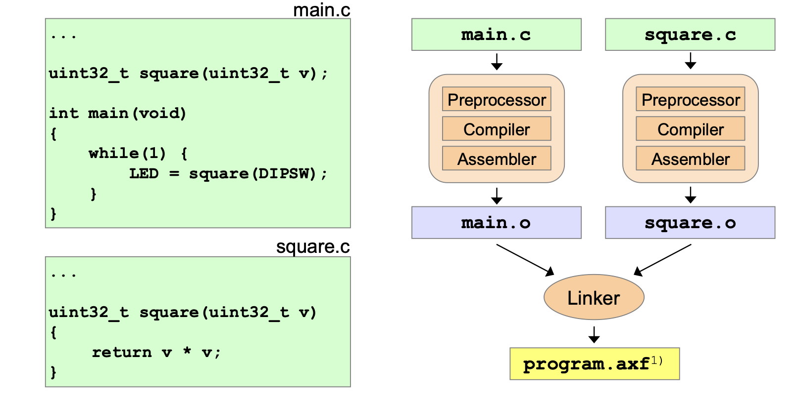

# Data Transfer

## Transfer Types




## Moving Data

Copy value of Rm to Rd

### Low and High registers

```assembler
MOV <Rd>, <Rm> 
```

### Only low registers

```assembler
MOVS <Rd>, <Rm> 
```

### Exampes

```assembler
address		opcode	instruction 	comment
00000002 	4621 	MOV R1,R4 		; low reg to low reg
```

## Loading Literals

### Immediate Data

- Copy immediate 8-bit value (literal) to register (only low registers)
- 8 Bit literal is part of the opcode (imm8)
- Registerbits 31 to 8 set to 0

```assembler
MOVS <Rd>, #<imm8>
```

### Assembler Directive

- Symbolic definitions of literals and constants
- Comparable to #define in C

```assembler
MY_CONST8 EQU 0x12
MOVS R1, #MY_CONSTS
```

### Load - LDR (literal)

- Indirect access relative to PC
- PC offset <imm>
- If PC not word-aligned, align on next upper word-address

```assembler
LDR <Rt>. [PC, #<imm>]
```

#### Pseudo Instruction

```assembler
			LDR R3,myLit


myList		DCD	0x12345678
```


## Storing Data
