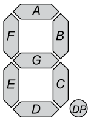

# 7 Segment Anzeige

Eine 7-Segment-Anzeige wird für Hexadezimalzeichen verwendet. Dabei wird jedes Segment der Anzeige einzeln angesteuert.




## Theorie

Bei der Zahl 1 würden die Segment B und C aufleuchten. Im Register heisst dass dann die Bits 1 und 2 aktiv sind. Somit würde der Wert 0000'0110 bzwh. 0x06 sein.

Ist die Anzeige active-low (invertiert), dann muss 1111'1001 bzwh. 0xF9 geschrieben werden.

Bei 16 Zeichen ist die manuelle Umwandlung relative mühsam. Wir können das Umwandeln aber auch einfach dem Compiler überlassen. Dies hat zudem den Vorteil, dass es deutlich einfacher zu verstehen ist.

## Code

Ich empfehle den Code immer so "blöd" wie möglich zu machen. Jedoch ist es auch wichtig, dass nicht einfach zufällige Zahlen irgendwo stehen (sog. Magic Numbers).


### Define für jedes Segmentstück definieren

Wie bereits oben beschreiben, ist es relativ mühsam die einzelnen Zahlen zu definieren. Um dies zu vereinfachen können wir die einzelnen Bits einem define zuordnen.

Dass könnte dann z.B. so aussehen. Es ist auch möglich die decimalzahlen, bzwh. die HEX Zahlen direkt zu verwenden.

```c
#define LED_A       1<<0
#define LED_B       1<<1
#define LED_C       1<<2
#define LED_D       1<<3
#define LED_E       1<<4
#define LED_F       1<<5         
#define LED_G       1<<6
#define LED_DP      1<<7
```


### Definieren der Zahlen


Nun ist es wessentlich einfacher diversen Zeichen darzustellen. Dazu müssen wir nur noch die verwendeten Segmente mit einem ODER verknüpfen.

```c
#define LED_SEGMENTE_ZAHL_1 (LED_B | LED_C)
#define LED_SEGMENTE_ZAHL_2 ...
```

### Umwandeln

Das umwandeln ist durch einen array mit den 16 Zeichen oder ein switch case möglich. Ich empfehle den Ansatz des arrays, da dieser weniger Aufwand ist.

```c
const static uint8_t segment_zeichen[16] = {
    LED_SEGMENT_ZAHL_1,
    LED_SEGMENT_ZAHL_2,
    ...
};

```
