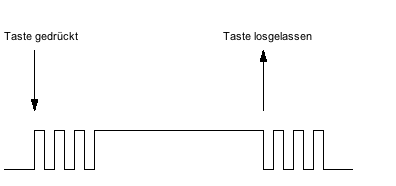

# Entrpellung

Im Gegensatz zu digitalen Schaltern, sind analoge Schalter nicht sofort 1/0. Sie prellen.



Um dieses Problem zu lösen, werden Flanken erkannt. Also die Zuständsänderungen.

## Flankenerkennung

```c
uint8_t is_positive_flank(uint8_t previous, uint8_t current, uint8_t mask)
{

    if ((previous & mask) == 0x00 && (current & mask) == mask)
    {
        return 1;
    }

    return 0;
}

uint8_t is_negative_flank(uint8_t previous, uint8_t current, uint8_t mask)
{

    if ((previous & mask) == mask && (current & mask) == 0x00)
    {
        return 1;
    }

    return 0;
}

```

### Verwendung

```c
#define ADDR_SWITCHES ...

#define MASK_OF_INTEREST 1<<2

int main ()
{
    uint8_t previous_value = read_byte(ADDR_SWITCHES);
    uint8_t current_value = read_byte(ADDR_SWITCHES);

    uint8_t counter = 0;
    while (1)
    {
        current_value = read_byte(ADDR_SWITCHES);

        if (is_positive_flank(previous_value, current_value, MASK_OF_INTEREST))
        {
            // do something
            counter += 1;
        }

        write_byte(LEDS, counter);

        previous_value = curent_value;
    }
}

```