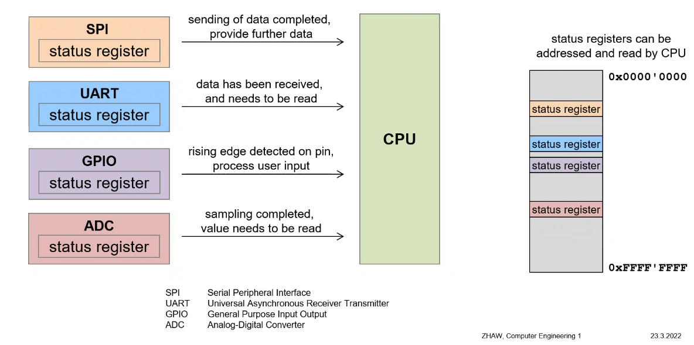
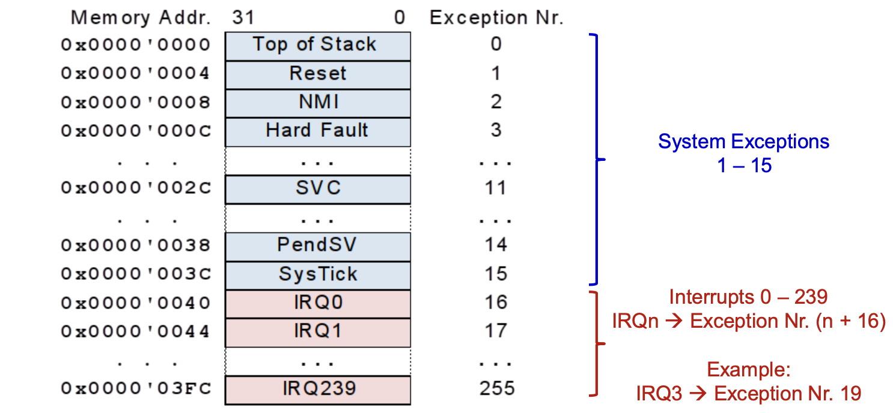

# Interrupts

Interrupts allow the code to:

1. pause
2. jump to a given address
3. do something there
4. jump back

**AT ANY TIME, EVERYWHERE**

A single interrupt is called (ISR - Interrupt service routine)

## Events

- Peripheral signal events to CPU
	- something happened that requires a CPU service -> call a subroutine



## Polling

Endloses pruefen eines Statuses.

- Maximale Durchlaufzeit ist bestimmbar

```c
while(1)
{
	if ( read_byte(ADDR_BUTTON_A) ) {
		execute_task_A();
	}
	if ( read_byte(ADDR_BUTTON_B) ) {
		execute_task_B();
	}
	if ( read_byte(ADDR_BUTTON_C) ) {
		execute_task_C();
	}
	...
}
```

## Interrupt-Driven

Sudden change of program flow due to an event

### Vector Table

The ISR starts at address 0x00. The table is implemented, the same way, as a switch/case jump table.



### Calculating the offset

$$
(\text{IRQ-NR} + 16) * 4 \text{bytes}
$$

### Implementation

```assembler
; Vector Table Mapped to Address 0 at Reset
	AREA RESET, DATA, READONLY

__Vectors DCD __initial_sp ; Top of Stack
	DCD Reset_Handler ; Reset Handler
	DCD NMI_Handler ; NMI Handler
	DCD HardFault_Handler ; Hard Fault Handler
	DCD ...
	DCD ...

	; Interrupts
	DCD IRQ0_Handler ; ISR for IRQ0
	DCD IRQ1_Handler ; ISR for IRQ1
	DCD ...
```

```assembler
	AREA SOURCE_CODE, CODE, READONLY
IRQ0_Handler
	EXPORT IRQ0_Handler
	PUSH { ... }
	... ; interrupt service
	POP { ... }
	BX LR
```

## Aufgaben

### NVIC (Nested Vectorred Interrupt controller)

Bestimmt, welche Interrupts anstehen

### CPU

1. Kontextsicherung
2. Lese Adresse aus Vektortabelle
3. Setzt aktiv Bit auf NVIC

## Interrupt aktivieren


Register Number: $\text{IRQ}/32$
Bit Number: $\text{IRQ} mod 32$


### Beispiel

**IRQ46**

SETENA1: $46/32 = 1$

BIT $46 mod 32 = 14$ -> Bit 14 (0x01 << 14 )


## Interrupt Priority

Die Priority kann ein Wert zwischen 0 und 15 (0xF) annehmen. Also die Bits 7:4 Je hoeher der Wert ist, desto hoeher ist die Prioritaet. 