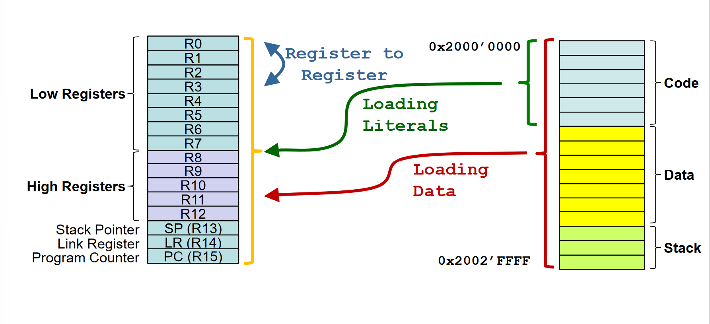

# Linker

## Steps

1. Merging Code Sections
2. Merging data sections
3. Symbol resolution
4. Symbol relocation

## Magic Rules of C
- Declare before use
- Single naming for variables & functions

## ELF SECTIONS

### DATA SECTION

### SYMBOL TABLE

### CODE SECTION

### RELOCATION TABLE

## Libraries

### Dynamic or shared libraries

IN KEIL STATIC LIBRARIES ARE USED

- Executable is **not linked** with a **dynamic library** at **link time**
- The resulting **executable** is **not self contained**
	- Needs other libraries at run time
	- Loader of hosting OS links at load time with the shared libraries
- Benefit
	- Smaller executable compared with static libraries
	- Can replace shared libraries
- Drawback
	- May result in versioning problems at loadtime

