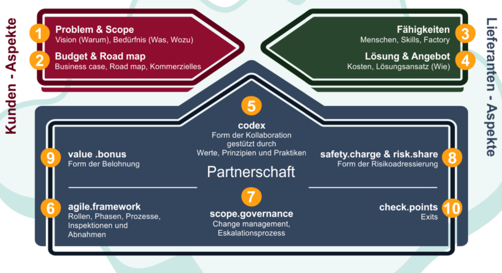

# IT Verträge

- **Vertrauen ist extrem wichtig**
- Klare, einfache Verträge sind wichtig
- An das Ende der Zusammenarbeit denken

## Anforderungen

- Vertrauen
- Austausch zwischen den Parteien / Kommunikation
- Ideen
- Umfang des Projektes

## Beweisbarkeit

Es gilt:
- Was die Parteien tatsächlich gelebt haben.
- Was wie bereits **vor der Vertragsunterzeichnung** besprochen / zugesichert haben.

# Softwareentwicklung

## Klassisch
Pflichtenheft, Milestones & Abnahme = Werkvertrag + viiiel Zeit + Lizenz / Kaufvertrag

## Agile Softwareentwicklung

= Werkvertrag? (Resultat zählt)

= Auftrag? (Dienstleistung / Zusammenarbeit zählt)

= Einfache Gesellschaft? (Zusammenarbeit für das Erreichen eines bestimmten Zwecks)

**Nichts passt wirklich - daher müssen die Verträge individuell zusammengestellt werden**

### Vorgehen

**Phase 1**: 1,2,3,4

**Phase 2**: 5,6,7,8,9,10

- Genügend Zeit in Phase 1 investieren

# Vertragsgestalltung

## Konfliktmanagement

- Passiert in allen Softwareprozessen
- Etwas steuern

## State Of the Art

- Flexibilität & Abänderbarkeit des Vertragsverhältnisses

## Offerte & Vertragsschluss

**Art. 1 OR: Vertrag kommt (nur) durch gegenseitige, übereinstimmende Willensäusserung zustande. Diese kann ausdrücklich oder stillschweigend erfolgen.**

**Offerte** = verbindlicher Antrag, den Vertrag unter bestimmten Bedingungen (Preis,
Menge etc.) abschliessen zu wollen.

**Akzept** = Annahme der Offerte.

**Willensäusserung** = schriftlich, mündlich oder konkludentes Verhalten

### Unlauterer Wettbewerb
- Hat ein Prospekt einen Einfluss auf die Willensbildung, dann ist der Preis rechtsgültig.
- Falsche Angaben von Liefermengen

Wird keine Auftragsbestätigung gesendet, dann ist das nur eine **Einladung zur Offerstellung** und ist somit nicht Rechtsgültig.

# Vertragsarten

## Nominatverträge

Gesetzlich geregelte Vertragsformen - zwingende oder dispositive Bestimmungen: "klare Regelun""

- Kaufvertrag (Standardsoftware, Infrastruktur)
- Auftrag (Consulting, Installation, Entwicklung, Projektmanagement, SLA)
- Werkvertrag (kundespezifische Software, Softwareerweiterung, Infrastruktur)
- Miete (Hardware)
- Zusammengesetzte Verträge (Hosting, Entwicklung, Projektvertrag, Lizensierung)

## Gemischte Verträge

Zusammengesetzt aus Nominatverträgen - aus dem Gesetz wird das passende genommen - oder später angewendet...

## Innominatverträge

Gesetzlich **NICHT** geregelte Vertragsformen. Das Prinzip der Vertragsfreiheit ermöglicht neue, innovative Vertragsinhalte & Zusammenarbeitsformen.

- Leasingvertrag
- Lizenzvertrag
- Factoring-Vertrag
- Escrow-Agreement
- Software-Entwicklungsvertrag
- Service Level Agreement (SLA)
- Non Disclosure Agreement (NDA) / Non Solicitation Agreement (NSA)

## Schwierige Fälle

- Verzögerung in der Leistungserstellung
- Mehrere an der Leistungserfüllung Beteiligte
- (angeblich) keine oder zu späte Lieferung
- Fehlerhaftes Produkt / Garantieleistung
- Unklares Abnahmeverfahren
- Fehlende Zahlung
- Übermässige Bindung
- andere Mängel (Nichtigkeit, Unmöglichkeit, Übervorteilung, etc.)

**Wenn es schwierig wird - "Papier" (Beweismittel) produzieren**