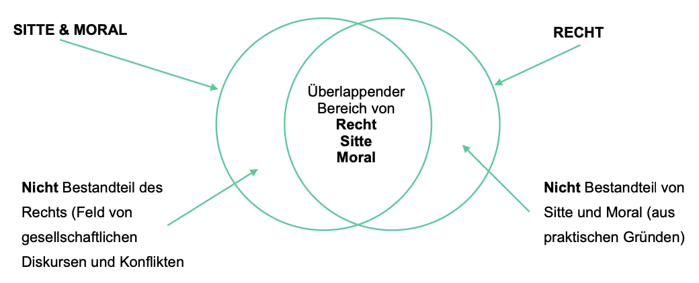
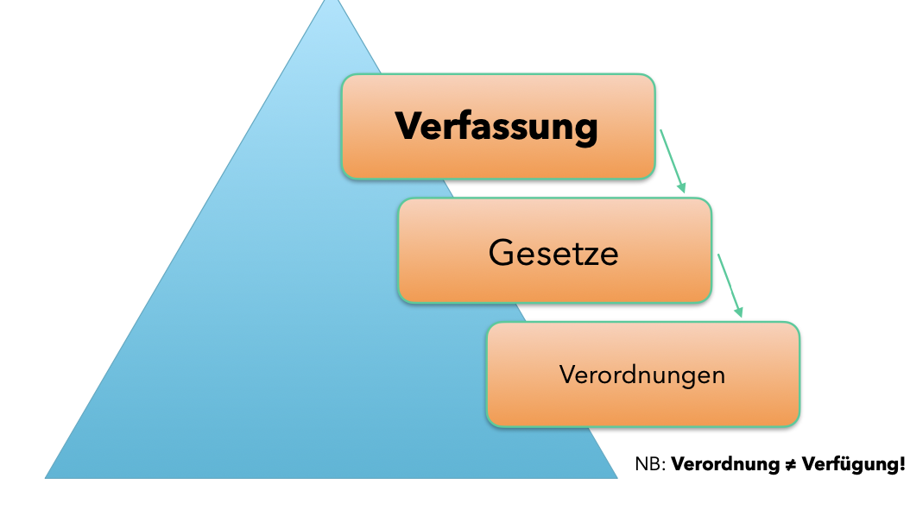
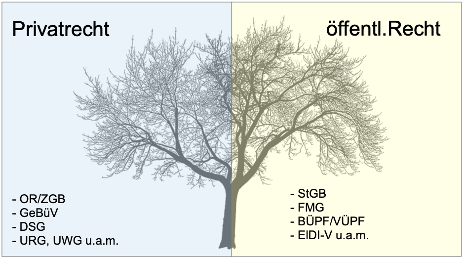

# ITR

## BEDEUTUNG VON „RECHT“ IN EINEM TECHNISCHEN UMFELD

- „Recht“ ist i.d.R. kein enges (manchmal aber schon…) Framework, sondern schreibt nur punktuell „gesellschaftlich“ gewünschte Verhaltensweisen vor.
- Innerhalb des rechtlichen Frameworks sind die Parteien weitgehend frei, sich technologisch & wirtschaftlich frei zu bewegen.
- Neue Technologien fordern neue - demokratisch ausgehandelte Regeln.
- Beispiele: KI, teil-autonom fahrende Autos (level 3), Drohnen, IoT (z.B. Medizintechnik), Funkstandard 5G, Blockchain etc.

- Recht als Rahmen des Zulässigen (= Maximum) oder des rechtlich Verlangten (= Minimum) innerhalb eines (sozialen) Systems.
- Klärung der Verpflichtungen (was), Verantwortlichkeiten (wer) und Haftung für die nicht korrekte Erfüllung von Verträgen.
- Haftung auch (ausservertraglich) für Schäden, welche technische Systeme verursachen (z.B. fehlerhafte Steuerungssoftware. KI?).
- Industrie-Standards/Best Practices (z.B. ISO-Standards) sind weit verbreitet und sinnvoll, sie ergänzen aber „nur“ das Recht.
- Vertragliche Vereinbarungen als „Recht”.

## Risk Management

- Um Risiken zu „handlen“ ist es sinnvoll, sowohl technische („security by design“), organisatorische als auch rechtliche Massnahmen zu treffen! (Compliance).
- Holen Sie sich rechtliche Unterstützung so früh wie möglich! Andernfalls können Projekte in „letzter Minute abgeschossen“ werden!
- Das Management ist persönlich verantwortlich, die Einhaltung von rechtlichen Vorschriften zu organisieren und zu kontrollieren (Compliance=Dokumentationspflichten)!

## ZENTRALE, (OBLIGATIONEN-)RECHTLICHE FRAGE

1. WER will
2. von WEM
3. WAS
4. WORAUS ?
- Im konkreten Einzelfall stellen sich in diesen Fragen regelmässig weitere rechtliche Unterfragen, welche oft nicht eindeutig (digital mit Ja/Nein) beantwortet werden können…
- ACHTUNG: kulturelle Differenz zwischen „Management“ (legal) und „Tekkies“!

## Sitte, Moral & Recht

- Sich z.T. überschneidende, sozial gewünschte Verhaltensweisen
- Recht muss sich veränderten Verhaltensweisen immer wieder anpassen. Aktuelle Fragestellung: welche Leitplanken wollen wir der KI geben? (EU: KI-Gesetz in Verhandlung)
- Rechtliche Verbindlichkeit ist in einer vielfältigen, offenen Gemeinschaft für alle einzufordern („grösster gemeinsamer Nenner“)

Aber: es gibt nicht mehr „eine Sitte“ & eine „Moral“, sondern viele! **Was „richtig & falsch“ ist, muss immer wieder neu ausgehandelt werden! Viele PolitikerInnen haben das noch nicht verstanden…**

## Juristische Argumentation

**Behauptung** wird durch **Grundlage** (Gesetzesartikel) und **notwendigen Beweis** gestützt.

oder 

**Gestützt auf Grundlage** (Gesetzesartikel) und notwendigem **Beweis** ergibt sich die **Schlussfolgerung**.

## Gewaltentrennung

Auf eidgenössischer, kantonaler und kommunaler Ebene gibt es jeweils drei
unabhängige Institutionen:
- **LEGISLATIVE** (Parlamente & Bürger)
- **EXEKUTIVE** (Verwaltung)
- **JUDIKATIVE** (Gerichte)
Jede dieser Autoritäten kontrolliert und balanciert die Macht der anderen beiden („check & balance“) - eigentlich… denn es ist unübersehbar, dass die Exekutive (nicht nur in der Schweiz) zunehmend Aufgaben übernehmen muss, welche die Zivilgesellschaft (& Unternehmen!) nicht mehr übernehmen wollen/können! Bsp  Sicherheitsgarantien für Banken & Stromunternehmen, Investionen in Grundlagenforschung etc.

## RECHTSORDNUNG UNTER VERSCHIEDENEN BLICKWINKELN
Einteilung nach:
- Rang (Verfassung, Gesetz, Verordnung)
- erlassendem Gemeinwesen (Bundesrecht, kantonales- und Gemeinderecht)
- Rechtsquelle (geschriebenes Recht, Gewohnheitsrecht, Gerichtspraxis, ZGB 1)
- Beteiligten Personen (Privatrecht, öffentliches Recht)

## BUND/KANTONE/GEMEINDEN
- „Das Schweizervolk und die Kantone... bilden die Schweizerische Eidgenossenschaft“ (Art. 1 BV) – nicht umgekehrt!
- Die Schweizerische Eidgenossenschaft ist ein föderalistischer Bundesstaat. Sie besteht aus 26 weitgehend souveränen Gliedstaaten, die sich eine eigene Organisation & Verfassung geben (z.B. Art. 1 Verfassung ZH: „Der Kanton Zürich ist ein souveräner Stand der Schweizerischen Eidgenossenschaft.“)
- Per 1.1.22: 2148 selbständige Gemeinden mit (beschränkter) Gemeindeautonomie! „Art. 1 Verfassung Zürich: „4 Der Kanton anerkennt die Selbstständigkeit der Gemeinden.“ Gemeinden sind im rechtlichen Rahmen frei, sich selber zu organisieren und auf ihrem Gemeindegebiet Regeln zu erlassen.
- Bund (resp. Kantone und jedes Gemeinwesen!) darf nur Gesetze erlassen und in einem Rechtsbereich handeln, wenn es dazu eine verfassungsmässige Legitimation gibt!
- Kantone stehen in der Gesetzgebungsmacht grundsätzlich über dem Bund! Kantone über den Gemeinden.

### Hierarchie des Rechts

## PRIVAT-/ÖFFENTLICHES RECHT

**Privatrecht** wird unter anderem vom Grundsatz der Koalitions- und Vertragsfreiheit beherrscht, **Öffentliches Recht** dagegen vom Legalitätsprinzip (= Gewaltenkontrolle).

= völlig unterschiedliche Gerichtsbarkeit (Zivil-/ Verwaltungsgericht) mit unterschiedlichen Prozessabläufen und Prozessrechten!

## Rechtsbegriffe

- Zwingendes, vereinbartes und dispositives Recht
- Vermutung des guten Glaubens (ZGB 2)
- Handeln nach Treu und Glauben (ZGB 2)
- Richterliches Ermessen (ZGB 4)
- Beweislast (ZGB 8)!

## INSTANZENZUG

- Es reicht nicht zu wissen, welche Rechte man hat, man muss auch wissen, wie man diese **durchsetzen** kann!
- **Zivil-, Verwaltungs- und Strafgerichte haben weitgehend unterschiedliche Verfahren!**
- Grundsätzlich aber in allen Rechtsbereichen drei Instanzen: Bezirksgericht – Kantonsgericht – Bundesgericht

## ESSENTIALS ZIVILPROZESS

- Vor dem örtlich/sachlich zuständigen Gericht
- In der Regel vorher eine Schlichtungsverhandlung/Friedensrichter
- In Zivilverfahren muss regelmässig ein Gerichtskostenvorschuss, der vom Streitwert abhängt, bezahlt werden! Ohne Zahlung kein Prozess!
- In Zivilverfahren muss der Kläger den behaupteten Anspruch beweisen das Gericht sucht keine Beweise!
- Wer den Zivilprozess verliert, muss die Gerichtskosten sowie Parteikosten der andern Seite übernehmen!
- Wer einen Forderungsprozess gewinnt, hat das Geld noch nicht...

## ESSENTIALS STRAFVERFAHREN
- Verfahren sind in StGB & StPO geregelt. Polizei unterliegt überwiegend kantonaler Hoheit & ist dort geregelt.
- Örtliche Zuständigkeit ergibt sich aus dem Tat- oder Erfolgsort.
- Für Antragsdelikte gilt eine Frist von 3 Monaten!
- Staatsanwalt (StA) leitet Untersuchung, muss belastende & entlastende Aspekte sammeln
- Als „Opfer“ hat man nur begrenzte Einsicht in Untersuchungsmassnahmen. Ausser man bringt sich als „Privatstrafkläger“ ein!
- StA stellt entweder Verfahren ein, straft (max. 6 Monaten Freiheitsstrafen und/oder
180 Tagessätze) oder überweist den Fall zur Beurteilung an das Strafgericht

## ESSENTIALS VERWALTUNGSVERFAHREN
- Verfügungen müssen durch die richtige Behörde im richtigen Verfahren und unter Angabe der Rechtsmittels dagegen erlassen werden. Sonst ist die Verfügung nichtig!
- Grundsätzlich immer Wiedererwägung/Einsprache gegen die Verfügung möglich, wenn neue Tatsachen auftauchen! Auch Jahre später!
- Gegen Verfügungen kann i.d.R. Beschwerde innert 10/20/30 Tagen geführt werden.
- Je nach Gesetzesgrundlage ist kantonales Obergericht oder Bundesgericht höchste Instanz. Gegen Verletzung verfassungsmässiger Rechte immer Bundesgericht.