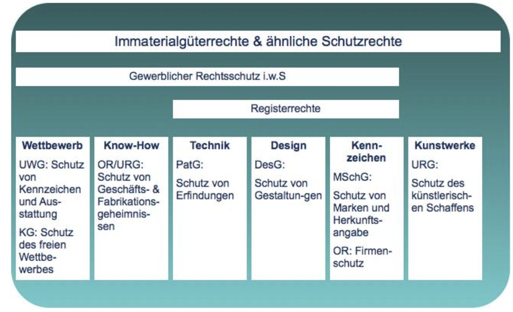

# Zivilrecht

## Essentials  
- Vor dem örtlich / sachlich zuständigen Gericht
- In der REgel vorher eine Schlichtungsverhandlung / Friedensrichter
- In Zivilverfahren muss regelmässig ein Gerichtskostenvorschuss, der vom Streitwert abhängt, bezahlt werden! Ohne Zahlung kein Prozess!
- In Zivilrechtsverfahren muss der Kläger dem behaupteten Anspruch beweisen - **Das Gericht sucht keine Beweise**
- Wer den Zivilprozess verliert, muss die Gerichtskosten sowie Parteikosten der anderen seite übernehmen.
-  Wer einene Förderungsprozess gewinnt, hat das Geld noch nicht...

**Gutes Geld nicht schlechtem Geld hinterherwerfen**

## Andere Möglichkeiten

- Richter einigen sich gemeinsam
- Aussergerichtliche Einigung

# Obligationenrecht

# Urheberrechte (URG)

- Urheber (Art. 6 URG) können nur natürliche (nie juristische!) Personen sein. Mehreren Urhebern steht das Urheberrecht jedoch gemeinschaftlich zu.
- Das Werk ist urheberrechtlich geschützt, sobald es erschaffen ist, unabhängig davon, ob es auf einem Träger festgehalten ist oder nicht (Art. 29 URG).
- Der Schutz erlischt: 
	- a.) 50 Jahre nach dem Tod des Urhebers für Computerprogramme 
	- b.) 70 Jahre nach dem Tod des Urhebers resp. letzten Urhebers bei einer Gruppe.

## Arten

### Werwertungsrechte

Ausschliessliches Recht zu bestimmen, ob, wann und wie das Werk verwendet/verwertet wird (Art. 10 URG)

### Urheberpersönlichkeitsrechte

Recht auf Anerkennung der Urheberschaft und Bestimmung der Urheberbezeichnung, Erstveröffentlichungsrecht, Recht auf Werkintegrität, Schutz vor Zerstörung (u.a. Art. 11 URG)

### Sonstige Rechte

Zutritts- und Ausstellungsrecht (Art. 14 URG), Ausleih- und Vermietungstantiemen (Art. 13. Abs. 1 URG), Kopierabgabe (Art. 20 Abs. 2 URG)

## Urheberrechte des Arbeitnehmers

- Recht am Werk gehört **grundsätzlich der (natürlichen) Person**, die es erschaffen hat. Bei mehreren Personen steht es ihnen **gemeinschaftlich** zu.
- In der Regel wird (**muss!**) die Übertragung der Verwertungsrechte an den Arbeitgeber vertraglich geregelt werden. In Zweifelsfällen: „Zweckübertragungstheorie“ (Art. 16 Abs. 2 URG).
- **ABER**: wird in einem Arbeitsverhältnis bei Ausübung dienstlicher Tätigkeiten sowie in Erfüllung vertraglicher Pflichten ein Computerprogramm erschaffen, so ist der Arbeitgeber allein zur Ausübung der ausschliesslichen Verwendungsbefugnisse berechtigt (Art. 17 URG).

## Übertragung von Urheberrechten

- Die Übertragung des Urheberrechts erfolgt stets **durch einen (Lizenz-)Vertrag** (schriftlich/mündlich/stillschweigend)!
- Liegt kein klarer Vertrag vor, so ist davon auszugehen, dass der Urheber seine Rechte nicht pauschal abtritt, sondern die Nutzung nur nach dem Zweck der Übertragung erlaubt (Art. 16 Abs. 2 URG - **Zweckübertragungstheorie**).
- Zweckübertragungstheorie: In unklaren Fällen (nur in diesen!) wird die Frage gestellt, welche Rechte absolut notwendig für die Erfüllung des Vertrages übertragen werden müssen.

## Sonderregelungen für Software

- Art. 10 Abs. 3 URG: Ausschliessliches Recht zur Vermietung
- Art. 12 Abs. 2 URG: Erschöpfung, nur **Weiterveräusserung oder Gebrauch**
- Art. 17 URG: Der Arbeitgeber hat ein Recht an den Programmen
- Art. 19 Abs. 4 URG: Kein Eigengebrauch
- Art. 21 URG: Entschlüsselung von Computerprogrammen
- Art. 24 URG: Sicherungskopie
- Art. 29 URG: **Schutzdauer von 50 Jahren**

## Rechtsschutz bei URG-Verletzungen

- Zivilrechtliche Ansprüche (Art. 61 ff URG): Feststellungsklage, Unterlassungsklage, Beseitigungsklage, Klage auf Herkunftsangabe, Schadenersatz, Genugtuung, Gewinnherausgabe, Vorsorgliche Massnahmen
- Strafrechtliche Ansprüche (Art. 67 ff URG): Bei Vorsatz auf Antrag Gefängnis und Busse bis CHF 100’000.—. Bei gewerbsmässiger Tatbegehung wird von Amtes wegen verfolgt!

## Gewährleistunge ("Garantie")

- Sachgewährleistung: „Der Lizenzgeber gewährleistet die Funktionalität des Lizenzgegenstandes mit den nachfolgenden Drittsoftware und das Testen sowie Anpassen des Lizenzgegenstandes bei Änderungen im Rahmen seiner üblichen Wartung.“
- Rechtsgewährleistung: „Behaupten Dritte Ansprüche, die den Auftraggeber hindern, die ihm vertraglich eingeräumten Nutzungsbefugnisse wahrzunehmen, unterrichtet der Auftraggeber den Auftragnehmer unverzüglich schriftlich und umfassend. Er ermächtigt den Auftragnehmer hiermit, Klagen gegen Dritte gerichtlich und außergerichtlich allein zu führen. Wird der Auftraggeber verklagt, stimmt er sich mit dem Auftragnehmer ab und nimmt Prozesshandlungen, insbesondere Anerkenntnisse und Vergleiche, nur mit dessen Zustimmung vor.“

# Datenschutzrecht

## Geltungsbereich - Art. 2 revDSG

1. Dieses Gesetz gilt für die Bearbeitung von Personendaten **natürlicher Personen** durch:
	- a. **private Personen;**
	- b. **Bundesorgane.**
2. Es ist **nicht** anwendbar auf:
	- a. Personendaten, die von einer natürlichen Person ausschliesslich zum persönlichen Gebrauch bearbeitet werden;
	- b. Personendaten, die von den eidgenössischen Räten und den parlamentarischen Kommissionen im Rahmen ihrer Beratungen bearbeitet werden;
	- c. Personendaten, die bearbeitet werden durch institutionelle Begünstigte nach Artikel 2 Absatz 1 des Gaststaatgesetzes vom 22. Juni 2007, die in der Schweiz Immunität von der Gerichtsbarkeit geniessen.
3. Das anwendbare Verfahrensrecht regelt die Bearbeitung von Personendaten und die Rechte der betroffenen Personen in Gerichtsverfahren und in Verfahren nach bundesrechtlichen Verfahrensordnungen. Auf erstinstanzliche Verwaltungsverfahren sind die Bestimmungen dieses Gesetzes anwendbar.
4. Die öffentlichen Register des Privatrechtsverkehrs, insbesondere der Zugang zu diesen Registern und die Rechte der betroffenen Personen, werden durch die Spezialbestimmungen des anwendbaren Bundesrechts geregelt. Enthalten die Spezialbestimmungen keine Regelung, so ist dieses Gesetz anwendbar.

## Räumlicher Geltungsbereich - Art. 3 revDSG

Auch das Schweizer Datenschutzrecht untersteht neu dem „Marktortsprinzip“!

1. Dieses Gesetz gilt für Sachverhalte, die sich in der Schweiz auswirken, auch wenn sie im Ausland veranlasst werden.
2. Für privatrechtliche Ansprüche gilt das Bundesgesetz vom 18. Dezember 1987 über das Internationale Privatrecht. Vorbehalten bleiben zudem die Bestimmungen zum räumlichen Geltungsbereich des Strafgesetzbuchs.

## Begrife / Definitionen - Art.5 rev DSG

- a. Personendaten: alle Angaben, die sich auf eine bestimmte oder bestimmbare natürliche Person beziehen;
- b. betroffene Person: natürliche Person, über die Personendaten bearbeitet werden;
- c. besonders schützenswerte Personendaten:
	1. Daten über religiöse, weltanschauliche, politische oder gewerkschaftliche Ansichten oder Tätigkeiten,
	2. Daten über die Gesundheit, die Intimsphäre oder die Zugehörigkeit zu einer Rasse oder Ethnie,
	3. genetische Daten,
	4. biometrische Daten, die eine natürliche Person eindeutig identifizieren,
	5. Daten über verwaltungs- und strafrechtliche Verfolgungen oder Sanktionen,
	6. Daten über Massnahmen der sozialen Hilfe;
- d. Bearbeiten: jeder Umgang mit Personendaten, unabhängig von den angewandten Mitteln und Verfahren, insbesondere das Beschaffen, Speichern, Aufbewahren, Verwenden, Verändern, Bekanntgeben, Archivieren, Löschen oder Vernichten von Daten;
- e. Bekanntgeben: das Übermitteln oder Zugänglichmachen von Personendaten;
- f. Profiling: jede Art der automatisierten Bearbeitung von Personendaten, die darin besteht, dass diese Daten verwendet werden, um bestimmte persönliche Aspekte, die sich auf eine natürliche Person beziehen, zu bewerten, insbesondere um Aspekte bezüglich Arbeitsleistung, wirtschaftlicher Lage, Gesundheit, persönlicher Vorlieben, Interessen, Zuverlässigkeit, Verhalten, Aufenthaltsort oder Ortswechsel dieser natürlichen Person zu analysieren oder vorherzusagen;
- g. Profiling mit hohem Risiko: Profiling, das ein hohes Risiko für die Persönlichkeit oder die Grundrechte der betroffenen Person mit sich bringt, indem es zu einer Verknüpfung von Daten führt, die eine Beurteilung wesentlicher Aspekte der Persönlichkeit einer natürlichen Person erlaubt;
- h. Verletzung der Datensicherheit: eine Verletzung der Sicherheit, die dazu führt, dass Personendaten unbeabsichtigt oder widerrechtlich verlorengehen, gelöscht, vernichtet oder verändert werden oder Unbefugten offengelegt oder zugänglich gemacht werden;
- i. Bundesorgan: Behörde oder Dienststelle des Bundes oder Person, die mit öffentlichen Aufgaben des Bundes betraut ist;
- j. Verantwortlicher: private Person oder Bundesorgan, die oder das allein oder zusammen mit anderen über den Zweck und die Mittel der Bearbeitung entscheidet;
- k. Auftragsbearbeiter: private Person oder Bundesorgan, die oder das im Auftrag des Verantwortlichen Personendaten bearbeitet. 

## Datenschutzgrundsätze - Art.6 revDSGO

1. Personendaten müssen rechtmässig bearbeitet werden.
2. Die Bearbeitung muss nach Treu und Glauben erfolgen und verhältnismässig sein.
3. Personendaten dürfen nur zu einem bestimmten und für die betroffene Person erkennbaren Zweck beschafft werden; sie dürfen nur so bearbeitet werden, dass es mit diesem Zweck vereinbar ist.
4. Sie werden vernichtet oder anonymisiert, sobald sie zum Zweck der Bearbeitung nicht mehr erforderlich sind.
5. Wer Personendaten bearbeitet, muss sich über deren Richtigkeit vergewissern. Sie oder er muss alle angemessenen Massnahmen treffen, damit die Daten berichtigt, gelöscht oder vernichtet werden, die im Hinblick auf den Zweck ihrer Beschaffung oder Bearbeitung unrichtig oder unvollständig sind. Die Angemessenheit der Massnahmen hängt namentlich ab von der Art und dem Umfang der Bearbeitung sowie vom Risiko, das die Bearbeitung für die Persönlichkeit oder Grundrechte der betroffenen Personen mit sich bringt.
6. Ist die Einwilligung der betroffenen Person erforderlich, so ist diese Einwilligung nur gültig, wenn sie für eine oder mehrere bestimmte Bearbeitungen nach angemessener Information freiwillig erteilt wird.
7. Die Einwilligung muss ausdrücklich erfolgen für:
	* a. die Bearbeitung von besonders schützenswerten Personendaten;
	* b. ein Profiling mit hohem Risiko durch eine private Person; oder
	* c. ein Profiling durch ein Bundesorgan.

## DATA PROTECTION BY DESIGN AND BY DEFAULT - ART. 7 revDSG

Art. 7 - Datenschutz durch Technik und datenschutzfreundliche Voreinstellungen

1. Der Verantwortliche ist verpflichtet, die Datenbearbeitung technisch und
organisatorisch so auszugestalten, dass die Datenschutzvorschriften eingehalten werden, insbesondere die Grundsätze nach Artikel 6. Er berücksichtigt dies ab der Planung.
2. Die technischen und organisatorischen Massnahmen müssen insbesondere dem Stand der Technik, der Art und dem Umfang der Datenbearbeitung sowie dem Risiko, das die Bearbeitung für die Persönlichkeit oder die Grundrechte der betroffenen Personen mit sich bringt, angemessen sein.
3. Der Verantwortliche ist verpflichtet, mittels geeigneter Voreinstellungen sicherzustellen, dass die Bearbeitung der Personendaten auf das für den Verwendungszweck nötige Mindestmass beschränkt ist, soweit die betroffene Person nicht etwas anderes bestimmt.

## Datensicherheit - Art. 8 revDSG

1. Der Verantwortliche und der Auftragsbearbeiter gewährleisten durch geeignete technische und organisatorische Massnahmen eine dem Risiko angemessene Datensicherheit.
2. Die Massnahmen müssen es ermöglichen, Verletzungen der Datensicherheit zu vermeiden.
3. Der Bundesrat erlässt Bestimmungen über die Mindestanforderungen an die Datensicherheit.

## BEARBEITUNG DURCH AUFTRAGSBEARBEITER (CLOUD-COMPUTING) - ART. 9 revDSG

1. Die Bearbeitung von Personendaten kann vertraglich oder durch die Gesetzgebung einem Auftragsbearbeiter übertragen werden, wenn:
	* a. die Daten so bearbeitet werden, wie der Verantwortliche selbst es tun dürfte; und
	* b. keine gesetzliche oder vertragliche Geheimhaltungspflicht die Übertragung verbietet.
2. Der Verantwortliche muss sich insbesondere vergewissern, dass der Auftragsbearbeiter in der Lage ist, die Datensicherheit zu gewährleisten.
3. Der Auftragsbearbeiter darf die Bearbeitung nur mit vorgängiger Genehmigung des Verantwortlichen einem Dritten übertragen.
4. Er kann dieselben Rechtfertigungsgründe geltend machen wie der Verantwortliche.

## VERZEICHNIS DER BEARBEITUNGSTÄTIGKEITEN - ART. 12 revDSG

1. Die Verantwortlichen und Auftragsbearbeiter führen je ein Verzeichnis ihrer Bearbeitungstätigkeiten.
2. Das Verzeichnis des Verantwortlichen enthält mindestens:
	* a. die Identität des Verantwortlichen;
	* b. den Bearbeitungszweck;
	* c. eine Beschreibung der Kategorien betroffener Personen und der Kategorien bearbeiteter Personendaten;
	* d. die Kategorien der Empfängerinnen und Empfänger;
	* e. wenn möglich die Aufbewahrungsdauer der Personendaten oder die Kriterien zur Festlegung dieser Dauer;
	* f. wenn möglich eine allgemeine Beschreibung der Massnahmen zur Gewährleistung der Datensicherheit nach Artikel 8;
	* g. falls die Daten ins Ausland bekanntgegeben werden, die Angabe des Staates sowie die Garantien nach Artikel 16 Absatz 2.
3. Das Verzeichnis des Auftragsbearbeiters enthält Angaben zur Identität des Auftragsbearbeiters und des Verantwortlichen, zu den Kategorien von Bearbeitungen, die im Auftrag des Verantwortlichen durchgeführt werden, sowie die Angaben nach Absatz 2 Buchstaben f und g.
4. Die Bundesorgane melden ihre Verzeichnisse dem EDÖB. **Der Bundesrat sieht Ausnahmen für Unternehmen vor, die weniger als 250 Mitarbeiterinnen und Mitarbeiter beschäftigen und deren Datenbearbeitung ein geringes Risiko von Verletzungen der Persönlichkeit der betroffenen Personen mit sich bringt.**

## DATENSCHUTZ-FOLGENABSCHÄTZUNG - ART. 22 revDSG

1. Der Verantwortliche erstellt vorgängig eine Datenschutz-Folgenabschätzung, wenn eine Bearbeitung ein hohes Risiko für die Persönlichkeit oder die Grundrechte der betroffenen Person mit sich bringen kann. Sind mehrere ähnliche Bearbeitungsvorgänge geplant, so kann eine gemeinsame Abschätzung erstellt werden.
2. Das hohe Risiko ergibt sich, insbesondere bei Verwendung neuer Technologien, aus der Art, dem Umfang, den Umständen und dem Zweck der Bearbeitung. Es liegt namentlich vor:
	* a. bei der umfangreichen Bearbeitung besonders schützenswerter Personendaten;
	* b. wenn systematisch umfangreiche öffentliche Bereiche überwacht werden.
3. Die Datenschutz-Folgenabschätzung enthält eine Beschreibung der geplanten Bearbeitung, eine Bewertung der Risiken für die Persönlichkeit oder die Grundrechte der betroffenen Person sowie die Massnahmen zum Schutz der Persönlichkeit und der Grundrechte.
4. Von der Erstellung einer Datenschutz-Folgenabschätzung ausgenommen sind private Verantwortliche, wenn sie gesetzlich zur Bearbeitung der Daten verpflichtet sind.
5. Der private Verantwortliche kann von der Erstellung einer Datenschutz-Folgenabschätzung absehen, wenn er ein System, ein Produkt oder eine Dienstleistung einsetzt, das oder die für die vorgesehene Verwendung nach Artikel 13 zertifiziert ist, oder wenn er einen Verhaltenskodex nach Artikel 11 einhält, der die folgenden Voraussetzungen erfüllt:
	* a. Der Verhaltenskodex beruht auf einer Datenschutz-Folgenabschätzung.
	* b. Er sieht Massnahmen zum Schutz der Persönlichkeit und der Grundrechte der betroffenen Person vor.
	* c. Er wurde dem EDÖB vorgelegt.

## MELDUNGEN VON VERLETZUNGEN DER DATENSICHERHEIT - ART. 24 revDSG

1. Der Verantwortliche meldet dem EDÖB so rasch als möglich eine Verletzung der Datensicherheit, die voraussichtlich zu einem hohen Risiko für die Persönlichkeit oder die Grundrechte der betroffenen Person führt.
2. In der Meldung nennt er mindestens die Art der Verletzung der Datensicherheit, deren Folgen und die ergriffenen oder vorgesehenen Massnahmen.
3. Der Auftragsbearbeiter meldet dem Verantwortlichen so rasch als möglich eine Verletzung der Datensicherheit.
4. Der Verantwortliche informiert die betroffene Person, wenn es zu ihrem Schutz erforderlich ist oder der EDÖB es verlangt.
5. Er kann die Information an die betroffene Person einschränken, aufschieben oder darauf verzichten, wenn:
	* a. ein Grund nach Artikel 26 Absatz 1 Buchstabe b oder Absatz 2 Buchstabe b vorliegt oder eine gesetzliche Geheimhaltungspflicht dies verbietet;
	* b. die Information unmöglich ist oder einen unverhältnismässigen Aufwand erfordert; oder
	* c. die Information der betroffenen Person durch eine öffentliche Bekanntmachung in vergleichbarer Weise sichergestellt ist.
6. Eine Meldung, die aufgrund dieses Artikels erfolgt, darf in einem Strafverfahren gegen die meldepflichtige Person nur mit deren Einverständnis verwendet werden.

## AUSKUNFTSRECHT - ART. 25 revDSG

1. Jede Person kann vom Verantwortlichen Auskunft darüber verlangen, ob Personendaten über sie bearbeitet werden.
2. Die betroffene Person erhält diejenigen Informationen, die erforderlich sind, damit sie ihre Rechte nach diesem Gesetz geltend machen kann und eine transparente Datenbearbeitung gewährleistet ist. In jedem Fall werden ihr folgende Informationen mitgeteilt:
	* a. die Identität und die Kontaktdaten des Verantwortlichen;
	* b. die bearbeiteten Personendaten als solche;
	* c. der Bearbeitungszweck;
	* d. die Aufbewahrungsdauer der Personendaten oder, falls dies nicht möglich ist, die Kriterien zur Festlegung dieser Dauer;
	* e. die verfügbaren Angaben über die Herkunft der Personendaten, soweit sie nicht bei der betroffenen Person beschafft wurden;
	* f. gegebenenfalls das Vorliegen einer automatisierten Einzelentscheidung sowie die Logik, auf der die Entscheidung beruht;
	* g. gegebenenfalls die Empfängerinnen und Empfänger oder die Kategorien von Empfängerinnen und Empfängern, denen Personendaten bekanntgegeben werden, sowie die Informationen nach Absatz 4.
3. Personendaten über die Gesundheit können der betroffenen Person mit ihrer Einwilligung durch eine von ihr bezeichnete Gesundheitsfachperson mitgeteilt werden.
4. Lässt der Verantwortliche Personendaten von einem Auftragsbearbeiter bearbeiten, so bleibt er auskunftspflichtig.
5. Niemand kann im Voraus auf das Auskunftsrecht verzichten.
6. Der Verantwortliche muss kostenlos Auskunft erteilen. Der Bundesrat kann Ausnahmen vorsehen, namentlich wenn der Aufwand unverhältnismässig ist.
7. Die Auskunft wird in der Regel innerhalb von 30 Tagen erteilt.

# Domainrecht

## Immaterialguterrechte

## Domainnamen

- Sind das sichtbare „Aushängeschild“ eines Unternehmens! ALLES hängt davon ab,ob der Namen kurz, klar, eingängig, unmissverständlich ist und in verschiedenen Sprachen funktioniert!
- Domainnamen dürfen keine Verwechslungsgefahr mit geschützten Marken, Unternehmensnamen und anderen Produkten/Dienstleistungen & öffentlichen Institutionen verursachen!
- Namen- (ZGB) & Firmenschutz (OR/HR) sind wirkungsvolle & günstige Instrumente!

- Der Schutz von Domainnamen erfolgt grundsätzlich national. **ABER**: unlauterer Wettbewerb kann auch grenzüber-schreitend erfolgen! („Marktorts-Prinzip“)
- Bei der Wahl von Domainnamen daher immer auch abklären, ob allenfalls national geschützte Marken, ausländische berühmte Marken, Ortsnamen oder Firmennamen betroffen sind!

# Markenrechte

- Eine Marke ist ein Zeichen, das geeignet ist, Waren oder Dienstleistungen eines Unternehmens von andern Unternehmen zu unterscheiden. Marken können insbesondere Wörter, Buchstaben, Zahlen, bildliche Darstellungen, dreidimensionale Formen oder Verbindungen solcher Elemente untereinander oder mit Farbe sein (Art. 1 MSchG)
- Man unterscheidet: **Wortmarken, Bildmarken, kombinierte Wort-/ Bildmarken, dreidimensionale Marken, Hologramme, Akustische Marken, Farbmarken, Positionsmarken, Kollektivmarken** (z.B. „Raiffeisenbank“), **Garantiemarken** (z.B. „IP-Suisse“)

- Markenrechte geben dem Inhaber die exklusive Möglichkeit, sein Produkt oder seine Dienstleistung individuell zu kennzeichnen („branding“) und jede Verwendung des Kennzeichens durch Dritte zu verhindern.
- Marken (Wort-, Bild-, kombinierte, dreidimensionale) sind immer national geschützte Kennzeichen für bestimmte Produkte- oder Dienstleistungen (vgl. Nizza-Klassen).
- Kosten: aktuell CHF 550.— für Eintragung mit e-trademark.ige.ch (inkl. 3 Nizza-Klassen).
- Schutzdauer 10 Jahre, kann beliebig oft erneuert werden.
- Voraussetzung: kein Freihaltebedürfnis (z.B. beschreibendes Kennzeichen, CH- oder Rotes Kreuz etc.). Bei Verwechslungsgefahr muss Partei klagen - keine Beurteilung durch IGE!
- Marke muss innert 5 Jahren markenmässig benutzt werden, sonst verfällt der Schutz (Art. 12 MschG)!
- Markeninhaber kann einem anderen, der das gleiche Kennzeichen vorher benutzt hat, den Gebrauch (im bisherigen Umfang) nicht verbieten! (Art. 14 MschG)
- ACHTUNG: immer auch ausländische Markeneintragungen prüfen (lassen)!! Das gilt gerade auch beim Festlegen von Domainnamen!

Markenrecherchen unter: [www.swissreg.ch](www.swissreg.ch)

## Nizza-Klassen

Internationale Klassifikation von Waren und Dienstleistungen für die Eintragung von Marken", NCL

| Klasse | Internationale Klassifikation der Waren und Dienstleistungen | Bemerkungen |
|-----|--------------------------------------------------------------|-------------|
| 37 | Baudienstleistungen; Installationsarbeiten und Reparaturdienstleistungen; Bergbau, Erdöl- und Erdgasbohrungen | |
| 38 | Telekommunikationsdienstleistungen ||
| 39 | Transportdienstleistungen; Verpackungen und Lagerung von waren; Veranstaltung von Reisen | Dienstleistungen eines Reisebüros zur Buchung von Hotelunterkünften in Klasse 43 |
| 40 | Materialbearbeitungen; Recycling von Müll und Abfall; Luftreinigung und Wasserbehandlung; Druckereidienstleistungen; Konservierung von Nahrungsmitteln und Getränken |
| 41 | Erziehung; Ausbildung; Unterhaltung; sportliche und kulturelle Aktivitäten | |
| 42 | Wissenschaftliche und technologische Dienstleistungen sowie Forschungsarbeiten und diesbezügliche Designerdienstleistungen; industrielle Analyse, industrielle Forschung und Dienstleistungen eines Industriedesigners; Qualitätskontrolle und Authentifizierungsdienstleistungen; Eintwurf und Entwicklung von Computerhard- und Software. | Montage, Wartund und Reparatur von Computern (Hardware) in Klasse 37 |
| 43 | Dienstleistungen zur Verpflegung von Gästen; Dienstleistungen zur Beherbergung von Gästen | |
| 44 | Medizinische Dienstleistungen; veterinärmedizinische Dienstleistungen; Gesundheits- und Schönheitspflege für Menschen und Tiere; Dienstleistungen im Bereich der Landwirtschaft, Aquakultur, Gartenbau und Forstwirtschaft | |
| 45 | Juristische Dienstleistungen; Sicherheitsdienstleistungen für den Schutz von Sachwerten und Individuen; von Dritten erbrachte, persönliche und soziale Dienstleistungen betfreffend individuelle Bedürfnisse. | Fachliche Beratung bezüglich Computersicherheit in Klasse 42 . Die von Dritten erbrachten persönlichen und sozialen Dienstleistungen betreffend individuelle Bedürfnisse müssen gemäss Institutspraxis präziser angegeben werden.

## VOM MARKENSCHUTZ (ABSOLUT) AUSGESCHLOSSEN SIND…

* a.) Zeichen, die Gemeingut sind, es sei denn, dass sie sich als Marke für die Waren oder Dienstleistungen durchgesetzt haben, für die sie beansprucht werden.
* b.) Formen, die das Wesen der Ware ausmachen und Formen der Ware oder Verpackung, die technisch notwendig sind
* c.) Irreführende Zeichen
* d.) Zeichen, die gegen die öffentliche Ordnung, die guten Sitten oder geltendes Recht verstossen (Art. 2 MSchG)

**Folge: das IGE verweigert die Registereintragung**

## VOM MARKENSCHUTZ (RELATIV) AUSGESCHLOSSEN SIND…

- Zeichen, die mit einer älteren Marke identisch und für die gleichen Waren oder Dienstleistungen bestimmt sind wie diese.
- Marken, die mit einer älteren identisch oder ähnlich sind und für gleichartige Waren oder Dienstleistungen bestimmt sind, so dass sich daraus eine Verwechslungsgefahr ergibt (Art. 3 MSchG)

Wichtig:
**Der Markeninhaber kann einem anderen nicht verbieten, ein von diesem bereits vor der Hinterlegung gebrauchtes Zeichen im bisherigen Umfang weiter zu gebrauchen! (Art. 14 Abs. 1 MSchG)**

## Rechtsschutz bei Markenverletzungen

- Zivilrechtliche Ansprüche (Art. 52 ff MSchG): Feststellungsklage, Unterlassungsklage, Beseitigungsklage, Klage auf Herkunftsangabe, Schadenersatz, Genugtuung, Gewinnherausgabe, Vorsorgliche Massnahmen
- Strafrechtliche Ansprüche (Art. 61 ff MSchG): Bei Vorsatz auf Antrag Gefängnis und Busse bis CHF 100’000.—. Bei gewerbsmässiger Tatbegehung wird von Amtes wegen verfolgt!

# Wettbewerbsrecht

## GESETZ ÜBER DEN UNLAUTEREN WETTBEWERB (UWG)
- Zweck: Gewährleistung des lauteren („fairen“) und unverfälschten Wettbewerbs im Interesse aller am Markt Beteiligten.
- Generaltatbestand (Art. 2 UWG): „Unlauter und widerrechtlich ist jedes täuschende oder in anderer Weise gegen den Grundsatz von Treu und Glauben verstossende Verhalten oder Geschäftsgebaren, welches das Verhältnis zwischen Mitbewerbern oder zwischen Anbietern und Abnehmer beeinflusst.“
- Industriespionage? Bei uns doch nicht! (??)
- Verwenden von „keywords“ der Konkurrenz in eigenen Websites
- Unfairer technischer Ausschluss der Konkurrenz oder übermässige Bindung der Kunden
- Abspringen des ganzen IT-Teams, das ein neues Konkurrenz-Unternehmen gründet & die meisten Kunden mitnimmt

### Spezialtatbestande

- Herabsetzung & Anlehnung an den Mitbewerber (Herabsetzung, Vergleich, Nachahmung, Anlehnung)
- Irreführung
- Einwirken auf den Willen eines Dritten zwecks Abschluss eines Vertrages
- Verleitung zu Vertragsbruch
- Verwertung fremder Arbeitsergebnisse
- Verletzung von Fabrikations- und Geschäftsgeheimnissen
- Verwendung missbräuchlicher Geschäftsbedingungen (AGB)

- SPAM-Verbot! (Art. 3 Abs. 1 lit. o UWG)
- Formvorschriften für (entgeltliche) Eintragung in Verzeichnisse (Art. 3 Abs. 1 lit. p UWG)
- Verbot von Schneeball-, Lawinen- oder Pyramidensystemen (Art. 3 Abs. 1 lit. r UWG)
- Impressungspflicht im elektr. Geschäftsverkehr! (Art. 3 Abs. 1 lit. s UWG)
- Verbot für überteuerte Mehrwertdienstnummern bei Wettbewerben (Art. 3 Abs. 1lit. t UWG)
- Verbot von Adressweitergabe (Art. 3 Abs. 1lit. u UWG)

### Rechtsschutz

- Zivilrechtliche Ansprüche (Art. 9 ff UWG): Feststellungsklage, Unterlassungsklage, Beseitigungsklage, Klage auf Herkunftsangabe, Schadenersatz, Genugtuung, Gewinnherausgabe, Vorsorgliche Massnahmen
- Strafrechtliche Ansprüche (Art. 23 ff UWG): Bei Vorsatz auf Antrag Gefängnis und Busse bis CHF 100’000.—. Bei gewerbsmässiger Tatbegehung wird von Amtes wegen verfolgt!