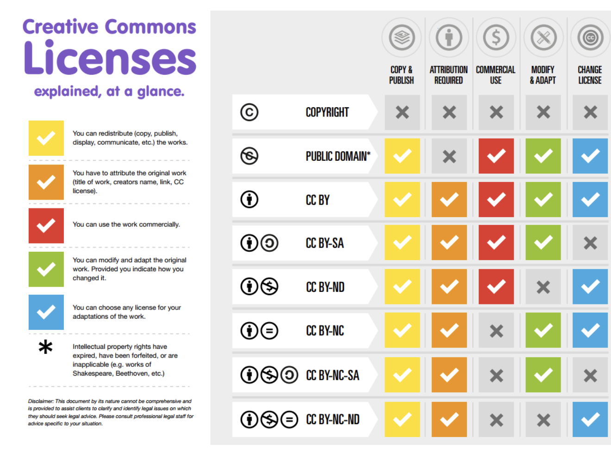

# Vertragsarten 

**WISSEN MACHT VERANTWORTLICH**

### Auftragsverhältnis

**Tätig werden im Interesse des Auftraggebers. Es ist kein Resultat geschuldet.**
- Kann grundsätzlich jederzeit beendet werden (OR 404). Achtung! Gilt jedoch nicht bei „atypischen“ Verträgen, wenn Kündigungsfrist vereinbart! (z.B. Support-Vertrag)
- Rechenschaftspflicht des Auftragnehmers. Er muss dem Auftraggeber aufzeigen, was er wann im Rahmen des Auftrags unternommen hat.
- Haftung für Handeln im Interesse des Auftraggebers. Aber keine Haftung für den Eintritt eines bestimmten Erfolges.

## Kaufvertrag

- Mobilien oder Immobilien aber auch Rechte (Markenrecht, Urheberrecht).
- Der Verkäufer muss der Eigentümer sein.

## Werkvertrag

**Unternehmer verpflichte sich zur Erstellung eines Werkes gegn Entgelt**
- Bestimmung des Preises: Fixpreis, nach Aufwand, Kostendach
    Was bei Überschreitung des vereinbarten preisen?
    - Kostendach gilt nur bei zu Beginn an klaren 
- Gewährliestungspflichten:
    - Abnahmeverfahren des Werkes in vereinbarter Qualität am Schlus
    - Garantie i.d.R. analog Kaufvertrag
- Rücktritt und Schadenersatz
    - Hat der Besteller ein Rücktrittsrecht während der Realisierungsphase?
    - **(Art. 377 OR) Wer bei iterativen/agilen Projekten eine Gesamtsumme vereinbart ist selber schuld...**

*Gewährliestungspflicht*: Garantie

## Auftragsverhältnis / Dienstleistungsvertrag

**Tätig werden im interesse des Auftraggebser. Es ist kein Resultat geschuldet**

- Kann grundsätzlich *jederzeit* beendet werden.
- **Rechenschaftspflicht** des Auftragnehmers! Er muss dem Aufgraggeber detailliert aufzeigen, was er im Rahmen des Auftrags unternommen hat.
- Hafrtung für Handeln im Interesse dess Aufgraggebers. Aber keine Hauftung für den Eintritt eines bestimmten Erfolges!
- Bei einer Einbindung von externen Enticklern in das Entwicklungsteam ist die Qualifikation als Aufgrag sinnvoll!

## Einzelarbeitsvertrag

- Inhalt & Abgrenzung zu Auftrag, Werkvertrag, Agenturvertrag, einfache Gesellschaft
- Arbeitnehmer, Selbständig (Auftrag/Werkvertrag) oder Scheinselbständig? Indizien für Anstellungsverhältnis:
	- regelmässige und dauernde Tätigkeiten für denselben „Auftraggeber“
	- Einordnung/Unterordnung in einer Projektorganisation des „Auftraggebers“
	- kein Tragen unternehmerischer Risiken
	- weder mit Kundenakquisition noch mit Projektmanagement befasst
	- dem Kunden gegenüber für Projektausführung und allfällige Mängel nicht verantwortlich
	- Inkasso nicht selbständig durchführen

## Zusammenarbeitsverträge

- Händlervertrag (Vertriebsvertrag)
- Agenturvertrag
- **(Achtung!) Einfache Gesellschaft** (Haftung)

## PERSONALVERLEIH (BODYSHOPPING/-LEASING)

- AVG (BG über die Arbeitsvermittlung und den Personalverleih)
- Bewilligungspflichtiges Gewerbe mit Pflicht zur Hinterlegung einer Kaution
- Regelmässig Fragen zu Weisungsrecht, Kündigung, Konkurrenzverbot

### Grattifikation

Zusätzliches Arbeitsentgelt **zusätzlich**, **nicht gesetzlich geregelt**

### Bonus

- Anspruch auf den variablen Lohn (Bonus), wenn dieser Berechenbar ist, maximal 5 Jahre rückwirkend.

### Überstunden

Die Stunden, die mehr gearbeitet werden, als im Arbeitsvertrag geregelt.

### Überzeit

Wenn mehr als 45 Stunden gearbeitet werden, dann sind diese als Überzeit geltend.

## Lizenzvertrag

Nutzungsrecht/"Miete"

- Sind gesetzlich (fast) nicht geregelt. Lückenfüllung falls notwendig i.d.R. aus Mietvertragsrecht, Auftragsrecht & Werkvertragsrecht.

- Weitere Anwendungsbereich: Software, Patente, Markenrechte, Urheberrechte, Nutzung von Plattformen, Vertriebsverträge, Kooperationsverträge etc.

### Typische Lizenzbestimmung

„Der Lizenzgeber gewährt dem Lizenznehmer ein **zeitlich unbegrenztes, nicht übertragbares, nicht ausschliessliches Recht**, den Lizenzgegenstand in der zum Zeitpunkt des Vertragsschlusses aktuellen Version zu nutzen.“

### Struktur

- Einleitung (um was geht es - Ziel)
- Grundlagen
- Lizenzgegenstand (Software)
- **Lizenzbestimmungen**
- Preis
- Escrow-Agreement
- Wartung Software
- Support
- **Gewährleistung** („Garantie“)
- Haftung
- Dauer und Beendigung des Vertrages
- Allgemeine Bestimmungen

### Haftung

- i.d.R. wird jegliche Haftung für Schäden im Rahmen des gesetzlich zulässigen (Art. 100 OR) ausgeschlossen! Verursacher haftet in solchen Fällen nur, wenn der Schaden grob fahrlässig oder vorsätzlich (mit Wissen & Wollen) verursacht wurde.

### Übliche allgemeine Bestimmungen

- Allfällige ungültige Bestimmungen sollen im Sinn der Fortführung des Vertrages ersetzt werden
- Ausschluss allgemeiner Geschäftsbedingungen (AGB)
- Schlichtungs-/Mediationsformel
- Anwendbares Recht und Gerichtsstand

### Open Source-Lizenzen

- Was, wenn verwendete Software-Module aus GitHub etc. stammen?
- Änderungen von Opensource-Lizenzen führen regelmässig zu Chaos…
- Unterscheidung zwischen strengen Copyleft- (z.B. GNU GPL oder SIK), Non-Copyleft- (z.B. Apache, MIT, BSD) & eingeschränkte Copyleft-Lizenzen (z.B. LGPL).
- Gefahr, dass die Verwendung von Software-Teilen/-Modulen unter strengem Copyleft bei einem kommerziellen SW-Produkt auf den Rest „durchschlägt“ und die Verwertung verunmöglicht/erschwert.
- Daher ist jeweils sehr sorgfältig zu prüfen, ob bei der SW-Entwicklung das Resultat Software- Module enthält, welche unter einer Copyleft-Lizenz stehen!
- Quellen:
    - https://opensource.org/licenses/category
    - http://www.gnu.org/licenses/licenses.html
