# Authentication

**CONFUSED DEPUTY PROBLEM**

The confused deputy problem refers to a situation where a trusted entity, acting on behalf of another, inadvertently performs malicious or unauthorized actions **due to insufficient or misapplied access controls**. It highlights the challenge of ensuring that a delegate, even when trusted, cannot be manipulated into acting against the interests of the entity it represents.

- Identifikcation: Who am I
- Authentifaction: Proof that i am me
- Authorization: What the user may do
- Audit traill: What the user has done

## Current recommendations for dealing with passwords

- change passwords if compromise is suspected
- Use a seperate password for each account
- change preset passwords
- secure screensavers with password
- do not send passwords in emails
- use long passwords
- use MFA if possible
- Use password managager and secure with master password

## Storing passwords

**HASH THEM**


## Cracking hashed passwords

- Try many differetn passwords, compute the hash and check if it matches any hash in the password file

-> **Users thend to pick simple passwords**

1. Start with a dictionary attack
2. Then try minor variations
3. Start with more random passwords

## Force attacker to crack each password individually: salting


## Peppering


## Password hashing

- Passwords have a **much smaller work factor** than 128 bits

### bcrypt

```
$2<algorithm>$<cost metric>$<22 character salt><31 character hash>

```

- algorithm is a, b, x, or y, indicating a bcrypt hash
- the cost metric c is an indication of how hard a hash is: hashing is iterated 2^c times
- the salt is a 128-bit salt
- the hash is a 192-bit hash
- encoded in not-quite-base64

### Argon2

- Argon2 won the Password Hashing Competition in 2015
- Can also be used as a key derivation function (password in, key out)
- Like bcrypt, can control execution time with parameter, "time-hard"
- Offers additional parameter that offers minimum guarantee of memory use (not just CPU time), "memory-hard"
- "GPU/FPGA/ASIC-unfriendly", no acceleration by dedicated hardware
- Several variants of Argon2
	- Argon2i: there seem to be "attacks" that, if successful, invalidate some of the guarantees w.r.t. memory and time complexity
	- Argon2d: no attacks known
	- Argon2id: no attacks known
- Standardised as RFC9106

## MFA - Multi Factor authentication

- Password + SMS/Token
- Does not prevent inline attacks, where websites are faked / e.g. interact with the real website

## Passwordless authentication

Passwordless authentication is based on the cryptographic methods public key cryptography and digital certificates.

**A cryptographic key is released by a biometric factor which is then used for the login.**

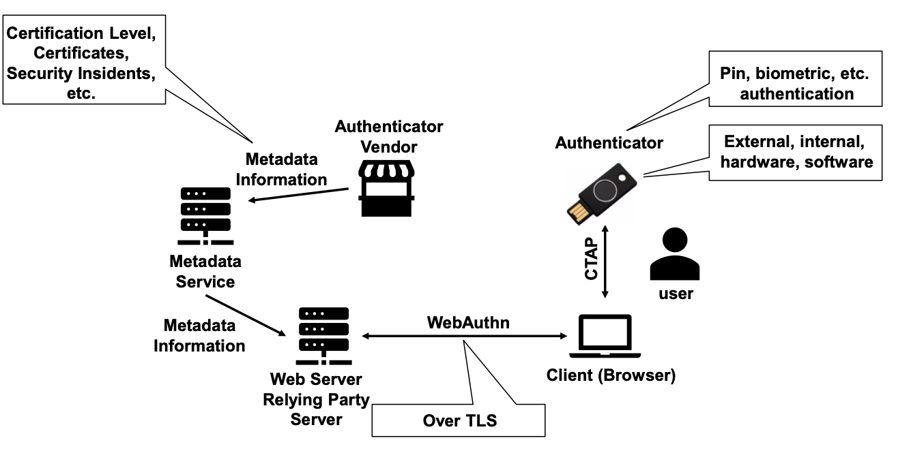

### Registration flow

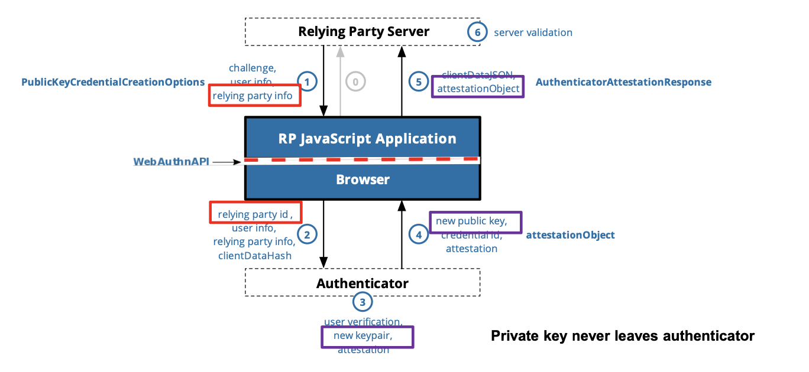

### Authentication Flow

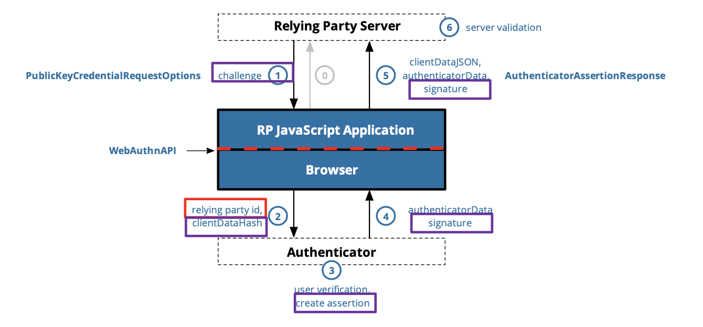

## User Authentication Protocols

Define the procedures and messges needed to authenticate users

### Direct user authentication

- User contacts a host/server and sends it the credentials
- Host/server has all information to authenticate the user
- Example: local or remote login on a server

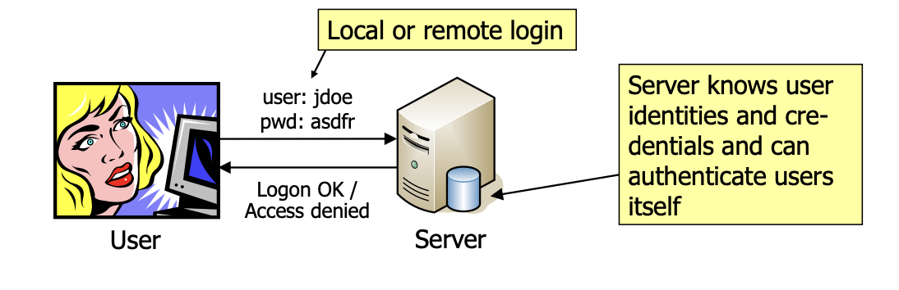

- Requires configuring authentication mechanisms and credentials **directly on every server**
	- OK for small sites: **does not SCALE WELL** with larger environments
- Remote login: make sure no passwords are transmitted in the clear

### Indirect user authentication

- User contacts a host / server and sends it the credentials
- Host/server does not directly authenticate the user
- To authenticate the user, an additional **authentication server** is used
- Examples: RADIUS, NTLM, Kerboros, Shibboleth, SAML, OpenID connect

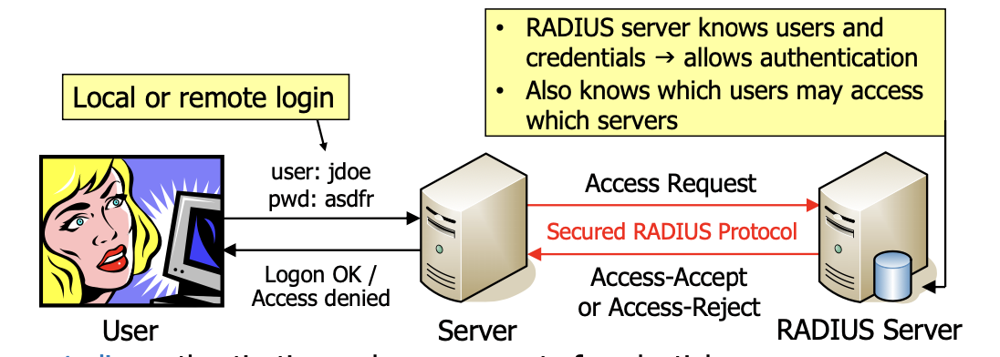

- Allows to **centralize** authentication and management of credentials
	- Scales much better with larger environments and allows Single Sign-On
- Orignially developed for **dial-up remote access**, now also used by WLAN access points, ethernet swichtes, VPN servers, SSH servers
	- AP/switch/VPN server/ SSH server sends user information to a **RADIUS server** which authenticates the user and grants/rejects access
	- Using **EAP over RADIUS**, a multitude of authentication methods are suppoerted

### Single Sign On (SSO)

- Use on identity (one login) for several applications
- Benefits
	- Comfort for user (does not have to remember several passwords)
	- Since no credentials are stored with applications, they cannot be stolen
- Drawbacks
	- If credentials are stolen, they can be used for many applications
	- If the cenral authentication system breaks, users cannot log into any application
	- Central authentication systems knows all activities of the user

#### Kerberos

- Over a LAN in a single company
- Used with active directory

#### SAML

- Over the Intenet between different companies
- Vendor independent
- Web apps

#### OpenID Connect

- Over the Internet between different companies
- Vendor independent
- Web Apps, Mobile Apps, APIs

## OpenID connect mit 0Auth 2.0

### 0Auth 2.0

- Framework for authorization (not authentication)
- Goal: Allow authorization via APIs without sharing passwords
- Standardized in RFC 6749 and RFC 6750

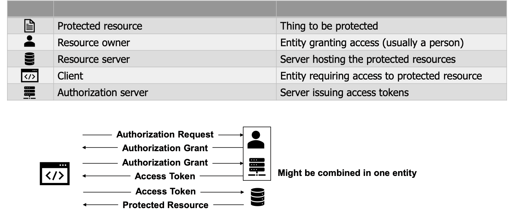

#### Critisism

- The protocol is so complex that it is basically impossible to implement securely
	- Too many compromizes during development
	- Very extensible and flexible
	- Difficult to achieve interoperability

### OpenID Connect

- Authentication protocol based on 0AUth 2.0
	- User authentication
	- Sharing of profile information
- Goal: use a single login for different sites
- Removes need for managing passwords in applications
- Developed by a dedicated organization
- Protocol used by social ID provider such as google, microsoft, amazon, etc.
- Supports
	- Browser-based applications
	- Mobile applications
	- API
- Uses JSON/REST protocol

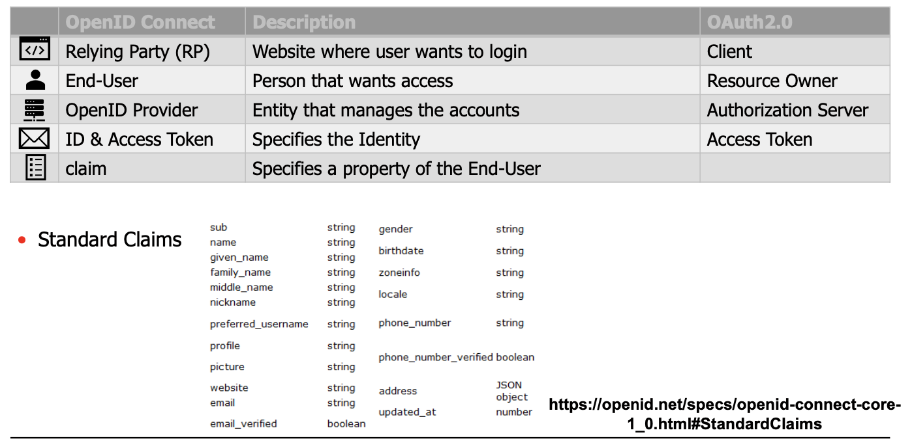

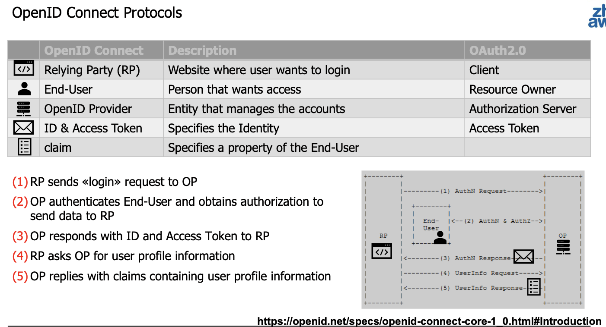

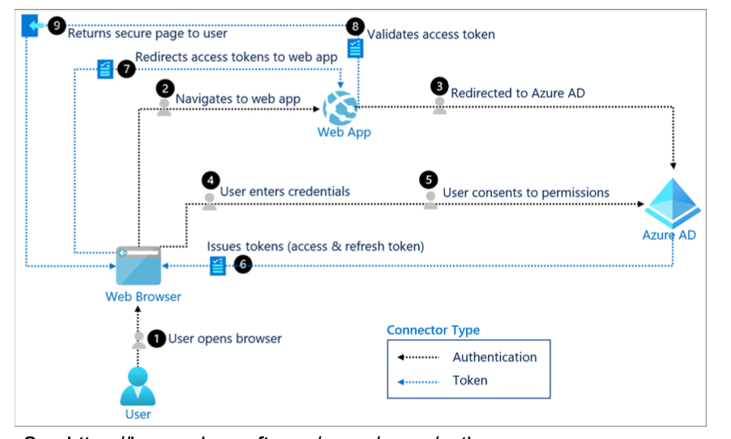


## SAML - Security Assertion Markup Language

- Provides Single Sign On (SSO) for web applications
- Used for browser based applications
	- No support for mobile devices
	- No support for API access
- very flexible protocol
	- assertions written in XML
	- can exchange anything that can be represented in XML (as long as sender and receiver know how to parse it)
- XML is relatively heavy weight (as compareed to JWT used in OpenID connect) and not supported on mobile applications
- Focus more on enterprise environments


### Differences

- OpenID Connect
	- Light weight JWT
	- Supports web, mobile and API
	- Encryption based on HTTPS connection
	- Easier to implement
	- Newer, still evolving protocol
	- Only asserts identity (no permissions)
	- User can choose which attributes (claims) to give to the relying party
- SAML
	- Heavy weight XML
	- Supports web applications
	- Encryption is part of SAML
	- More difficult to implement
	- Older, established standard (2005)
	- Allows for permissions to be transfered from IdP to SP
	- Implementation decides which attributes are given to relying party

## Kerberos

- User authentication in IP networks
- Use a secret key cryptorgraphy

### Details

- Participant is called a principal
- Each principal shares a common secret (the principal's master key) with a centrealized server: the **Key distribution center KDC**
- All principals trust the KCD; the principals and the kdc form a **realm**
- when two principals want to communicate, authentication and session key distribution is done **via the KDC**
- Kerberos uses a **ticket-based approach**
	- A principal that wants to access principal B asks the KDC for a ticket
	- This ticken can then be used by A to get access to B


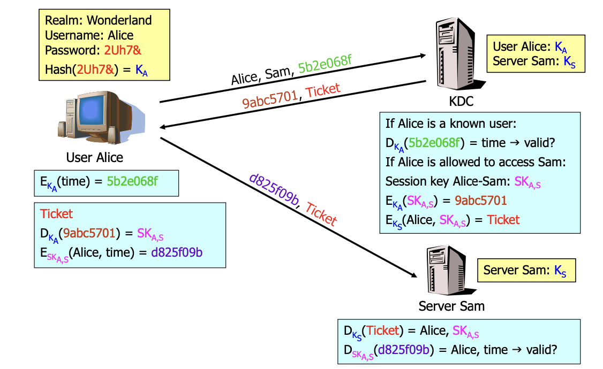

- In reality, the KDC is split into two separate services
- The **Authentication Service (AS)** authenticates users
	- User receives a Ticket-Granting Ticket (TGT)
	- Ticket is valid for a specified lifetime (e.g. 12 hours to cover a workday)
	- Usually only needed once per workday just after logging in
- The Ticket-Granting Service (TGS) issues tickets to access services
	- To access the TGS, the user needs a TGT from the AS
	- Tickets have a lifetime and can be reused if a service is accessed repeatedly
	- Therefore, the TGS must usually be contacted once per workday for each service used
- Often, AS and TGS are provided by a single physical server
- Timestamps are used in both directions between client and AS, TGS and servers
	- This enables authentication and replay attack detection in both directions

### Security Analysis

- Kerberos version 5 is considered to be secure
	- No passwords are transmitted in the clear
	- Timestamps prevent replay attacks and enable mutual authentication
	- At the end, user and server share a key to protect the communication
	- But: the users' master keys are still derived from their password  offline attacks possible if passwords are weak
- Kerberos requires a reasonably synchronised time among the participants
	- Because replay attacks are detected based on timestamps
	- In practice, timestamps of the clients are accepted during a certain time window around the time of the servers (e.g. +/- 1 minute)
	- In addition, received messages must be stored on the server while their timestamps are still valid to detect replayed messages

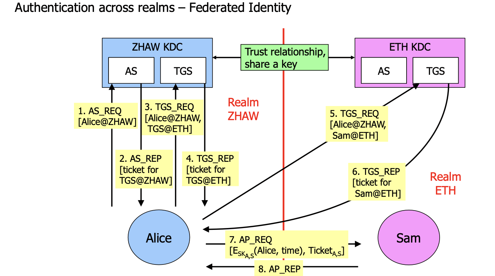

## Shibboleth

- Shibboleth is a system for federated identity management
- Federated identity management: Identity information is managed and used across multiple security domains
	- Security domains: Individual organizations, e.g. universities (ZHAW, ETH...)
	- A federation is a collection of security domains that agree to interoperate
- Basic idea:
	- Every user has one credential (e.g. username / password) that is stored and managed by his home security domain
	▪ E.g. by the ZHAW for ZHAW students
	- Authentication always happens in the home security domain, which issues a token to access a service in another security domain
	- The token does not necessarily have to contain the user's identity
	▪ Sometimes, information such as «is a ZHAW student» or «is above 18 years» is enough -> privacy preserving authentication is possible

### security analysis

- In general, Shibboleth is considered secure, provided that HTTPS is used on all communication links
- Shibboleth has several similarities to Kerberos across KDCs:
	- Authentication is done by the organization where the user is at home: IdP ≡ Authentication Service
	- Access to the resource is protected by the organization of the service: Service Provider ≡ Ticket-Granting Service / Server
	- Tokens are provided by the home organization and interpreted by the organization of the service: Assertion & Attribute Statements ≡ Tickets
	- Trust between IdPs and service providers ≡ Trust between KDCs
- But Shibboleth is based on different technologies than Kerberos: HTTPS, SAML / own Kerberos protocol
	- And Shibboleth uses public key cryptography