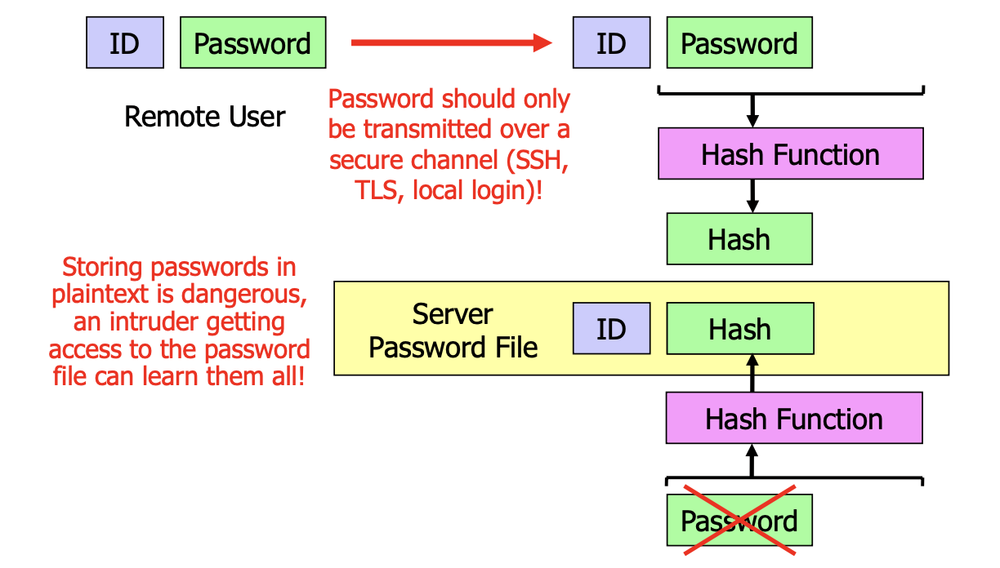
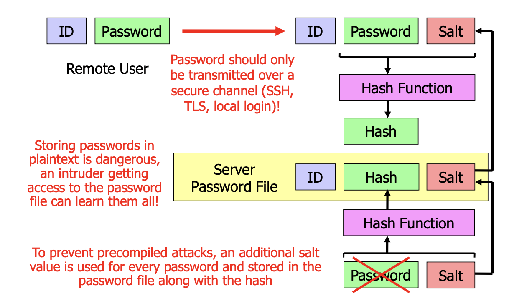
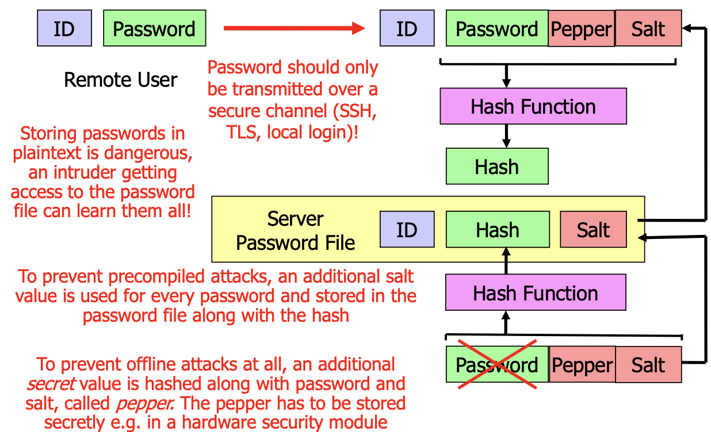

# Authentication

**CONFUSED DEPUTY PROBLEM**

The confused deputy problem refers to a situation where a trusted entity, acting on behalf of another, inadvertently performs malicious or unauthorized actions **due to insufficient or misapplied access controls**. It highlights the challenge of ensuring that a delegate, even when trusted, cannot be manipulated into acting against the interests of the entity it represents.

- Identifikcation: Who am I
- Authentifaction: Proof that i am me
- Authorization: What the user may do
- Audit traill: What the user has done

## Current recommendations for dealing with passwords

- change passwords if compromise is suspected
- Use a seperate password for each account
- change preset passwords
- secure screensavers with password
- do not send passwords in emails
- use long passwords
- use MFA if possible
- Use password managager and secure with master password

## Storing passwords

**HASH THEM**

## Cracking hashed passwords

- Try many differetn passwords, compute the hash and check if it matches any hash in the password file

-> **Users thend to pick simple passwords**

1. Start with a dictionary attack
2. Then try minor variations
3. Start with more random passwords

## Force attacker to crack each password individually: salting

## Peppering

## computational effort

TODO