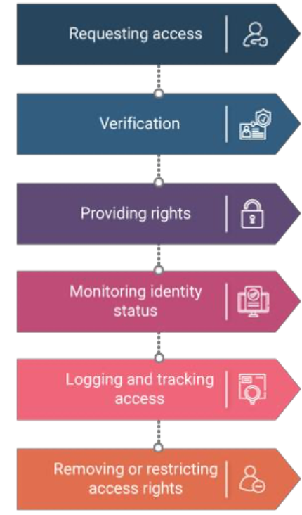
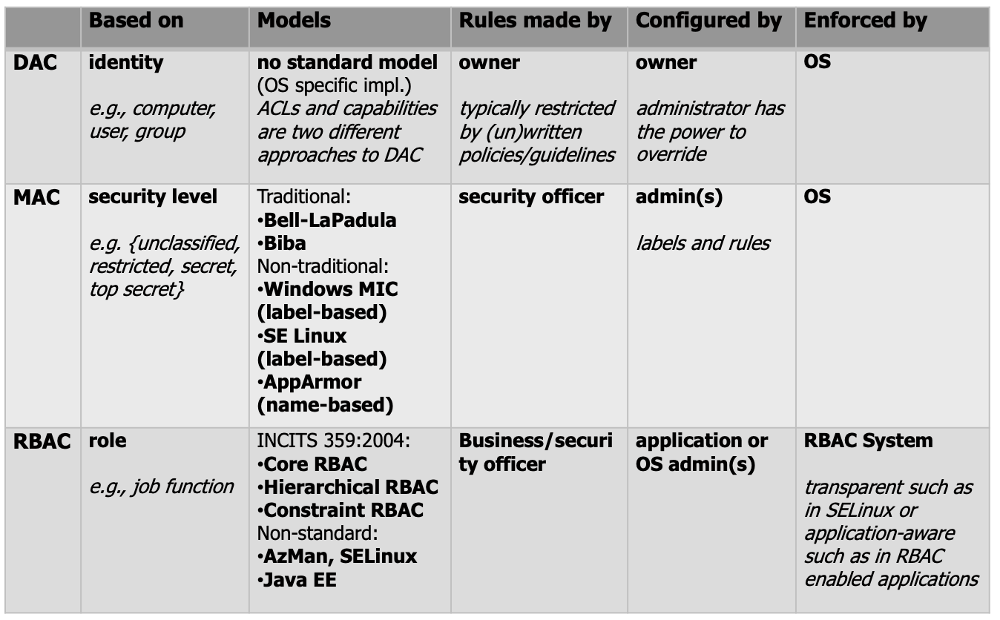

# Authorisation

Process of establishing whether a **subject** is allowed to **access** or generally perform some sort of operation on **objects**

- After successful authentication
	- The system must determine whether the user is **authorized** to access a particular resource to perform a specific operation (e.g., read the file example.txt)
- Authorization is a core component of every **operating system**
- In addition, authorization can also be performed by **aplications or security add-on packages**

## Security policy

- Defines who is allowed to do what
- To specify the right level of access, a security policy should be **flexible**  with respect to configuration and allow access based on **different criteria**
	- the job function of a subject
	- the group to which a subject is assigned
	- the time of day of physical/location of a subject
	- the transaction/operation type
- who defines / implements a security policy?
	- the **business** (e.g., application/data owners) should (must!) determine who (users, groups, roles, ...) must be allowed what access
	- The **security administrator** implements the policy to fulfill the requirements

### Security Policy Drivers

- The following drivers determine the content of a security policy
	- **business drivers** lower the cost of managing permissions or minimize the amount of time users are without their necessary permissions
	- **security drivers**: ensure information security, integrity, and availability
	- **regulatory drivers**: forced upon enterprises to comply with regulations

### Authorization creep

- User's access needs are not static
	- moving jobs inside a company
	- For each new position they get additional access rights
	- ... and for simplicity reasons don't give up their old access rights

### Access Managemnt process according to ITIL

- ITIL (Information Technology infrastructure library)
- Best practice and de-factor standard in the area of IT-Service-Management
- Definition of a management process for identity and access management
- The last step "removing or restricting access rights" is often neglected

# Discretionary access control (DAC)

- Basic idea: The control of access is based on the discretion of the
owner of an object
- The owner of the object (e.g., a file) controls which subjects (user,
computer, group,…) can have access to it and to what degree
- The owner of an object is typically the user who created the object
- Most modern OS are based on DAC
	- e.g., Windows, Linux, Mac OS, Android,... 
- To make DAC-based systems administrable, they typically include a
user that can bypass the restrictions, e.g.:
	- User root on Linux/Unix systems (which simply bypasses DAC)
	- Administrator account on Windows (which is basically just a user with additional special privileges)

| Bypassing | Additional priviliges |
|-----------|-----------------------|
| Linux | Windows |
| It is not possibel to deny access to root | Access denied to admin user by DAC |
| root has always full access | Admin user can rewrite DAC, but this wil be logged |
| No possibility for prevention of "accidental/malicious" access through root | Admin user can give himself exactly the rights required, E.g. delete but not read (if supported by security mechanisms) |

## Standard Unix Permissions

Levels:

- No access
- Execute (x)
- Read (r)
- Write (w)

| String representation | numerical representation | single number representation |
|-|-|-|
| --- | 000 | 0 |
| --x | 001 | 1 |
| -w- | 020 | 2 |
| -wx | 021 | 3 |
| r-- | 400 | 4 |
| r-x | 401 | 5 |
| rw- | 420 | 6 |
| rwx | 421 | 7 |

Seperated into **user, group, others** (--- --- ---)

# Mandatory Access Control (MAC)

- Access control is **mandated** by the system: A **system-wide policy** determines who is allowed to do what on the system
	- Individual user cannot alter this (in contrast to DAC)
	- The policy is configured by a (security) policy administrator

- Typically **only used for critical parts** of the system

## Integrity Levels (IL)

Are assigned to processes and objects

**TYPES**

- Installer
- System (OS processes)
- High (Administrators)
- Medium (Non-Administrators)
- Low (temporary internet files)
- Untrusted (logged on anonymously)

- Processes usually inherit the integrity level of the process that spawned it
	- But a process can start another process with reduced IL

# Role-Based Access Control (RBAC)

Unlike DAC and MAC, RBAC mechanisms are typically **not provided by the operating system**

- In a RBAC system, access control decisions are based on the role(s) a user has within an organization
- A role defines a set of transactions allowed for its members
	- Membership in a role is granted and revoked by a central authority
- Formally, a transaction is a transformation procedure (a program or a portion of it such as a method) plus a set of associated objects

## Security Principles

- Principle of least privilege (or authority)
	1. Define roles that reflect the actual roles/jobs in your company
	2. Determine the minimum necessary set of transaction/tasks (privileges) for each role that must be allowed, and
	3. restrict a user to one or more roles that fit to his actual job duties and nothing more
- Seperation of duties
	- For example, requiring an accounting clerk and account manager to participate in issuing a check -> These two roles must be mutually exclusive
- Data abstraction
	- Permission can be defined at a higher level (transactions) rather than attempting to administer lower-level access control mechanisms directly (e.g., access control lists, capabilities) on an object- by-object basis

