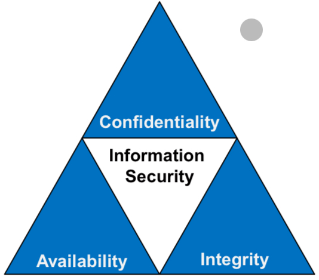
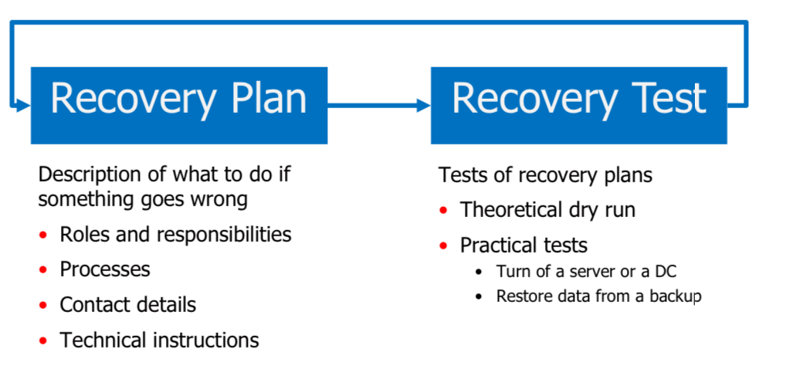

# Business IT Risks

Mit AdHoc Methoden sind Systeme nicht genügend geschützt. Diese Massnahmen müssen systematisch aufgebaut werden. 

## Risks
- Ransom Demand
- Fraud
- Esponiage
- Violation of Regulations
- Misuse of Computing Resources
- Reputation Loss

### System Outage
- Max outage: 7 days
- Mostly critical for not prepared businesses

### Sabotage
- Sabotage von physischen Geräten

### Brand Misuse
- Werbung von bekannten Unternehmen

### Data Loss
- Unabsichtlich, durch schlecht gesicherte / backupte Ordner
- Meistens durch interne Mitarbeiter, die aufräumen wollen

# CIA Triade

Grundpfeiler von sicheren Systemen.
- Daten sind vertraulich
- Daten sind nicht beschädigt
- Systeme sind verfügbar

## Impact of Data Availability
| | Physical | Virtual |
|--|--|--|
| Accidental | - Natural disaster (fire, water, earthquage)   - Construction sites   - Hardware failures | - Unintentional missconfiguration   - Sotware failures |
| Malicious | - Vandalism   - Sabotage | - Ransomeware   - Distributed Denial of Service (DDoS) |

## Gegenmassnahmen

Die Gegenmassnahemen können in folgende Kategorien aufteteilt werden.

### Disaster Recovery
- Offlince backup solutions
- Restoring from images

### Access Control
- Restricted Access Rights
- Multi-Factor-Authentication
- Firewalls
- Traffic Management Solutions

### Physical Protection
- Physical Access Control (locks, fences, etc.)
- Fire protection (Alarm, Dry Sprinklers)
- Monitoring (CCTV, Guards, etc.)

### Training and Processes 
- Employee Training
- Four eyes principle
- Automation of routine processes
- Monitoring
- Preventive maintenance

### Redundancy
- Uninterruptable power supply
- High-Availability setups
- Reduntant data center
- Reduntant network connections

## Business Continuity Management

