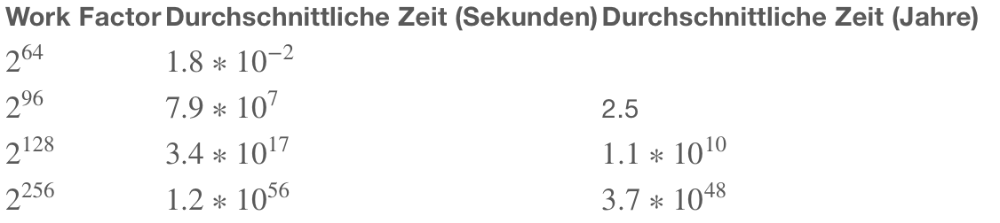
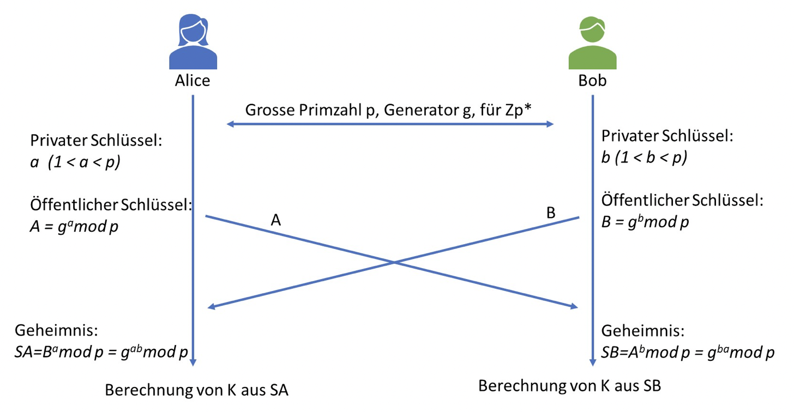

# Kryptographie

## Attacken

### Ciphertext-only attack

Der Attacker kann vom Ciphertext alleine Rückschlüsse auf den Plaintext oder den verwendeten Schlüssel ziehen.

### Chosen-ciphertext attack

Der Attacker kann Ciphertexte generieren und diese vom System entschlüsseln lassen. Der Attacker bekommt entweder den zum gewählten Ciphertext gehörenden Plaintext (und kann daraus potenziell Rückschlüsse auf den verwendeten Schlüssel machen) oder er bekommt nur Teilinformationen, wie zum Beispiel "Die Entschlüsselung konnte / konnte nicht durchgeführt werden".

### Known-plaintext attack

Der Attacker kennt sowohl Teile des Plaintext als auch den dazugehörenden Ciphertext (oder zumindest Teile davon). Er kann daraus Rückschlüsse auf andere Plaintexte oder gar den Schlüssel machen.

### Chosen-plaintext attack

Der Attacker kann Plaintexte wählen, welche er vom System verschlüsseln lassen will. Er erhält dann den dazugehörenden Ciphertext und kann daraus Rückschlüsse auf andere Plaintexte oder gar den Schlüssel machen.

### Brute-force attack

Der Attacker probiert alle möglichen Schlüssel aus, bis er den richtigen gefunden hat. Dass er den richtigen gefunden hat, erkennt er daran, dass der erhaltene Plaintext sinnvoll erscheint.


## Work Factor

Durschnittliche Anzahl Versuche, bis der richtige Schlüssel gefunden wird.

### Verschlüsselungsalgorithmus

Je nach verwendetem Algorithmus ist die Berechnung des Work Faktors anders. Wir werden in den entsprechenden Kapiteln jeweils den dazugehörenden Work Faktor auflisten.

### Schlüssellänge
Grundsätzlich gilt: Je länger der Schlüssel, desto höher der Work Faktor
Zufälligkeit des Schlüssels

### Zufälligkeit des Schlüssels

Der Work Faktor von einem Algorithmus mit einem Schlüssel fixer länge, ist dann maximal, wenn alle Schlüssel gleich wahrscheinlich sind. Sind die Schlüssel nicht gleich wahrscheinlich, wird der Attacker zuerst die wahrscheinlicheren Schlüssel ausprobieren und so durchschnittlich weniger Schlüssel ausprobieren müssen, bis er den richtigen Schlüssel gefunden hat. Daher ist es sehr wichtig, dass die gewählten Schlüssel immer zufällig sind.
Dies ist aber leider, gerade zum Beispiel bei Passwörtern, nicht immer der Fall. Wird zum Beispiel ein Wort von einem Wörterbuch als Passwort gewählt, kann das Wort noch so lange sein, der Attacker muss im Mittel nur die Hälfte der Wörter im Wörterbuch ausprobieren, bis er das richtige Passwort gefunden hat. In der Regel sogar noch weniger, da manche Wörter häufiger gewählt werden als andere. Der Attacker würde also mit häufigen Wörtern anfangen.



## Hashfunktionen

Unter einer kryptographischen Hash Funktion versteht man eine mathematische Funktion mit folgenden Eigenschaften:

1. aus einem beliebig langen Input wird ein Output mit konstanter Länge generiert.
2. es gibt keine Möglichkeit aus dem Output den Input wieder herzuleiten.
3. unterschiedliche Inputs ergeben mit sehr hoher Wahrscheinlichkeit völlig unterschiedliche Outputs,
auch wenn sich die Inputs nur wenig unterscheiden.
4. Es ist nicht innert nützlicher Zeit möglich zwei unterschiedliche Inputs zu generieren, welche denselben Output haben

| Funktion | Hash länge | work factor |
|----------|------------|-------------|
| MD5 | 128 bit | 64 bit |
| SHA-1 | 160 Bit | 80 bit |
| SHA-2 | 224 - 512 Bit | 112 - 256 bit |
| SHA-3 | 224 - 512 bit | 112 - 256 bit |

64 Bit is nicht mehr ausreichend

## Public Key

- Der öffentliche Schlüssek Kpub und der private Schlüssel Kpriv bilden eine Einheit. Eine mit Kpub verschlüsselte Nachricht kann mit dem dazugehörigen Kpriv wieder entschlüsselt werden und umgekehrt
- Den öffentlichen Schlüssel dürfen **alle** kennen. Der private Schlüssel muss **geheim** gehalten werden.

### Work Factor

- ist dann am grössten, wenn alle Schlüssel gleichverteilt ist. Da dann alle Schlüssel theoretisch geprüft werden müssen

**klassische Algorithmen**

- 4096 bit => 128 bit work factor

**Algorithmen mit elliptische Kurven**

- 256 bit => 128 bit work factor
- 512 bit => 256 bit work factor


## Diffie-Hellman Key Exchange

Ist nur dann sicher, wenn der Angreifer die Nachricht nicht verändern kann. Um dem entgegen zu wirken, muss eine Nachricht noch signiert werden.



```python
p = 7
g = 5
a = 3
b = 4

# Alice public key
A = g**a % p

# Bob public key
B = g**b % p

# Secret Alice (SA1 = SA2)
SA1 = B ** a % p
SA2 = g ** (a*b) % p
print (f"secret alice: {SA1 == SA2}, {SA1}")

# Secret Bob (SB1 = SB2)
SB1 = A ** b % p
SB2 = g ** (b*a) % p

print (f"secret bob: {SB1 == SB2}, {SB1}")
```

## RSA

$e$: public key exponent, usually set to 65537
$d$: private key exponent
$n$: Modulus, grosse Primzahl. Die Länge von n entspricht der Schlüssellänge

- Verschlüsselung: $c = p^3 mod n$
- Entschlüsselung: $s = p^d mod n$
- Verifikation: $p = s^e mod n$

| Abkürzung | Bezeichnung |
|-----------|-------------|
| DH | Diffie-Hellman |
| DHKE | Diffie-Hellman Key Exchange |
| ECDH | Elliptic Curve Diffie-Hellman Key Exchange |
| ECC | Elliptic Curve Cryptography |
| ECDSA | Elliptic Curve Digital Signature Algorithm |
| EdDSA | Elliptic Curve in Edward Form Digital Signature Algorithm | 
| PKCS#1 | Algorithmus zur Signatur Generation basierend auf RSA |


