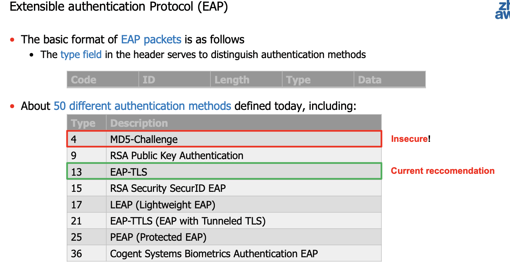
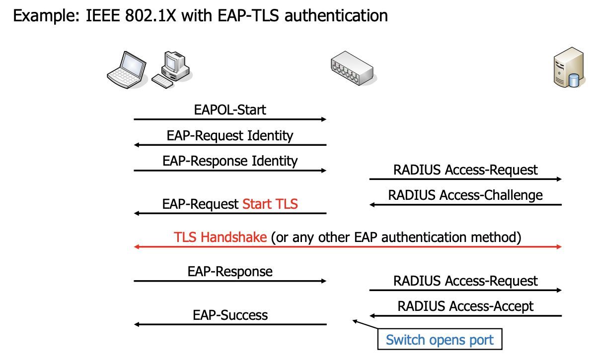
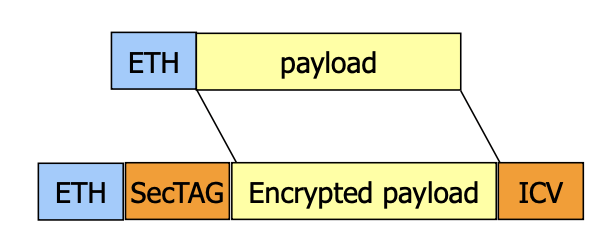
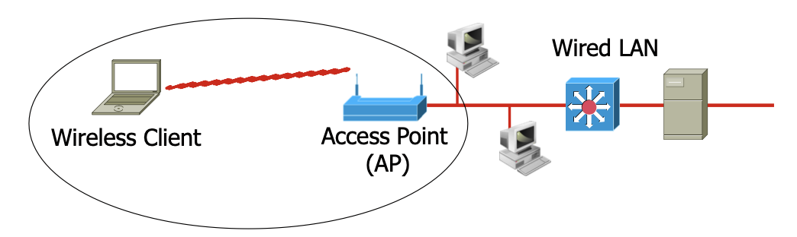
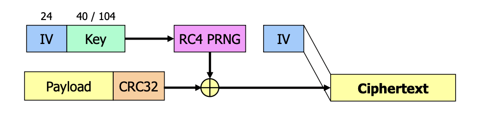
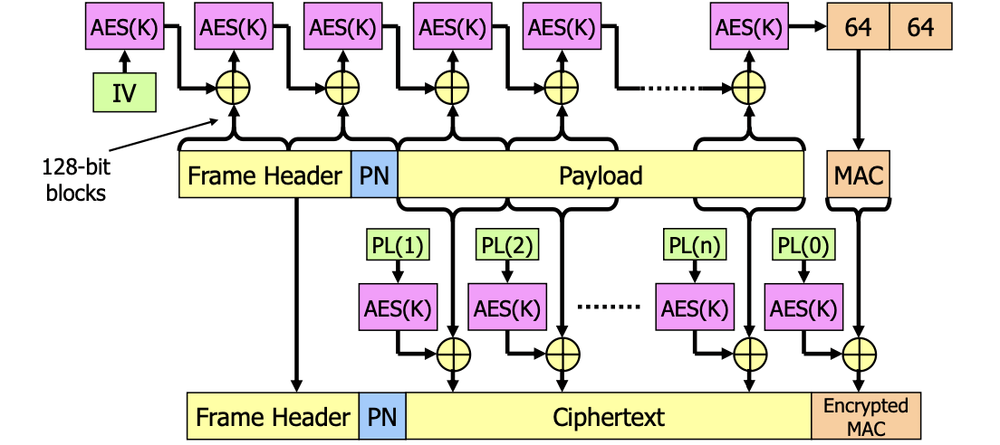

# Layer Security

| Layer | Protocol(s) |
|-------|-------------|
| Application Layer | PGP, S/MIME |
| Transport layer | TLS |
| Network layer | IP Security (IPsec) |
| Data Link (Medium Access) Layer | EAP, 802.1X, WEP, WPA, WPA2/802.11i |
| Physical Layer | Quantum cryptography |

# Data Link Layer Security

- Use Cases for Encryption at Layer 2
	- Wired networks
		- Somewhat protected since physical access for packet sniffing required
		- Encryption at layer 2 protects sensitive (legacy) applications that do not use secure protocols
		- Second layer of defence in regulated environments
	- Wireless networks
		- Packet sniffing does not require physical access
		- Encryption at layer 2 protects sensitive (legacy) applications that do not use secure protocols
		- Always use encryption at layer 2 in wireless networks!

- Authentication at Layer 2
	- You want only authentic users to use your network
	- The Extensible Authentication Protocol (EAP, RFC 3748) is the most relevant standard in this context

## Extensible Authentication Protocol (EAP)

- Current reccomendation: EAP-TLS

## IEEE 802.1X: port-based access control

- Applicability
	-Protect Network from unauthorized access (e.g. someone plugging in a device)
		- Especially useful for publicly accessible network sockets, e.g., in open office space, super markets, etc.
	- Centralized assignment of VLAN IDs to clients
		- Depending on who you are, you will be assigned to a different VLAN (Virtual Local Area Network)

- Authentication
	- The standard is one of the most important applications of EAP
	- Switch delegates authentication to authentication server (RADIUS Server)
		- The switch / access point merely relays the EAP protocol messages

### Working

- A client connecting to a port of the switch is first blocked, only EAP messages are accepted
- The authenticator relays all EAP messages between the client and the RADIUS server
	- The RADIUS protocol is secured using pre-shared keys  authenticity and confidentiality between authenticator and RADIUS server
- A client gets full network access when the authenticator has received the «authentication successful» message from the RADIUS server
- RADIUS server can send additional data such as the VLAN ID to be used for the specific client

#### Security Analysis

- It protects against someone plugging in an unauthorised device
- That means that an adversary is assumed to have physical access
- Once you have physical access to a switch that has an authorised device plugged in, getting access yourself is pretty easy, e.g.:
	1. Obtain device with two network interfaces ("attacker")
	2. Insert attacker between legitimate device ("client") and switch
	3. Enable layer-2 bridging to make client complete 802.1X authentication (just forward frames between switch and client)
	4. Once that is done, monitor network traffic to obtain parameters (network address, netmask, …) and configure attacker's interface
	5. If attacker wants to send own frames, put client's MAC address in
	6. Profit!
- Solved in 802.1X-2010 with the use of MACsec

## MACSec (IEEE 802.1 AE)

- Confidentialiy and integrity/authenticity on Layer 2 (Ethernet)
	- secure all data including DHCP, ARP, and any higher layer protocols
	- Physical and virtual link
	- Between two network devices
	- The data is not encrypted on the network device itself

- Speed
	- Lane rate encryption with HW pure HW implementation
- Cryptography
	- Key Management According IEEE 802.1X (EAP-TLS) or pre shared keys
	- Cipher: GCM-AES-128 (GCM-AES-256)
- Packet format
	- SecTAG: pointer to key, packet number for IV
	- ICV: Integriy Check Value (MAC) based on GCM-AES

## Medium Access Layer Security of IEEE 802.11 WLANs

- IEEE 802.11 WLANs ("WLANs") are used everywhere today, also in companies

- A typical WLAN usage scenario is as follows:

- The basis is a wired network
- one or more acces points (APs) are used to enable wireless access to the network
- Wireless devies connect to the network via the access point

### Security Concerns with wireless networks

- There is no cable -> **sniffing packets is very easy** -> data should be encrypted
- I only want **legitimate people to use my access point** (and be part of my network) -> some sort of authentication needed
- This should happen at the layer 2, so any data exchanged between clients and AP is protected
- Even with security mechanisms available, they are sometimes not enabled -> there are (still) a few open APs available
- IEEE 802.11 WLANs have **already quite a security history**:
	- Original attempt: Wired Equivalent Privacy (WEP) -> has several major design flaws
	- Wi-Fi Protected Access (WPA) as a «quick fix» because developing the official successor of WEP (IEEE 802.11i) took so long
	- IEEE 802.11i (usually named WPA2) as the official successor of WEP
	- WPA3

## WLAN "security" with wired equivalent privacy (WEP)

- The AP and all clients share **preconfigured long-term key**
	- This key is used to **encrypt** individual frames
	- Since all clients use the smae key, every user (who knows this key) can read the traffic of every other user
- The length of the key is eitehr **40 or 104 bits**, encrzption uses RC4
- Key is often specified by entering **5 or 13 ASCII** characters or **10 or 26 HEX** symbols
	- Make sure the key is **random** and not based on common words, as this may allow to get the key with a dictionary attack

### Frame protection in WEP

- CRC checksum protects the payload integrity so the recipient can detect if an encrypted frame was modified in transit
- 40-bit keys have too low work factor, even when chosen randomly
- 104-bit keys are also on the very low end, but much better  brute force attacks very hard
- Unfortunately, even with 104-bit keys, **WEP is totally insecure**
- The reason is that with a 24-bit IV and a constant key, the RC4 PRNG only generates 224 =
16'777'216 different keystreams
- -> We do **not attack the key, but the different keystreams!**

## Wifi Protected access (WPA)

- There exist two versions of Wi-Fi protected access: WPA and WPA2
	- WPA is an industry standard that emerged because developing the official successor of WEP (IEEE 802.11i) took so long
	- WPA2 corresponds to the IEEE 802.11i standard
- A fundamental difference to WEP is that in WPA/WPA2, clients first have to authenticate
themselves at the access point
	- There are two options to authenticate the clients:
		- With port-based network access control according to IEEE 802.1X
			- Using a RADIUS server and EAP (often EAP-TLS or PEAP)
			- WPA-Enterprise
	- Using a Pre-shared key (PSK) among all clients and APs
		- Suited for small and home offices (SOHO)
		- WPA-Home
- During authentication, a key exchange takes place between the client and the AP -> each client uses its own key material
	- Users cannot read the unicast data of other users (unlike WEP)

### WPA Details

- Key exchange between client and AP:
	- Two 128-bit unicast keys for encryption and integrity protection (unique per client and session)
	- Two 128-bit broadcast keys for encryption and integrity protection (the same for all clients)
	- Periodic re-keying, typically after one hour (avoid IV wrap around)
- Both standards define two encryption modes: TKIP and CCMP
	- Support of CCMP is optional in WPA while it is the default in WPA2
- Temporal Key Integrity Protocol (TKIP):
	- For each frame, generates an individual encryption key
	- This key is used to initialize RC4, which is used to encrypt the frame
	- Authenticity/integrity: A MAC using the Michael algorithm is appended
- Counter Mode CBC-MAC Protocol (CCMP):
	- Based on the Advanced Encryption Standard (AES)
	- This mode guarantees confidentiality and authenticity/integrity

### Temprorary Key Integrity Protection (TKIP)

- Introducing a MAC to protect the integrity is certainly a good idea
	- This should prevent attacks against the integrity of the frames that are possible in WEP
- But: TKIP makes use of algorithms with well-known weaknesses
	- RC4 has shown significant weaknesses during the past years
	- Unlike typical MAC algorithms, Michael is not a one-way function: An attacker can learn the integrity key if he knows the plaintext and the MAC
- As a result, several practical attacks have been discovered
	- Injection of frames that have a valid MAC after decryption
	- Attack to decrypt all traffic towards the client
	- Denial of Service attack requiring 2 packets per minute only
- Main reason for using RC4 and Michael was performance and (to some extent) backwards compatibility with devices designed for WEP

### Insecurity

- So we have weaknesses in WEP (since 2000) and WPA/WPA2 with TKIP (since 2008)– so these standards are probably no longer supported in new access points and clients...
	- Nope: WEP and TKIP are still supported in many cases
	- The only noteworthy change was that the Wi-Fi Alliance requires (since 1.1.2014) that WPA must support CCMP in new Wi-Fi certified access points (before, this was only required with WPA2)
- That's a very typical problem with insecure communication protocols: They are often supported for a long time even after they are known to contain weaknesses and even if secure replacements are available
	- One important reason for this is backward compatibility with older devices
- To be on the safe side, make sure your access points uses at least WPA2 with CCMP
	- If you have clients that don't support this, it's a good time to get rid of them...
- The current standard is WPA3 (released in 2018)
	- Improved authentication (with SAE Simultaneous Authentication of Equals) to prevent offline password cracking
	- Removed support for insecure protocols (e.g., SHA1, MD5)

## Counter-mode CBC-MAC Protocol (CCMP)

- CCMP = Counter Mode CBC-MAC Protocol
	- A cipher mode that uses a block cipher to achieve encryption, authenticity, and integrity protection
	- Like Galois/Counter-Mode (GCM), it is therefore an Authenticated Encryption mode
- In WPA/WPA2, CCMP is used with AES and 128-bit keys
- WPA2 always supported CCMP, in WPA this was optional before 2014
- Unlike TKIP, CCMP is considered secure
	- No weaknesses are known which make it insecure in practice

### Inner workings

- PN (packet number) is an 48-bit value, incremented for each frame
- IV is based on PN  MAC computation is always freshly seeded
- AES(K) means AES used with the established 128-bit encryption/integrity key
- PL(x) is based on PN and a block counter (x)  encryption key is unique per frame/block

### Client authentication and key exchange

- Before a client can participate in a WPA/WPA2-protected WLAN, it has to authenticate itself at
the access point using a master key that is shared between the client and the access point
- There are two ways for clients and access points get this master key
	- With port-based network access control according to IEEE 802.1X
	- Using a pre-shared key (PSK) among all clients and APs – in this case this PSK directly corresponds to the master key
- When a client authenticates itself with the master key, this also includes exchanging key
material to protect the frames
	- This process is typically repeated every hour to make sure the key material is periodically refreshed
