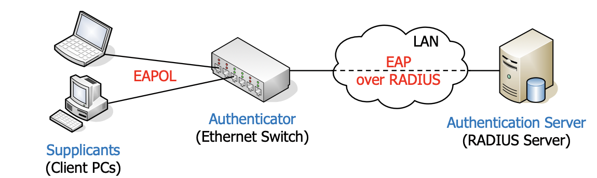

# Layer Security

| Layer | Protocol(s) |
|-------|-------------|
| Application Layer | PGP, S/MIME |
| Transport layer | TLS |
| Network layer | IP Security (IPsec) |
| Data Link (Medium Access) Layer | EAP, 802.1X, WEP, WPA, WPA2/802.11i |
| Physical Layer | Quantum cryptography |

# Data Link Layer Security

- Use Cases for Encryption at Layer 2
	- Wired networks
		- Somewhat protected since physical access for packet sniffing required
		- Encryption at layer 2 protects sensitive (legacy) applications that do not use secure protocols
		- Second layer of defence in regulated environments
	- Wireless networks
		- Packet sniffing does not require physical access
		- Encryption at layer 2 protects sensitive (legacy) applications that do not use secure protocols
		- Always use encryption at layer 2 in wireless networks!

- Authentication at Layer 2
	- You want only authentic users to use your network
	- The Extensible Authentication Protocol (EAP, RFC 3748) is the most relevant standard in this context

## Extensible Authentication Protocol (EAP)

- Current reccomendation: EAP-TLS

Format:
- Code
- ID
- Length
- Type
- Data

## IEEE 802.1X: port-based access control

- Applicability
	-Protect Network from unauthorized access (e.g. someone plugging in a device)
		- Especially useful for publicly accessible network sockets, e.g., in open office space, super markets, etc.
	- Centralized assignment of VLAN IDs to clients
		- Depending on who you are, you will be assigned to a different VLAN (Virtual Local Area Network)

- Authentication
	- The standard is one of the most important applications of EAP
	- Switch delegates authentication to authentication server (RADIUS Server)
		- The switch / access point merely relays the EAP protocol messages

### Working

- A client connecting to a port of the switch is first blocked, only EAP messages are accepted
- The authenticator relays all EAP messages between the client and the RADIUS server
	- The RADIUS protocol is secured using pre-shared keys  authenticity and confidentiality between authenticator and RADIUS server
- A client gets full network access when the authenticator has received the «authentication successful» message from the RADIUS server
- RADIUS server can send additional data such as the VLAN ID to be used for the specific client

#### Security Analysis

- It protects against someone plugging in an unauthorised device
- That means that an adversary is assumed to have physical access
- Once you have physical access to a switch that has an authorised device plugged in, getting access yourself is pretty easy, e.g.:
	1. Obtain device with two network interfaces ("attacker")
	2. Insert attacker between legitimate device ("client") and switch
	3. Enable layer-2 bridging to make client complete 802.1X authentication (just forward frames between switch and client)
	4. Once that is done, monitor network traffic to obtain parameters (network address, netmask, …) and configure attacker's interface
	5. If attacker wants to send own frames, put client's MAC address in
	6. Profit!
- Solved in 802.1X-2010 with the use of MACsec

## MACSec (IEEE 802.1 AE)

- Confidentialiy and integrity/authenticity on Layer 2 (Ethernet)
	- secure all data including DHCP, ARP, and any higher layer protocols
	- Physical and virtual link
	- Between two network devices
	- The data is not encrypted on the network device itself

- Speed
	- Lane rate encryption with HW pure HW implementation
- Cryptography
	- Key Management According IEEE 802.1X (EAP-TLS) or pre shared keys
	- Cipher: GCM-AES-128 (GCM-AES-256)
- Packet format
	- SecTAG: pointer to key, packet number for IV
	- ICV: Integriy Check Value (MAC) based on GCM-AES

## Medium Access Layer Security of IEEE 802.11 WLANs

- IEEE 802.11 WLANs ("WLANs") are used everywhere today, also in companies

### WLAN "security" with wired equivalent privacy (WEP)

- The AP and all clients share **preconfigured long-term key**
	- This key is used to **encrypt** individual frames
	- Since all clients use the smae key, every user (who knows this key) can read the traffic of every other user
- The length of the key is eitehr **40 or 104 bits**, encrzption uses RC4
- Key is often specified by entering **5 or 13 ASCII** characters or **10 or 26 HEX** symbols
	- Make sure the key is **random** and not based on common words, as this may allow to get the key with a dictionary attack