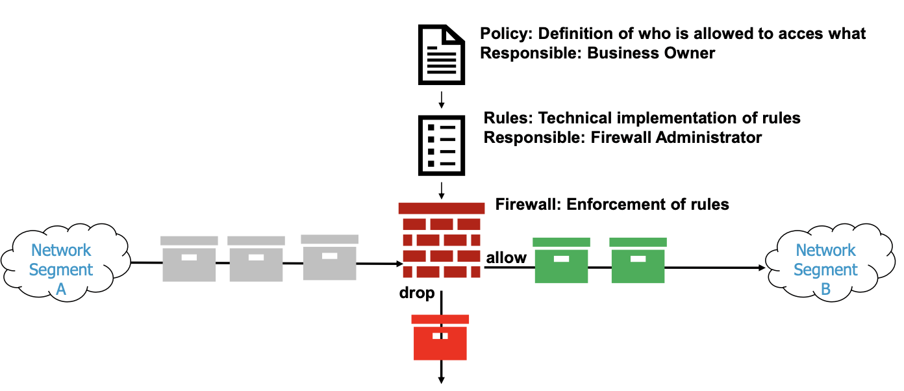

# Network Security

## Network segmentation

- Within a network segment, each machine trusts the other machines

- Goals of network segmentation
	- Increase operational performance with "hiding" traffic in different logical networks
	- Limit damage from cyber attacks to a single network segments
	- Protect vulnerable devices by moving them in a dedicated segment
	- Reduce the scope of compliance by combining regulated devices in a dedicated segment
	- Protect from insider attaks with limiting scope of individuals

## Firewall rule management processes

- Without a firewall rule management process the firewall rules will grow ncontroleed and nobody will understand the actually configured rules.
- New rules need to be approved
- Existing rules need to be regularly re-assessed

- Firewalls are important components in any serious IT security concept
	- Blocks a lot of unwanted traffic before it enters the own environment
	- Controls access from and to the outside at centralized points - this is much simpler than controlling this on each individual host
	- Can hide the internal network structure from outsiders
- But they do not solve everythign and have limitations
	- Firewalls are typical **perimeter protection mechanisms**: As long as the attachers are on the outside, they provide good protection
		- The problem is that in reality, attackers may manage to circumvent the firewall to get into the internal network
		- E.g. when an employee attaches his infected laptops to the internal network
		- E.g. when internal users install insecure access points for convenient access
	- Packet-filtering firewalls don't protect from attacks on the application layer
		- If you allow access from the Internet to TCP port 80 of your webserver, the packet filtering firewall cannot provide any protection from attacks that try to exploit software vulnerabilities in the web server

## Next Generation Firewall (NGFW)

- In addition to packet level filtering other capabilities are added
- Common capabilities
	- Deep packet inspection (with TLS inspection)
		- Additionally inspect content of packets
	- Intrusion Prevention
		- E.g., block malicious traffic immediately
			- Signature based (blocking of well known Command and Control communication)
			- Policy based (blocking of traffic violating security policies such as visiting known malicious sites)
			- Anomaly based (blocking unusual traffic)
	- Application awareness
		-Treat an application as an entity and not just IP Address / ports
		- Make applications visible and block risky apps
	- Threat Intelligence sources that are continuously fed to device
	- Antivirus inspection
		- Find known viruses in transmitted packets
	- Sandboxing
		- Before delivering suspicious files open them in a dedicated and protected environment

## Zero Trust

- Do not trust anything unless it is verified
- Least privileg access is enforced
- security monitoring is implemented