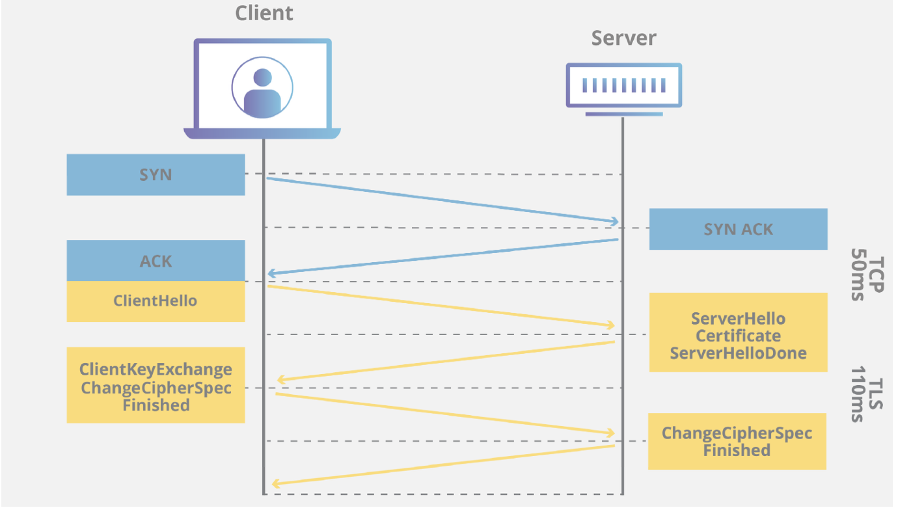
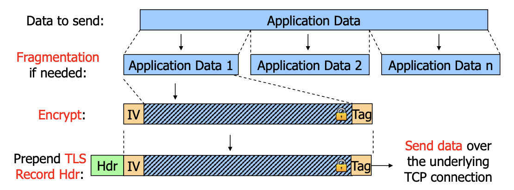
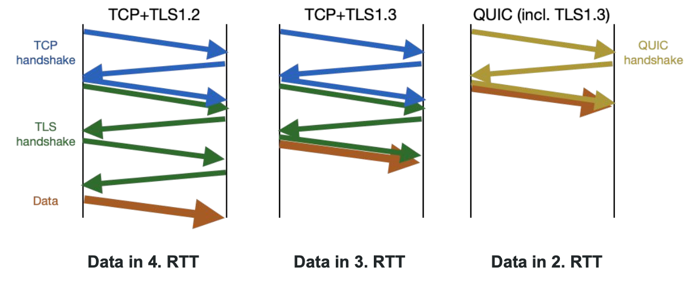

# TLS (Transport Layer Security)

- Secure Communication between applications
- Bound to the underlying TCP connection
- If the client opens a second TCP connection to the same server application, then a second TLS session must be established

## Properties

- Authenticated
- Integrity Protected
- Confidential
- Secure against replay and deletion

## Building Blocks

Ordered by strength of security

- Strong block ciphers (AES, Twofish, ...)
- Authenticated encryption mpdes (GCM, CCM)
- Diffie-Hellman Key agreement
- Groups that yield small keys and fast DH operations (ECC, ECB)
- Public key authentication with certificates
- Authentication trough signatures
- Cryptographic hash functions for key generation (HKDF) (e.g. AES session keys)

A cipher suite determinces the **set of cryptographic algrogithms** to be used.

## Layer

- TLS works on top of TCP
- Can be implemented in **user space** (directly in the application software)
- Does not have to worry about **lost/retransmitted data**

## Protocol stack

## TLS 1.3 Record Protocol

### TLS Record Protocol

Defines the TLS packet format; all data that are using TLS are transported within TLS Records

### Handshake Protocol

Used to establish TLS sessions

### Change Cipher Spec Protocol (deprecated)

Dummy messages only. In TLS 1.2, it indicated switching to the newly negotiated secure communication relationship and keys

### Alert Protocol

Indicates warnings/errors (e.g., certificate expired)

### Application Data

Data meaningful to applications (not for TLS)

## TLS message formats

## Phases

### Handshake

Authentication and establishment of cryptographic algorithms and key material

**Key agreement**

1. Client and server negotiate crypto algorithms
2. Client and server perform Diffie-Hellman
3. Client and server generate Handshake keys

**Authentication**
4. Server Authenticates to client
5. CClient and server prove to one another that no one has Tampered with the previous messages

**Key Agreement**
6. Client and server generate Data keys
- (Client and server exchange encrypted data, not part of handshake)

### Data Exchange

Exchange protected data

- In TLS 1.3, **all** ciphers are AEAD ciphers (authenticated encryption with additional data)
- AEAD ciphers encrypt and authenticate data at the same time
- Causes an **authentication tag** to be added to a message
- Receiver computes its own auth tag and compares to received one

### Connection teardown

- When an endpoint wants to terminate the TLS session, it first sends the other endpoint a specific alert message (close_notify) to indicate that it has completed sending the data; then it sends the TCP FIN or RST
- The other endpoint should accept the data only if the close_notify alert was received before TCP FIN or RST

# DTLS (Datagram transport layer security)

- DTLS is not a completely new protocol, but just makes some **small changes** to TLS so it can work over UDP
- Implicit **sequence number** problem is solved by using **explicit** ones
- TLS handshake reliability is solved by adding **reliability functions** just for the handshake
	- timeouts and retransmissions to handle lost UDP datagrams
	- explicit sequence numbers for reordering
	- this allows to use the TLS handshake over UDP
- optional replay detection
	- if enabled, duplicated recores are silentyl discarded
	- such duplicates can be the sign of a replay attack but can also happen accidentally (because UDP is used)

# QUIC

A new encrypted transport protocol

- QUIC is a new transport protocol (layer 4, like TCP, UDP)
	- Multistreamed, designed to support HTTP and the modern web applications running on it
	- Deeply integrated into HTTP/3
- It's based on (encapsulated in) UDP
	- UDP gets through most networks (middleboxes prevent new IP protocol deployment)
	- Userspace implementation allows fast update and browser deployment
- Encryption is baked into the protocol
	- Both data and metadata are protected
	- uses TLS 1.3 for key negotiation
- It carries a significant portion of Web traffic today
	- If you're using Chrome to talk to one of a number of large networks (including Google's), you're probably using QUIC.

## QUIC transport and cryptographic handshke

## QUIC 0-RTT Session resumptuion

