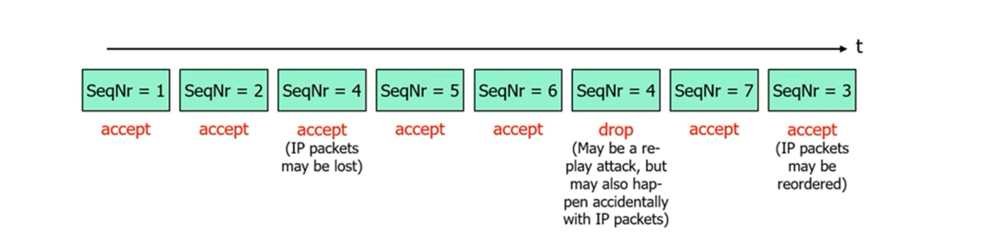
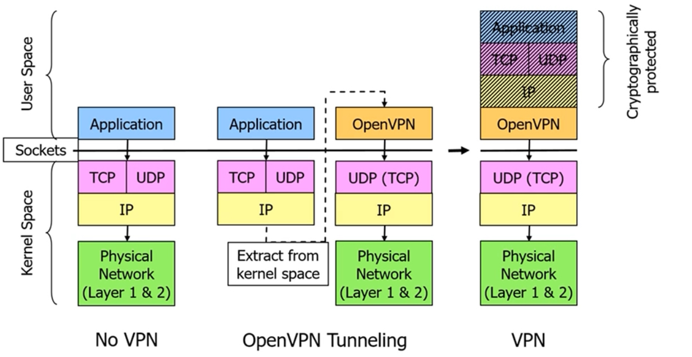
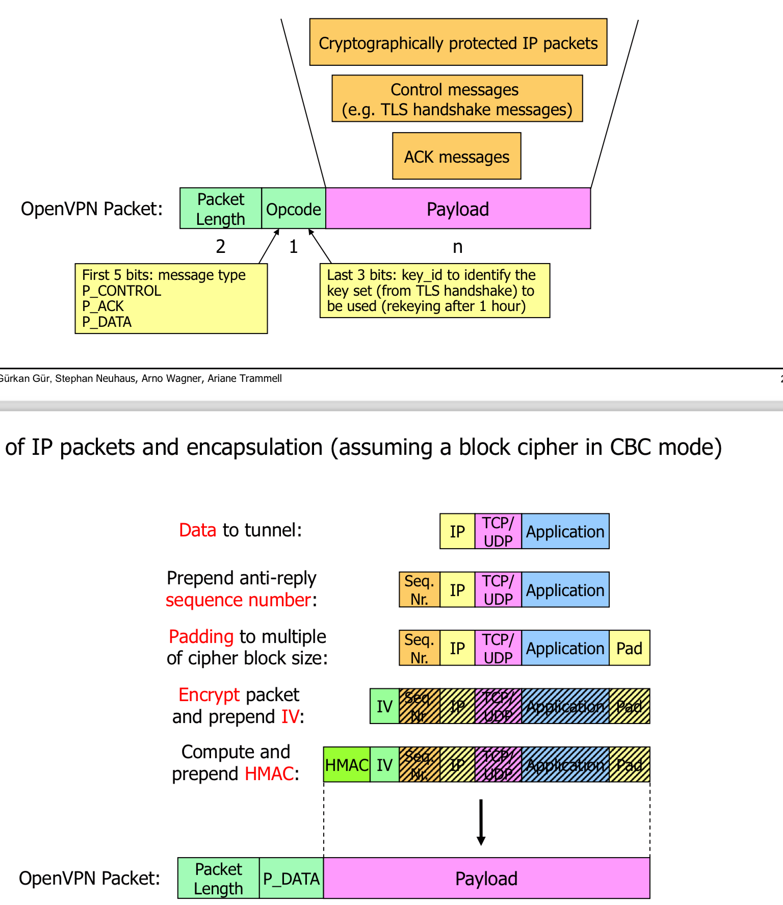
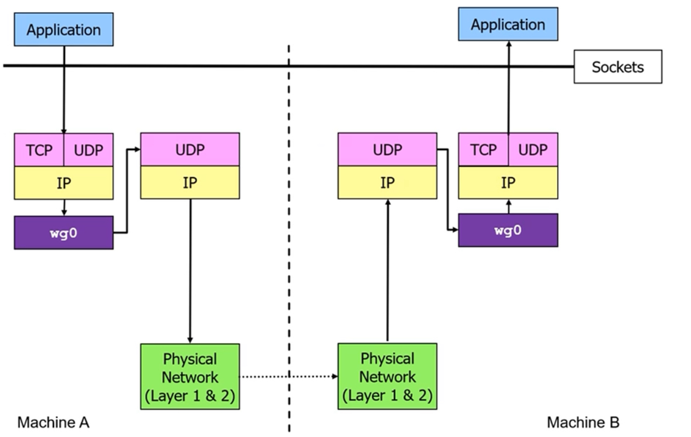

# VPN - Virtual Private Network

## IPSEC

- Works on layer 3

### ESP-Protected packets with sequence numbers

- As TLS is based on TCP records cannot arrive in the wrong order unless theres an attack or a serious error has happened -> clsoe with error

## Open VPN

- Runs on top of UDP or TCP
- Usually uses UDP, as TCP over TCP results in poor performance
- Software on the VPN endpoints run in the user space
- Protect IP Packets between the VPN endpoints
-  Uses TLS handshake protocol for mutual authentication and key exchange

### Protocol Stack

### Packet format

## Wireguard

- Works on layer 3
- Very little configurability, deliberately no cipher and protocol agility
    - much smaller attack surface
- uses modern crypto primitives (ChaCha20, Ruve25519)
- Has a 1-RTT handshake
- Has perfect forward secrcy (PFS)
- Has DoS mitigation techniques

### Message Flow

##