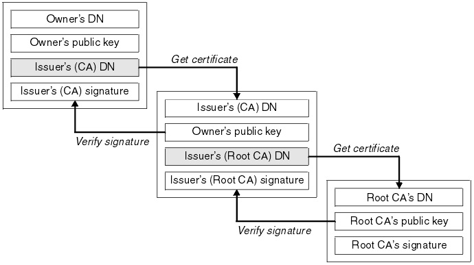
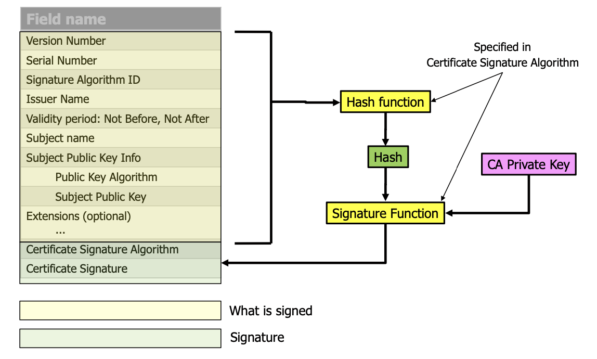

# Zertifikate

Is a **signed  statement** by a **trusted third party** that **a certain public key belongs to a certain name**. It is a **means to authenticate a public key** It is **NOT** a means to authenticate a communication partner.

## Key exchange problem

- Pre shared keys do not scale (and require communicating partner to know each other)
- Public key crypto provieds a possibility to share a secret over an **unprotected channel**

## Proberties

- Bind certain things together
- issued and signed by a trusted third party (Certification authorities CA)

## Certificate chains

## Obtaining a certificate 

Kpub and Kpriv are only valid for for www.alice.com

1. Alice creates a key pair (Kpub, Kpriv)
2. Alice sends a **Certificate Signing Request (CSR)** optaining (www.alice.com, Kpub) to her CA of choice
3. The CA verifies that Alice really owns "www.alice.com"
4. The CA signss Alice's CSR, givign the signature S = sign(CSR, Kca_priv)
5. The CA puths the following together for a certificate
	1. The subject name www.alice.com
	2. the subject public key Kpub
	3. the issuer name (Name of the CA)
	4. the issuer signature S
6. The CA sends the certificate to Alice
7. Alice pays the CA and she installs the certificate in her webserver

## Obtaining root certificates

- Root certificates are the ultimate anchors of trust
- Without them, no certificate could be successfully validated
- Without them, no public key could be successfully authenticated
- How does Carol receive and validate root certificates?
- She can’t get them from the root CA with http
	- A man-in-the-middle could substitute their own certificate
- She can’t get them from the root CA with https
	- As part of the TLS handshake, the root CA would send its cert to Carol
	- Carol would have to validate that root certificate
	- How to do that? Well, just get it from the root CA with https!
	- Oops
- In practice, root certificates are preinstalled
	- Browsers, JREs, {Open,Libre,…}SSL

## Validating certificate chains

- Bob connects to www.alice.com
- Server sends certificate chain of length n to Bob (excluding root cert)
- Chain has certs C[1], …, C[n]; C[1] being www.alice.com's cert
1. Check that C[1].name = www.alice.com
2. for i = 1 to n - 1
	1. Check that C[i].issuer = C[i+1].subject
	2. Check that C[i].signature can be verified with C[i+1].publicKey
3. Locate root cert R with C[n].issuer = R.subject, fail if there isn’t one
4. Check that C[n].signature can be verified with R.publicKey
5. Check that R.signature can be verified with R.publicKey
- At this point, Bob knows that C[1].publicKey is for www.alice.com
- Here “check that x” means: “check whether x is true, and if it is not, fail the entire certificate validation”

### Algorithm

- In the algorithm to validate a certificate chain, we had:
1. for i = 1 to n - 1
	1. Check that C[i].issuer = C[i+1].subject
	2. Check that C[i].signature can be verified with C[i+1].publicKey
- This needs to be replaced with
2. for i = 1 to n – 1
	1. Check that C[i].issuer = C[i+1].subject
	2. Download CRL from C[i+1].subject
	3. Check that CRL's signature can be verified with C[i+1].publicKey
	4. Check that C[i].serial is not on the CRL
	5. Check that C[i].signature can be verified with C[i+1].publicKey

## Certificate Revocation

- Issuer publishes Certificate Revocation List (CRL), app downloads this from CA
	- Normal Certificate Revocation Lists
	- Browser-Summarized Revocation Lists
- Issuer has **Online Certificate Status Protocol**
	- Normal OCSP Protocol
	- OCSP Stapling
	- OCSP Must Staple

### Certificate Revocation List

- List of Serial Numbers revoced

#### Limitations

- are only updated every couple of days
- A certificate cannot be removed from a CRL, even when it is expired
- many certificates go onto a CRL in a short amount of time (heartbleed)
- CLRS are only getting larger

### OCSP (Online Certificate Status Protocol)

#### Advantages
- usually fresher than CRL
- only little information bust be exchanged to verify status

#### Disadvantages

- Privacy issues
	- OCSP allows the CA to collect information abouth which client visits which server
- Single point of failure
	- the ocsp responder bust always be available
	- when OCSP is offline, the client initiates a **SOFT FAIL**, then a certificate is treated ad **GOOD**

### OCSP Stapling

- The server queries the OCSP-Responder listed in the certificate itself and caches the OCSP responses while it is valid
- Client gets OCSP response from server during the TLS handshake (see later)
- If a response is valid, the server usually does not contact the OCSP-Responder again but always serves the clients the cached response

# X.509 STANDARD

- X.509 is the dominating standard for certificates these days
- It is part of a group of standards roughly in the X.500 range
- Developed by International Telecommunication Union, an UN agency
- The ITU is run by governments or government-affiliated companies, not like the IETF, which is
run by nerds
- First standardized in 1988
- The 1988 equivalent of JSON was Abstract Syntax Notation One, or ASN.1
- ASN.1 is a syntax for describing data, which can then be translated into various binary formats
that have names like DER (Distinguished Encoding Rules) and BER (Basic Encoding Rules)
- X.509 certificates are described in ASN.1
- If you want to handle X.509 certificates, you need an ASN.1 DER parser in your code (not
trivial, significant attack surface)

## Naming (From X.500)

- Certificates contain the **subject** and **issuer name**
- Names have been "standardized" by X.500
- One purpose of X.500 was a global! directory (phone book)
- Names must be disambigated
	- Solved by adding attributes to names
	- CN = common name
	- O = organization
	- OU = organizational unit
	- C = contry
	- E = email
	- S = state (canton)

## Structure

