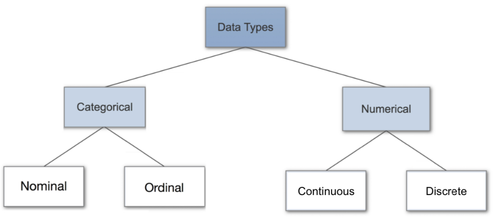
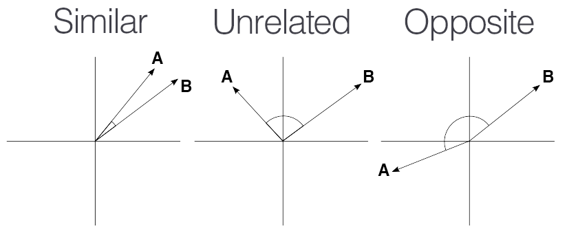

# Data Processing

In Machine Learning werden Milliarden an einzelnen Daten benötigt.

Daten als Grundlage müssen verstanden sein.

## Quellen

- Sensoren
- Umfragen
- Simulationen
- Social Media
- Texte
- Finanzen
- Multimedia
- ERP System Data

## Datentypen

### Nominal Categorical Data

Benutzt für Bezeichnungen, die ungeordnet sind

- Haarfarbe
- Geschlecht

### Ordinal Categorical Data

Geordnete Bezeichnungen

- Rang
- Bewertung in Sternen

### Continous Numerical Data

Werte die gezählt werden können

- Anzahl Personen in einem Raum

### Discrete Numerical Data

Interval Daten, werden oft gemessen.

- Exakte Menge ([0, 20])

## Datenklassen

- Eindimensionale Daten
- Mehrdimensionale Daten
- Netzwerkdaten
- Hierarchische Daten
- Zeitserien
- Geographische Daten

## Struktur

### Strukturiert

- Datenmodelle

- csv
- ods
- xlsx
- HDF (Hierachical Data Format)

### Nicht strukturiert

- Hat kein fixes Format
- Hat keine Struktur

## Metadata

Beschreibende Daten zu Bildern

# Data Pre Processing

Shit in - Shit out

## Probleme

- Schreibfehler in Quellen
- Falsches Format von Daten
- Falsche Berechnung von Eingabedaten
- Verschiedene Klassifizierung von gleichen Inhalten
- Doppelte Inhalte in falschen Werten

## Methodiken

### Duplicate Search

Vektorvergleich

### Near Duplicate Search

- **Titeln**: Die Levensteindistanz gibt an, wie viele Operationen notwendig sind, um von einem Text auf den anderen zu kommen.

#### Vektoren

CoSine Similiarity

$$
\cos(\theta) =
\frac{
    \sum\limits_{i=1}^n a_i b_i
}{
    \sqrt{\sum\limits_{i=1}^n a_i^2}
    \times
    \sqrt{\sum\limits_{i=1}^n b_i^2}
}
=

\frac{A \cdot B}
{
    \left|\left|A\right|\right|
    \left|\left|B\right|\right|
}

$$

### Fehlende Daten

- Interpolation / Annahme durch andere Werte
- Löschen / nicht zu oft, um Mengen nicht zu verfälschen 