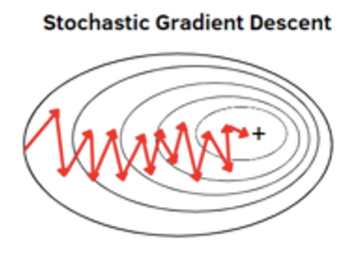

# Gradient Descent

The idea of gradient descent, is to find an optimal value for a problem. This is done using the **learning rate** $\alpha$. $\alpha$ is stepped towards the minimum, after every step the learning rate is decreased.

## Learning rate adjustments

### Optimal Cost Function

## Generic Algorithm

1. Initialize $\theta_0, ... \theta_n$
2. Repeat until convergence
$$
\text{Update} \theta_j = \theta_j - \alpha \frac{\partial}{\partial \theta_j} J(\theta)   \qquad   \forall{j = 0, ..., n}
$$

## Learning Rate adjustments

$$
\alpha_t = \frac{1}{1 + \text{decay rate} * t} \alpha_0
$$

# Algorithms

## Batch Gradient Descent

Computes the gradient of the cust function with respect to the parameters for the entire training dataset

Repeat until convergence

1. $\theta_n = \theta_n = \alpha \frac{1}{M} \sum_{m=1}^M  (\^y^{(m)} - y^{(m)}) x_n^{(m)}$ for every n=1..N

### Advantages

- Guaranteed to converge to the global minimum for convex error surfaces
- Guaranteed to converge to the local minimum for non-convex surfaces

### Disadvantages

- - As we need to calculate the gradients for the whole dataset, batch gradient descent is slow
- Is intractable for datasets that don't fit in memory.
- Doesn't allow us to update our model online, i.e. with new examples on-the-fly.
- Performs redundant computations for large datasets, as it recomputes gradients for similar examples before each parameter update.

## Stochastic Gradient Descent

Performs a parameter update for each training example.

Repeat until convergence

1. Randomly shuffle the examples
2. for m =1 to M 
	1. $\theta_n = \theta_n - \alpha ( \^y^{(m)} - y^{(m)})$ for every n = 1...N

### Advantages

- Is much faster and can also be used to learn online.
- when we slowly decrease the learning rate, SGD shows the same convergence behavior as batch gradient descent

### Disadvantages

- SGD performs frequent updates with a high variance that cause the objective function to fluctuate heavily
- SGD's fluctuation, enables it to jump to new and potentially better local minima. This ultimately complicates convergence to the exact minimum, as SGD will keep overshooting

## Mini Batch Gradient Descent

Performs an update for every mini-batch of n training examples

Use a batch of a fixed number of training examples 𝑏 in each step, with 1 ≤ 𝑏 ≤ 𝑀
- Typical mini-batch sizes are 50-250 samples

### Advantages

- Reduces the variance of the parameter updates, which can lead to more stable convergence
- 'Mini-batch gradient descent is typically
- Size of mini batches can be adapted to available memory

### Disadvantages

NONE