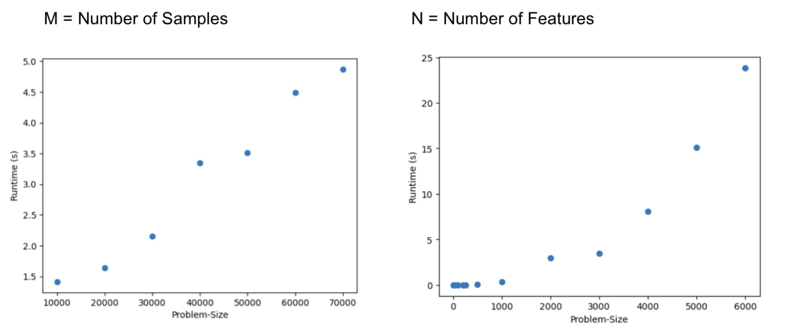
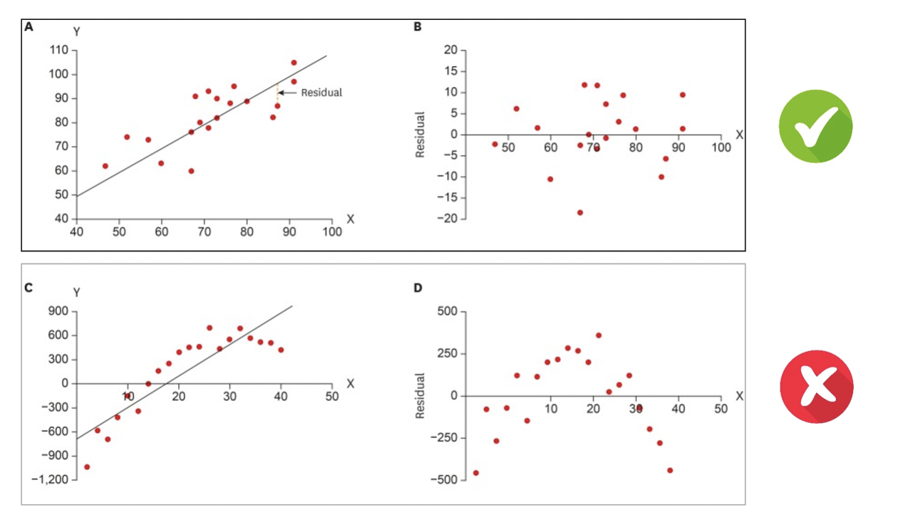
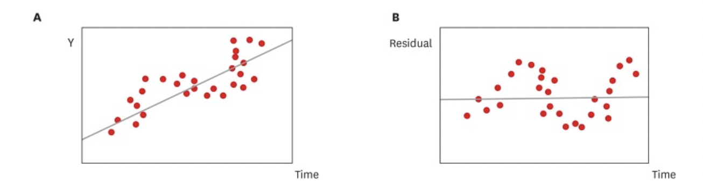
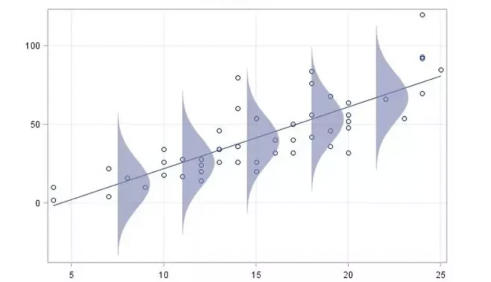
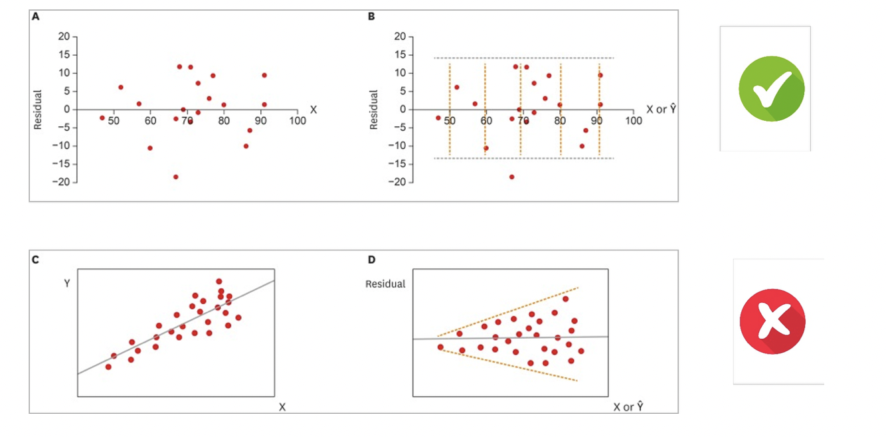

# Linear Regression

Linear regression is often used for predicting the value of the dependent variable based on the values of one or more independent variables. For example, predicting sales based on advertising spending.

- Works on smaller datasets (< 20'000 Features), since matrix multiplication is used
- Runtime is cubic in size of the matrix

## Cost function

A cost function s a a measure, of how well a machine learning model performs by quantifiying the difference between predicted and actual outputs.

$$
J(\theta_0, \theta_1) =
\frac{1}{2M}
\sum\limits_{m=1}^{M}
(y_m - \hat{y}_m)^2
$$

Die Werte werden quadriert, um:

- Die Werte zu normieren
- Grosse Fehler werden verstärkt

### Optimaler Wert der Cost-Function

- Die Cost-Function ist genau dann 0, wenn alle Punkte **genau** auf einer Gerade sind.

- Der Fehler der Kostenfunktion soll so klein sein wie möglich, der Wert wird dabei einfach minimiert.

Mit der Normal Equation können wir die optimalen Theta Werte bestimmen.

# Univariate Linear Regression

$$
h(x) = \theta_0 + \theta_1*x_0 + \theta_2*x_1
$$

**HAS Only one input variable (X)**

$$
h_{\theta_0, \theta_1} = \theta_0 + \theta_1x
$$

- There exists a closed formula for univariate linear regression to compute the optimal values of $\theta$
-$\theta_0$ is a parameter of the hypothesis function
- There exists a closed formula for multivariate linear regression to compute the optimal values of $\theta$
The goal of Linear Regression is to minimize the value of 𝐽($\theta$)

## Normal equation

Can be computed for **smaller** problems. Calculation of larger problems, with more than 20'000 features can **not be computed in reasonable time** with the normal equation.

$$
y = X \theta + e
$$

## Closed Form 

$$
\theta
=
(X^T X)^{-1}
X^T y

$$

# Multivariate Linear Regression

**HAS MULTIPLE PARAMETERS**

$$
y = X \theta + \epsilon
$$

- $x_0$ = 1

## Runtime

- Mehr als 15'000 Features sind nicht möglich.

Matrix X ist: $X \in \mathbb{R}^{M \times N}$

Umgewandlet, bedeutet dass: $X^T X \in \mathbb{R}^{N \times N}$, wobei N die Features sind. Die Matrix wird dadurch riesig.

# Evaluating Regression Models

## Mean Absolute Error: MAE

- All erros are counted
- All errors are weighted the same

$$ 
\text{MAE} = \frac{\sum_{i=1}^I |y^{(i)}- \hat{y}^{(i)}|}{I}
$$

## Mean Squared Error: MSE

- Ignores negative values
- Weights bigger errors much higher than smaller ones

$$ 
\text{MSE} = \frac{\sum_{i=1}^I (y^{(i)}- \hat{y}^{(i)})^2}{I}
$$

## Coefficient of determination ($R^2$)
Iis a measure of how well the independent variable(s) in a linear regression model explain the variability of the dependent variable. 

Range: 0-1
- 0: does not explain the variability
- 1: does explain the variability

$$
R^2 = ((m*x_1 + b) -y_1)^2 + ((m*x_2 + b) - y_2)^2 + ((m*x_n + b) - y_n)^2
\\
= \frac{var(mean) - var(fit)}{var(mean)}
$$

$$
data = \sum_i^{N} y_i
$$

$$
mean = \frac{\sum_i^{N} y_i}{N}
$$

### Mean

$$
SS(mean) - (data-mean)^2
$$

$$
var(mean) = \frac{SS(mean)}{N}
$$

### Fitted line

$$
SS(fit) - (data-line)^2
$$

$$
var(fit) = \frac{SS(fit)}{N}
$$
## Residual plot

- A residual for a sample is the difference between expected and predicted output value
- Residual plots show the residual values on the vertical axis

- If a model always predicts the mean of all expected outcomes, then $R^2$ equals 0
- The larger $R^2$, the farther the points scatter to the regression line

- There exists a closed formula for univariate linear regression 
to compute the optimal values of $\theta$
- There exists a closed formula for multivariate linear regression to compute the optimal values of $\theta$
- $\theta_0$ is a parameter of the hypothesis function

## GOOD Residual plot

### Linearity

Line relationship between $X$ and $Y$ is linear, the residual error should be scattered randomly around the linear prediction

### Independence

No repeating patterns

### Normality

There should be some (equal) noise

### Homoscedasticity (equality of variance)

# Fitting Data
# $R^2$

**Percentage:** $R^2 *100$

$$
data = \sum_i^{N} y_i
$$

$$
mean = \frac{\sum_i^{N} y_i}{N}
$$

$$
R^2 = \frac{var(mean) - var(fit)}{var(mean)}
$$

## Mean

$$
SS(mean) - (data-mean)^2
$$

$$
var(mean) = \frac{SS(mean)}{N}
$$

## Fitted line

$$
SS(fit) - (data-line)^2
$$

$$
var(fit) = \frac{SS(fit)}{N}
$$
