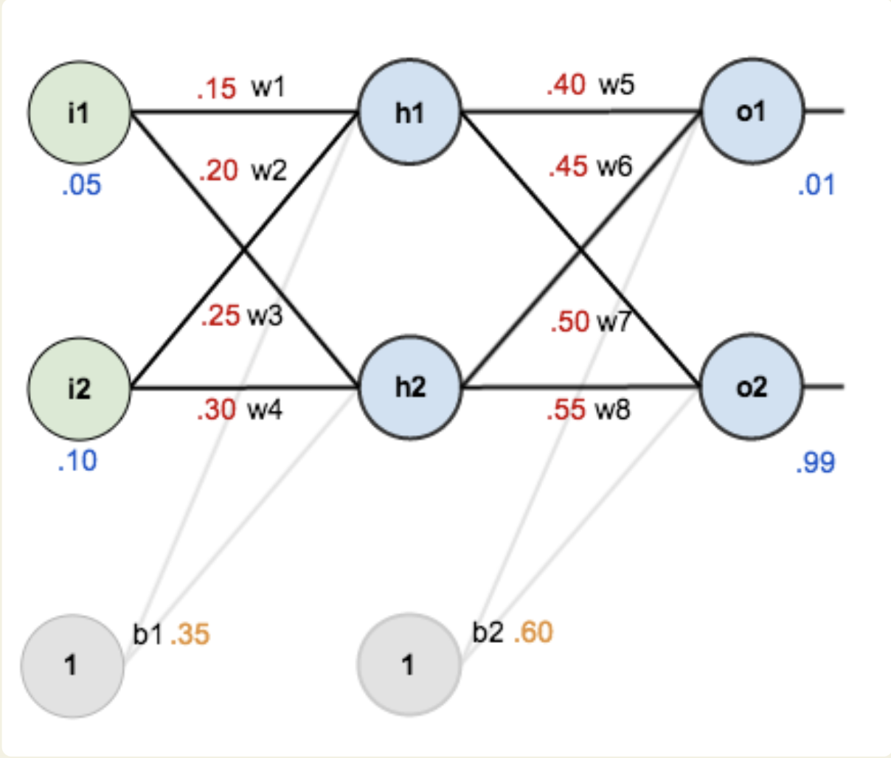

# Neural Networks

## Activation Functions

An activation function in neural networks introduces non-linearity to the model by determining the output of each neuron. Common activation functions include ReLU (Rectified Linear Unit) and Sigmoid, helping the network learn complex patterns and relationships in data during training.

### Softmax

Goal: For Classification tasks with mutually exclusive classese, in the output layer we want to have 1.0 for the correct class and 0 for all other classes.

- learns linear decision boundaries.

$$

\text(softmax) (z)_k
=

\frac{
	\exp{(z_k)}
}
{
	\sum_{i=1}^{K}
		\exp{(z_i)}
}
$$

#### Cross entropy loss

$$
Loss(\^{y}^{(m)}, y^{(m)})
=
-
\sum_{k=1}^{K}
y_k^{(m)}
log(\^{y}_k^{(m)})
$$

$$
J(W)
=
\frac{1}{M}
\sum_{m=1}^{M}
Loss(\^{y}_m, y_m)

$$

## Feedforward Neural Networks

Parameters (weights/biases) are optimized by gradient descent.

Repeat for every hidden node, output node in the model.

$$
net_{h1}
= i_1 * w_{1}
+ i_2 * w_{3}
+ b_1
$$

$$
out_{h1} = \text{activation\_function} (net_{h1})
$$

$$
E_{\text{total}}
=
\sum
1/2
(\text{target} - \text{output})^2
$$

## Backpropagation

- Updating the weights

How much a change in $w_6$ affects the total error. $\frac{\partial E_{\text{total}}}{\partial {w_5}}$

### Apply Chain rule (OUTPUT LAYER ONLY)
$$
\frac{\partial E_{\text{total}}}{\partial {w_5}}
=
\frac{\partial E_{\text{total}}}{\partial {\text{out}_{o1}}}
*
\frac{\partial {\text{out}_{o1}}}{\partial {\text{net}_{o1}}}
*
\frac{\partial {\text{net}_{o1}}}{\partial {w_{5}}}
$$

1. how much does the total error change with respect to the output
$$
\frac{\partial E_{\text{total}}}{\partial {\text{out}_{o1}}}
=
-(\text{target}_{o1} - \text{out}_{o1})
$$

2. how much does the output of $o_1$ change with respect to its total net input?
	1. When activation function ==  logistic function

$$
\frac{\partial{\text{out}_{o1}}}
{\partial{\text{net}_{o1}}}
=
\text{out}_{o1}
(1 - \text{out}_{o1})
$$

3. Finally, how much does the total net input of $o_1$ change with respect to $w_5$?

$$
\frac{\partial{\text{net}_{o1}}} {\partial{w_5}}
= 
w_5 * out_{h1}
+ w_6 * out_{h2}
+ b_2 * 1
$$

$$
\frac{\partial{\text{net}_{o1}}} {\partial{w_5}}
=
1
*
out_{h1}
*
w_5^{1-1}
+ 0 + 0
$$

**ALL TOGETHER AS**

$$
\frac{\partial E_{\text{total}}}{\partial {w_5}}
=
- (\text{target}_{o1} - out_{o1})
*
\text{derative of activation}(out_{o1})
*
out_{h1}
$$

**UPDATING $w_5$**

$$
w_5^+ = w_5 - \alpha
*
\frac{\partial E_{\text{total}}}{\partial {w_5}}
$$

### Apply Chain rule (HIDDEN LAYER ONLY)

$$
\frac{\partial{E_{total}}}{\partial{w_1}}
=
\frac{\partial{E_{total}}}{\partial{out_{h1}}}
*
\frac{\partial{out_{h1}}}{\partial{net_{h1}}}
*
\frac{\partial{net_{h1}}}{\partial{w_{h1}}}
$$

- Since a hidden layer contributes to multiple nodes, and therefore error, we have to take the corresponding layers into account

$$
\frac{\partial{E_{total}}}{\partial{out_{h1}}}
=
\frac{\partial{E_{o1}}}{\partial{out_{h1}}}
+
\frac{\partial{E_{o2}}}{\partial{out_{h1}}}
$$

$$
\frac{\partial{E_{o1}}}{\partial{out_{h1}}}
= 
\frac{\partial{E_{o1}}}{\partial{net_{o1}}}
*
\frac{\partial{net_{o1}}}{\partial{out_{h11}}}
$$

$$
\frac{\partial{net_{h1}}}{\partial{out_{h1}}}=w_5
$$
2. Part
