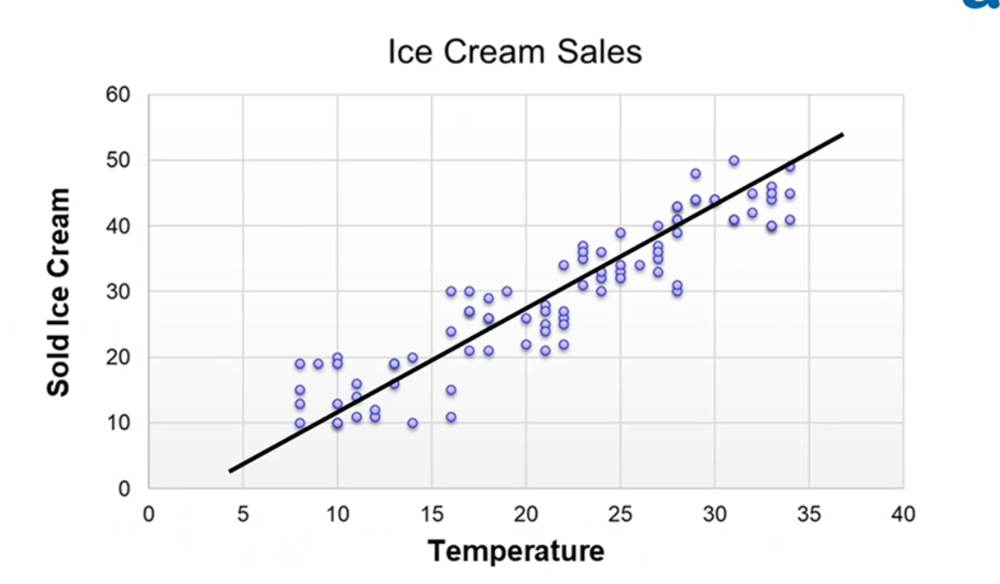

# Regression

## Univariate

Statistische Auswertung nur eines Merkmals.
Beispiel: für zehn Personen wird das Körpergewicht gemessen und dann ein Mittelwert bzw. Durchschnitt gebildet. Statt univariat könnte man auch eindimensional sagen.

## K Nearest Neighbour Regression

In den meisten Fällen haben nah beieinander liegende Datenpunkte auch ähnliche Kategorien / Werte.

- Es gibt keine theoretische spezifikation wie viele k Nachbaren verwendet werden sollen.
- Je grösser k ist, desto geringer ist es für das Model "lokale" patterns zu erkennen, jedoch wird die Varianz kleiner und die Prediction wird stabiler.

1. Es werden K Datenpunkte verwendet, die dem Suchwert am nähesten liegen.
2. Mittelwert der K Punkte ergibt annäherung.

## Linear Regression

Die Daten sind linear, es gibt also eine Linie. Diese kann dafür verwendet werden, anhand einer Gerade einen Wert Y zu dem Wert X zu bestimmen.

$$
h(x; \theta_0, theta_1) = theta_0 + theta_1 x
$$

- $\theta_0$: Schnittpunkt mit der Y-Achse
- $\theta_1$: Steigung der Gerade

$$
\^{y}_m = h(x_m; \theta_0, \theta_1) = \theta_0 + \theta_1 x_m
$$

### Loss
Abstand von einem Sample Wert zu seinem richtigen Wert

Wird pro einzelnes Samples berechnet

$$
L_{RSS}(\theta_0, \theta_1; \{x_m, y_m\})
=
\sum\limits_{m=1}^{M}(y_m - \hat{y}_m)^2
=
\sum\limits_{m=1}^{M} \varepsilon_{m}^2 

$$

### Cost

Abstand aller Samples zu ihrem korrekten Wert.

$$
J(\theta_0, \theta_1) = \frac{1}{2M}
\sum\limits_{m=1}^{M}(y_m - \hat{y}_m)^2

$$