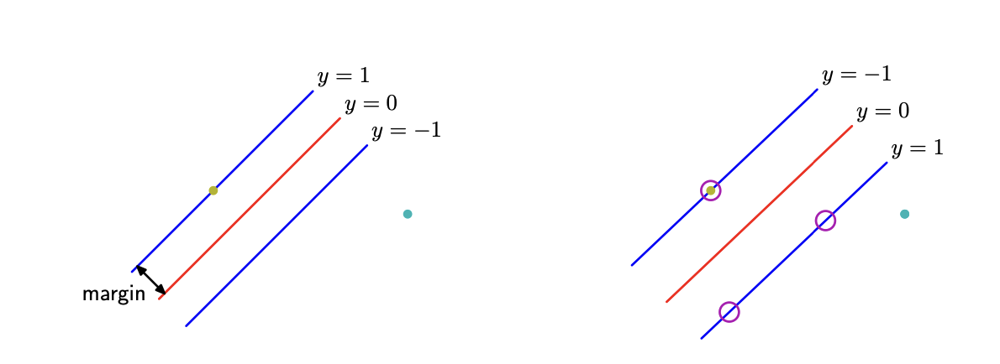

# Support Vector Machines

- Each feature, column in matrix X, in the dataset has its **own** dimension
- Dimensions are denoted as $x_1, x_2, x_3, ...$
- Each point in the scatterplot is defined as ${(x_1^{(1)},x_2^{(1)}), ..., (x_1^{(M)},x_2^{(M)})}$

In $\mathbb{N}$ dimensional space, a hyperplane is a flat affine subspace of **dimension $\mathbb{N}-1$**

## Hyperplance

A hyperplane is a seperator between two sets of data, it can be in any dimension.

$$
b
+ w_1 x_1 
+ w_2 x_2
+ ...
+ w_N x_N
= 0
$$

$$
x = (x_1 \quad x_2 \quad ... \quad x_N)^T
$$

$$
b + w^T x = 0
$$

## Maximal Margin Classifier

- Designed for linearly separable data

### Construction

## Soft Margin Classifier