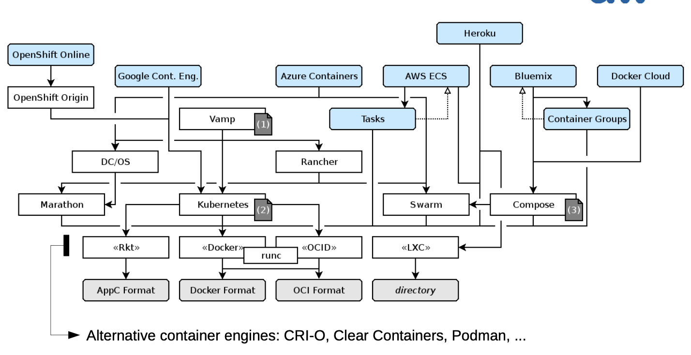

# CaaS (Container as a Service)

**Rationale**
-light-weight isolation of application functionality (fault separation, confidentiality)
– complementing multi-user separation
- main directions: OS-level and application-level (e.g. preloads)

## LXC (Linux Containers)

- vendor-neutral
- linux-specific
- booting from a directory, e.g. unpacked image
	- /config: text file for e.g. mounts, capabilites, networks, ...
	- /rootfs: root file system

```python
import lxc
c = lxc.Container("myubuntucontainer")

c.create("download", 0, {"dist":"ubuntu","release":"xenial","arch":"amd64"}) # Downloading the rootfs... (~400 MB; alpine would be ~7 MB)
# → True

c.running
# → False

c.start()
# → True

import os
def f(): os.system("ps wauxf; ls -l /home")

c.attach_wait(f)
# → pid
```

## Docker / Podman 

- os-independent
- booting from a docker containered image with a layered file system
	- images created by interpretation of Dockerfiles

```Dockerfile
FROM python:3

RUN pip install requests && \
	rm /usr/local/lib/python3.6/site-packages/requests/__init__.py && \ wget https://github.com/Yelp/dumb-init/releases/download/v1.2.0/dumb-
      init_1.2.0_amd64.deb && \
    dpkg -i dumb-init_1.2.0_amd64.deb

ADD my-application /srv/my-application
WORKDIR /srv

EXPOSE 8080
ENTRYPOINT ["/usr/bin/dumb-init", "--"]

CMD ["/srv/my-application/start.sh"]
# test execution
# docker build -t mycontainer . && docker images && docker run -ti mycontainer
```

```shell
docker run -p 8080:8080 -it --rm \
	-v /var/www/html/:/usr/local/tomcat/webapps/news \
	tomcat:8.0
```

### Docker Compose

Compose files (docker-compose.yaml) desribe:

- a set of microservices as Docker containers
- build and run configuration
- dependencies
- instance details: replicas, restart policies, placement, networking, volumes

```yaml
version: "3.9"
services:
  coder:
    # This MUST be stable for our documentation and
    # other automations.
    image: ghcr.io/coder/coder:${CODER_VERSION:-latest}
    ports:
    - "7080:7080"
    environment:
      CODER_PG_CONNECTION_URL: "postgresql://${POSTGRES_USER:-username}:${POSTGRES_PASSWORD:-password}@database/${POSTGRES_DB:-coder}?sslmode=disable"
      CODER_HTTP_ADDRESS: "0.0.0.0:7080"
      # You'll need to set CODER_ACCESS_URL to an IP or domain
      # that workspaces can reach. This cannot be localhost
      # or 127.0.0.1 for non-Docker templates!
      CODER_ACCESS_URL: "http://localhost:7080"
      CODER_WILDCARD_ACCESS_URL: "*.janisjanis.com"
    # If the coder user does not have write permissions on
    # the docker socket, you can uncomment the following
    # lines and set the group ID to one that has write
    # permissions on the docker socket.
    #group_add:
    #  - "998" # docker group on host
    volumes:
      - /var/run/docker.sock:/var/run/docker.sock
    depends_on:
    - database
    dns:
    - 10.0.0.1
  database:
    image: "postgres:14.2"
    ports:
      - "5432:5432"
    environment:
      POSTGRES_USER: ${POSTGRES_USER:-username} # The PostgreSQL user (useful to connect to the database)
      POSTGRES_PASSWORD: ${POSTGRES_PASSWORD:-password} # The PostgreSQL password (useful to connect to the database)
      POSTGRES_DB: ${POSTGRES_DB:-coder} # The PostgreSQL default database (automatically created at first launch)
    volumes:
      - coder_data:/var/lib/postgresql/data # Use "docker volume rm coder_coder_data" to reset Coder
    healthcheck:
      test:
        [
          "CMD-SHELL",
          "pg_isready -U ${POSTGRES_USER:-username} -d ${POSTGRES_DB:-coder}",
        ]
      interval: 5s
      timeout: 5s
      retries: 5
volumes:
  coder_data:
```

## Comparison

| Container Technology | Background | Booting | Namespacing | Integration |
|----------------------|------------|---------|-------------|-------------|
| LXC | Vendor-neutral<br/>open source | directories | kernel | frontend |
| Rocket | vendor<br/>open source | AppC/Docker images,<br/>OCI | Rocket launcher | boot manager |
| Docker | vendor<br/>open source | AppC/Docker images,<br/>OCI | docker daemon | composition |
| Podman | vendor<br/>open source | AppC/Docker images,<br/>OCI | kernel | composition |

## Platforms and stacks

