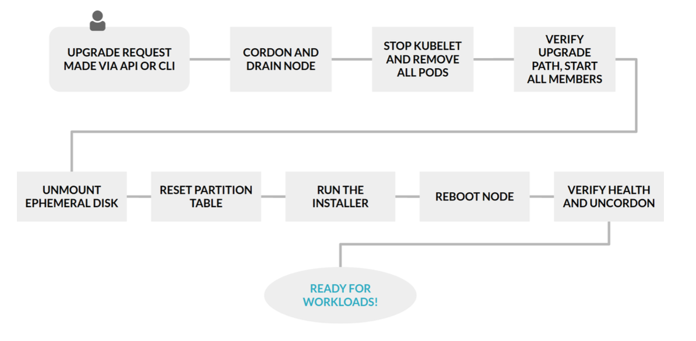

# Cloud Applications

Cloud Apps are decentralised applications

- Set of smart contracts (microservices semantics)
- Executed per node
- Common data layer, such as blockchain -> stateful

**Cloud native deployability**

The ability to deploy arbitrary application components,
concerning all cloud service models, that can be vertically “hosted on” or horizontally “connected to” any other component or service hosted on any cloud provider, cloud platform, or hybrid environment. This includes supporting the processing of declarative deployment models given in machine-readable formats fostering automation.

## Requirements

Expressivity

- Holistic application models vs. purely instructive scripts
- in principle: TOSCA/CAMEL, in practice: HELM, SAM, etc.

### Optimality

- Application runtime requirements
- Infrastructure capabilities

Global: cloud service selection based on criteria \[C\]

local: assignment of workload (e.g.) containers or components (e.g. autonomous Managers \[AM\] managinr resources \[R\]) per cloud

### Transactionality

- High availaibilit (seamlessness)
- rollback
- versioning
- staging
- dry runs

### Immutability

- Indirect modification through e.g. git push
- single system images
- intrusion resiliecne (easy to recover)

#### I2Kit

- Produces a VM image per kubernetes pod
- strong isolation
- reduced attack surface (minimal dependencies)

### Reproducibility

- Multiple instances with exact same behaviour or controlled deviation

Authoratie source needed for any public dependencies

Reproducible builds: "It should be possible to reproduce, byte for byte, every build of every package"

#### Cloud-specific reproducibility

software + infrastructure/hardware e.g. performance:

- hardware and software setup: OS, entire software stack
- environmental parameters + configuration
- cost model used/assumed
- accounted resource usage
- charged cost according to cost model + resource usage

### Architectural requirements

Deployment <-> Design/Architecture

- Artefact types: short-running, long-running containers, functions, flows
- architectural preparation
	- cloud nativeness
	- downward compatability
	- metrics provisioning
- pre-deployment planning (sising etc.) + checks / analytics
- automated deployment
- post-deployment observability (resizing, autoscaling, adjustments, etc.)

## Benefits

- On-Demand Provisioning
- elastic scaling
- pay-per-use accounting
- rick service ecosystem
- rick hubs and marketplaces for developers/app engineers

## Models

### TOSCA (Topology and Orchestration Specification for Cloud Applications)

Is an OASIS Standard for automating the deployment and management of cloud applications in a portable manner.

- Portability
- Interopability
- Vendor-neutral ecosystem

#### Tosca Simple Profile

**Normative node types**

- (Root), Compute, SoftwareComponent, WebServer, WebApplication, DBMS, Database, ObjectStorage, BlockStorage, LoadBalancer
- Container.Runtime, Container.Application

**Artifact types (normative + non-normative)**

- (Root), File, Deployment → D.Image.VM.ISO, D.Image.Container.Docker, ...

**Capabilities**

- Compute, Network, Storage, Container, Endpoint

**Relationship types**

- HostedOn, ConnectsTo, DependsOn, AttachesTo, RoutesTo

**Lifecycle (node status)**

- initial, creating → created, configuring → configured, starting → started, stopping (→ configured), deleting, error

### HELM

## Deployment

### Deployment targets

- Public Cloud
- Hybrid Cloud (Public cloud, private cloud / DC)
- Multi Cloud (Public Cloud 1, Public cloud 2)
- Continuum (Public Cloud, mu cloud, Edge Cloud, Fog Cloud)
- P2P/ decentralised (Node 1, Ndoe 2, Node 3)

### Deployment matching

- static
- optimised, e.g. via rules
- dynamic/intelligent

### Deployment Technologies

- general-purpose automation beyond deployment
- orchestration / composition
- PaaS / Faas

### Deployment methods

- push based
	- dominant method for interactive application deployment
- pull based
	- suply of artefacts via storage services to secured/network-constrained nodes, e.g. in the IoT/edge context
- combined
	- commit trigger push to CI/CD platform + subsequent code pull + subsequent push to build artefact
	- helm chart push to k8s + subsequent k8s-initiaated pull of docker container images

#### Deployment in TOSCA

#### Weight based deployment

- Introduction of weights
	- preferences by developers

#### Rule-baesd deployment

- A: Artefacts
- R: Resources
- C+P: Constraints and Preferences
- F: Decision Factors (metrics)

$$
\rightarrow_{C+P} \mathbb{R}_{\text{used}} \subseteq \mathbb{R}
$$

**Rules**

- Propagation
	- replication: all factors in **a** trivially apply to all other instances of the same artefact
	- subsuption: the resources needs of **A** are trivially defined as the conjunction of all resource needs of the constituent **a**.
	- bounding: the upper bound of latency in **a** is mirrored in **A**
	- tainting: any deficiency/vulerability in **a** is mirrored in **A**
- skipping
	- context (skipping CPU/memory factors)
	- fesability (e.g. trust, location)
- deployment -> central rules, e.g. **A** with vulnerability must run in DMZ
- accumulation -> additive/idempotent resoruce sharing (port numbers, disk space) or exclusive allocation (GPU)

#### Edge-Cloud Deployment

(edge, fog, ioT)

##### Kubernetes approach

- Adaption to constrained environments
	- k3s
	- microk8s
- extend control cluster towards edge
	- KubeEdge
	- FLEDGE
	- OpenYURT
	- SuperEdge
- main drawbacks: far from PaaS semantics and DevOps support

### Deployment analysis

Whenevever we deploy something, it may even when the deployment went successfully, not be all good.

- pre-deployment vs. post-deployment checks
- statis vs dynamic analysis
- sporadic checks vs. systematic monitoring

#### MAPE-K loop

Autonomic control loop approach

#### Helm Charts Static Analysis

[HelmQA](https://github.com/serviceprototypinglab/helmqa)