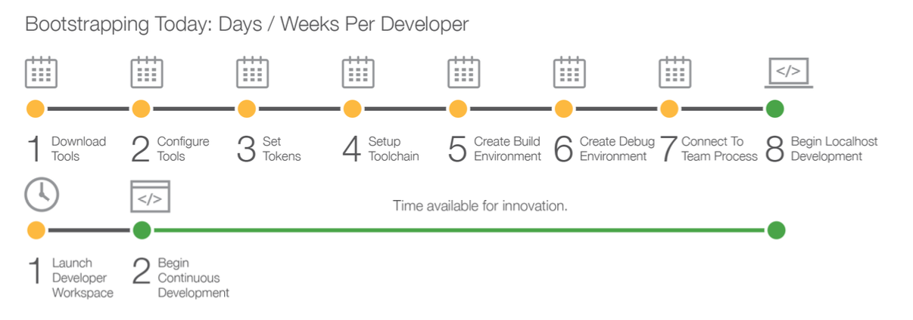

# Cloud Development

Cloud development is the idea of having everything on the cloud, e.g. the engineer just has to launch a workspace, and is ready to go.

## Consequences

- Internet-connection (always online)
- higher risk for vendor lock-in
	- extensions are gradually offered to engineers
	- result may not be portable / conforming to standards anymore
- development/operations seperations of concerns lifted
	- requires care to not affect production systems
	- new trends: immutable infrastructure/GitOps, DevSecOps and “left shift“, NoOps/serverless, Web IDEs, ..

## WEB IDEs

Propprietary

- Cloud9
- CodeAnywhere
- Koding
- ShiftEdit
- AWS CodeStar

Open Source

- Neutron Drive (Chrome)
- Collide
- Eclipse Cloud Development: Che, Orion, ...
- Python Fiddle
- Codiad
- FaaS-specific: Apache OpenWhisk, Kubeless UI

## Cloud application model

	Application := artefacts (functions code, container images) (& build files)
				+ glue (workflows, orchestration)
				+ configuration (infra resources, secrets)
				+ service interfaces

## Service Model Description

Service model descriptions allow to auto-generate the API-bindings therefore:

- [OpenAPI Editor](https://editor.swagger.io)

### Programming languages (Microservices)

- Jolie
- Ballerina

## Publishing Services

