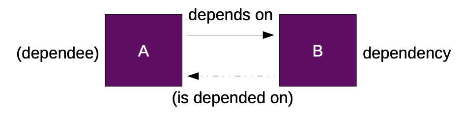
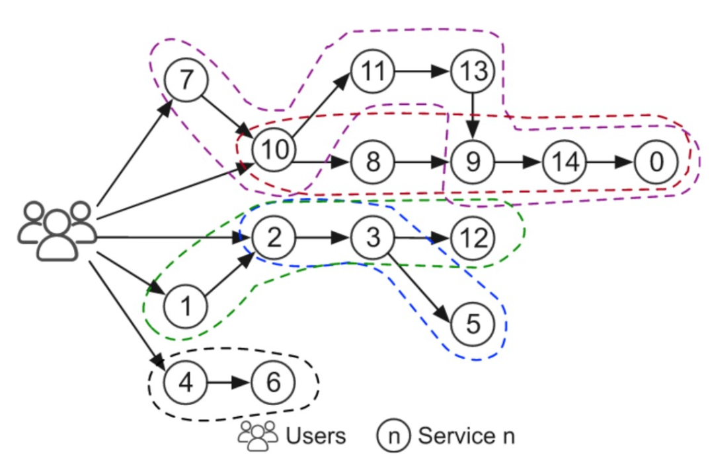
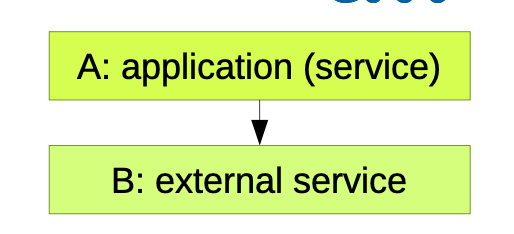
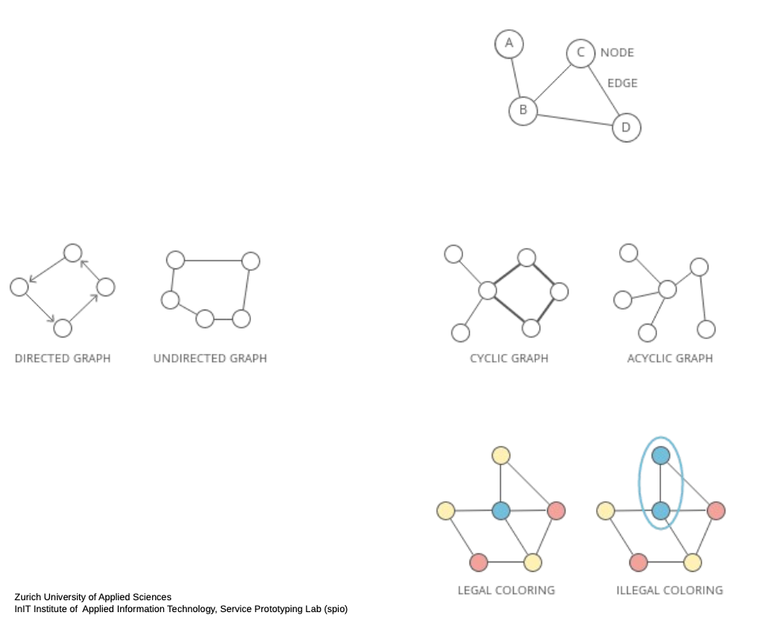
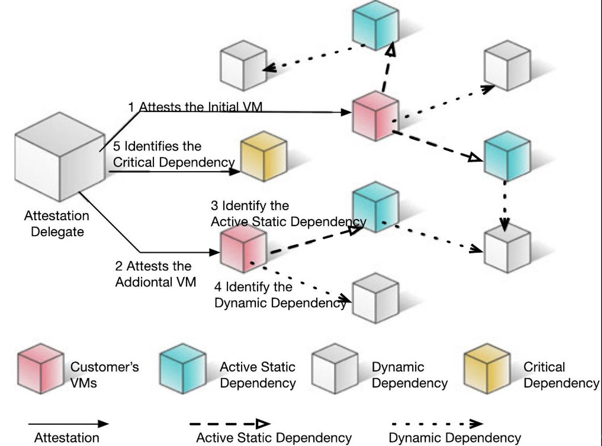
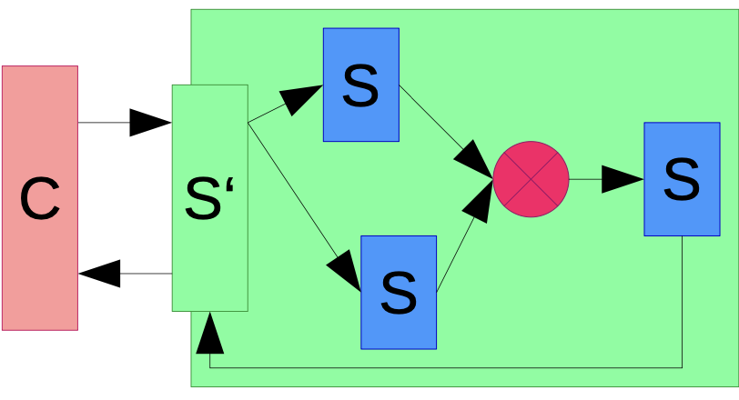
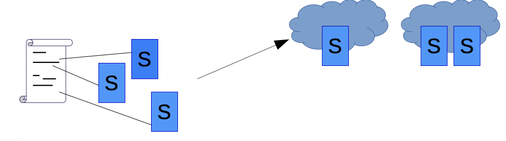
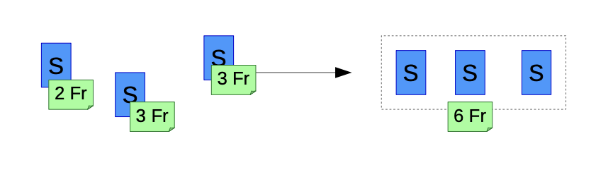
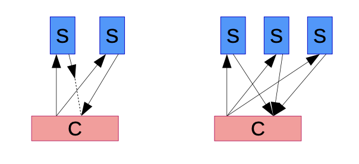

The more dependencies, the more likely an application is to fail

**Dependency Tracing**
- [EPSAGON](https://github.com/epsagon)
- [Pinpoint APM](https://github.com/pinpoint-apm/pinpoint)
- [Jaeger tracing](https://www.jaegertracing.io)

# Digital Artefacts

- Code (executable)
	- components
	- services
- configuration (declarative)
- data (binary)

# Specialisation of software engineering process

- CBSE - component based
- SOSE - service oriented
- microservice oriented

# Service Dependency

Anti patterns, like importing packages, that ... should be minimized.

- are not used
- have other large dependencies

As they cause an increase in the dependency tree.

**Importance**
- If B goes down, A goes down, too
- hidden cost

**Dependency manifiestation (dynamics)**
- tight couplign / fixed binding
- loose coupling / late binding

**Dependency type**
- inter-service
- intra-service (e.g. libraries, hidden backend services)

**Dependency management consideration**
- transitivity -> recursive algorithms
- data sources -> Data-as-a-Service model
- deployment -> dependency affinity
- consistency -> strict, sequential, casual, eventual,..

# Composition Model

Each object can be component and composition at the same time.

## Composition 

- multiple components
- some equal, some with distinct function
	- homgeneous
	- heterogeneous
- glao: whole parts

### Example
New mobile cloud-native app for mensa food delivery to lecture roomm

- registration e-mail: re-use existing software?
- menu selection: re-use current menu listing?
- payment: handle different methods?

-> main drivers: re-use, extensibility

## Component

- piece of hardware
- piece of software
- restricted view
	- black box: only interface
	- grey box: partial information about the inside and behaviour

# Dependency Matrix

- Cyclic Graphs should be avoided

A depends on B if:
- explicitly declared as such (statically detectable)
- A invokes B (traceable)
- logic of A depends on state within B (not traceable)

Analysis techniques
- statically on description
- dynamically during single-shot execution
- learning over time (time-series)

Dynamic analysis correctness challenges
- correlation vs. causation (coincidental vs. true)
- small data sets (infrequent/conditional use)
- clustering of services (e.g. backup/failover)

## Peddycord's technique

3 novel identification techniques

basis:
- passive network monitoring and analysis
- logarithm-based ranking scheme
- frequency inference

- implementation: extended NSDMiner (NSD: Network Service Dependency)
- model: communications graph
- heuristic calculation: confidence in dependency candidates

$$
\text{Node Weights} = \text{No of}(\text{Occurences as destination})
$$

$$
\text{Edge Weights} = \text{No of}(\text{nested occurences})
$$

$$
\text{confidence as ratio-based ranking} = 
\frac{\text{weight}(A \to B)}
{
	\text{weight(A)}
}
$$

$$
\text{confidence as logarithm based ranking} =

\log_{\text{weight}(A)}(\text{weight}(A \to B))
$$

## ReCloud

Developed by Nokia Bell Labs / University of Chicago

- assure redundancy (-> reliability) by eliminating common dependencies
- hardware, software and network dependencies
- deployment plan optimisation
	- 30 seconds for ~ 30'000 hosts -> 10x more reliable than common practice

Solution angle: "Independence as a service"

- NP-hard problem → approximation through dagger sampling
	- technique to handle two-state variables and low-probability events
	- failure probability p, divider for subintervals (sampling rounds) in [0, 1)
- Route-and-check algorithm

## RepCloud

Dependency graph = web of trust graph
- complement to trusted (attested) clouds concept
- analysis of communication patterns (on-demand, decentralised)
	- local trust vectors vs. holistic graph model
- Dependency types
	- dynamic: functionality affected by behaviour of neighbour
	- active static: static + dynamic
	- critical: trigger immediate attestation

## Consistency

Cloud storage (in)consistency example on AWS S3
- asynchronous cross-region replication with eventual consistency
- issues: obsolete read, lower read throughput, inherent differences
- goal: causal consistency [related writing should be seen by all in same order]
	- check: A:write, A:notify-B, B:read
	- many solutions
		- verify-repeatedly
		- read-from-original-if-inconsisten

# Dependency Resolution

Immediate resolution
- simple transitive inclusion
- solution not guaranteed
	- e.g. greedy, rule-based

Interactive resolution
- with feedback
- iterative improvements
- may complement immediate resolution upon escalation

SAT (satisfiable) solver resolution
- a solution which exists will be found
- generation of proof for unsolvable problems
- NP-complete calculation

# Composite Services

Create code dependencies

Characteristics
- offer a single service interface
- distribute requests to multiple services within the composition (in parallel, serially, or more complex routing)
- require knowledge of dependencies (internally or by the caller)

Remember software engineering – design patterns
- Composite / Façade
- Factory method

Advantages for services
- improved QoS – e.g. higher availability
- improved QoE – e.g. flexibility to switch

## Techniques / patterns

### Orchestration (with or without workflow semantics)

#### Service Orchestration

Definition: global interaction protocol between autonomous service partners

- Potential benefits: no central point of control; declarative messaging behaviour
- Potential risks: difficult decentralised enactment; little industry acceptance

- multiple services form another one
- centrally managed and executed
- based on workflows
- workflows require service interfaces

##### Resource & Service Artefact Orchestration (e.g. for deployment)

- workflows require resources (e.g. software implementation of service)
- resource allocation must be performed centrally

##### Languages

- Generic workflows
	- Snakemake, Apache AirFlow / Google Cloud Composer etc.
- Service workflows
	- Business Process Execution Language (BPEL)
	- Yet Another Workflow Language (YAWL)
	- Dynamic Service Orchestration Language (DSOL)
- Cloud function workflows
	- AWS Step Functions
	- Fission Workflows
	- IBM Composer
	- Google Workflows

Resource/Implementation Orchestration
- Heat Orchestration Template (HOT), AWS CloudFormation, AWS SAM, Vamp Blueprints, Docker Compose, Kubernetes Descriptors, Juju Charms, Helm Charts, TOSCA, ..

### Bundling

Definition: multiple services offered/used in a bundle

(Mixed bundles: service access + tools, clients, other products)

- Potential benefits: cheaper, less administrative overhead
- Potential risks: less flexibility for exchanging single service

### Multiplexing

Definition: multiple services used in parallel handling partial requests

(compare load balancing or failover: serial use)

- Potential benefits: flexible redundancy schemes, “survival of the fittest“ - Potential risks: more administrative overhead, higher cost due to candidates

