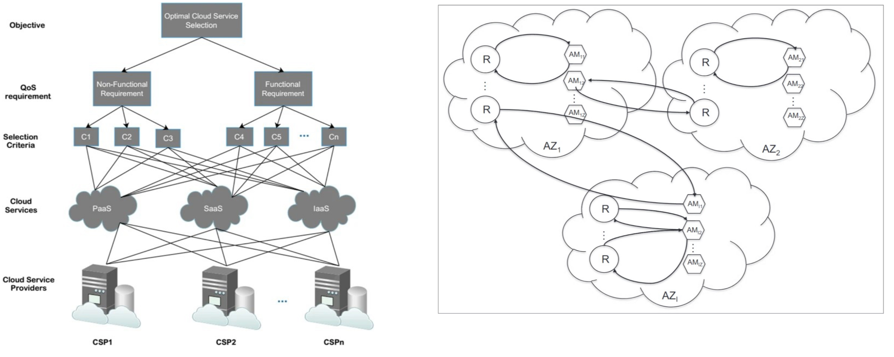
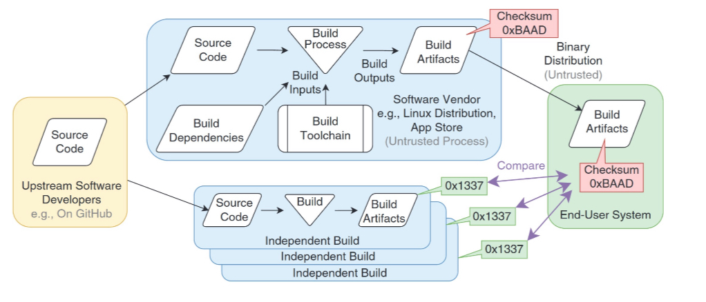
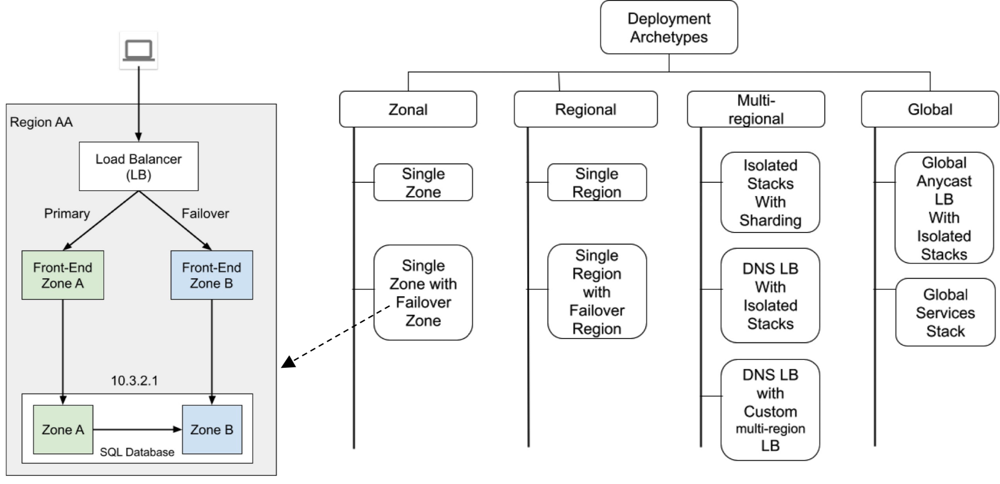
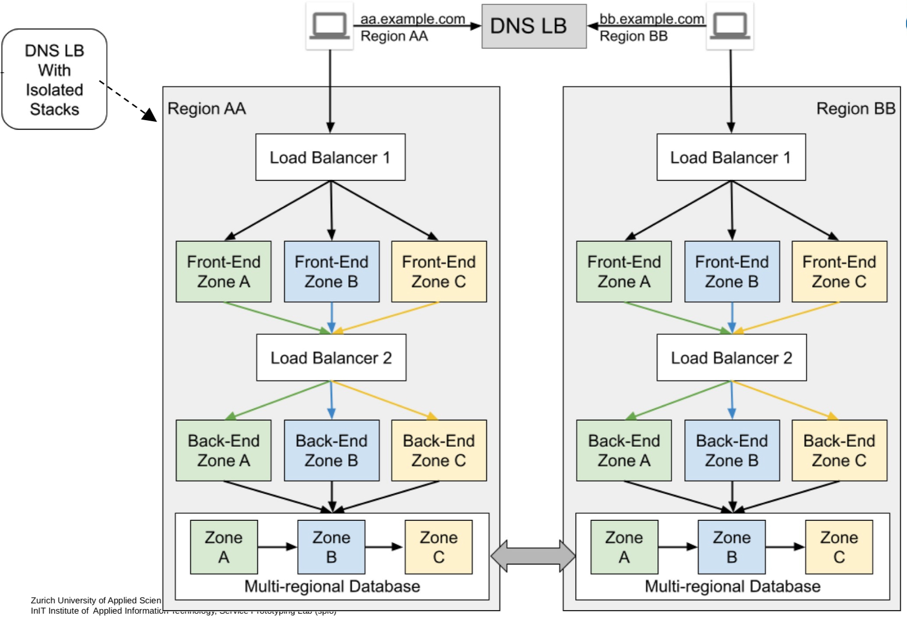
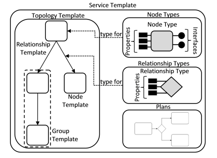

# Deployment

- Deployment of Helm chart to kubernetes cluster

## Requirements

### Expressivity

- Holistic application models vs. purely instructive scripts
- In principle *TOSCA/CAMEL* in practise: *Helm, SAM, Etc,...*

### Optimality

- Application runtime requirements X inftrastructure capabilities

Global: Cloud service selection based on Critiera [C]

Local: Assignment of workload (e.g. containers) or components (e.g. autonomous managers [AM] managing resources [R]) per cloud

### Transactionality

- Hight- Availability (Seamlessness), rollback, versioning, staging, dry runs

Built in seamless *rolling updates* and *rollback*

### Immutability

- Indirect modification through, e.g. git push, single-system images

Def. immutability: system does not change after deployment

- immutable infrastructure, changes via continous deployment & delivery
- consistency, cattle vs pet stateless containers
- intrusion resilence (easy to recover)

### Reproducibility

- Multiple instances with exact same behaviour or controlled deviation

Authoritiative source needed for any public dependencies

Master source: Software Heritage append-only archive
-> unique cross-force fingerprinting of repositories

**Reproducible builds**: It should be possible to reproduce, byte for byte, every build of every package

### Architectural Requirements

    Deployment <- -> Design / Architecture

- Artefact types: short-running, long-running containers; functions; flows
- Architectural preparation
    - cloud-nativeness
    - downward compatibility
    - metrics provisioning
- Pre-deployment planning (sizing, etc,.) + checks / analytics
- Automated deployment
- Post-deployment observability (resizing, autoscaling adjustments etc.)

## TOSCA (Topology and Orchestration Specification for Cloud Applications)

