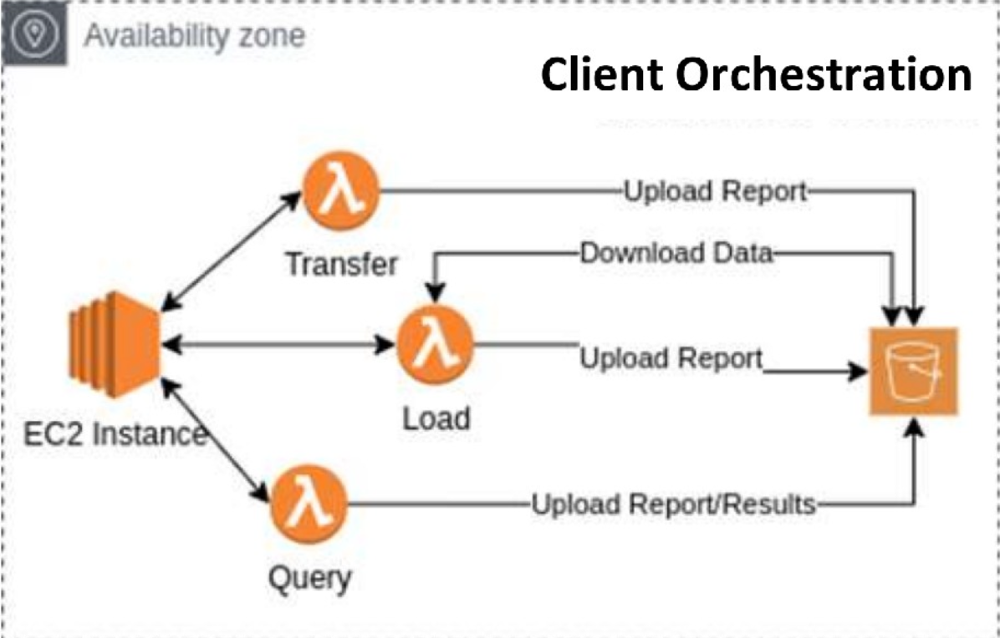
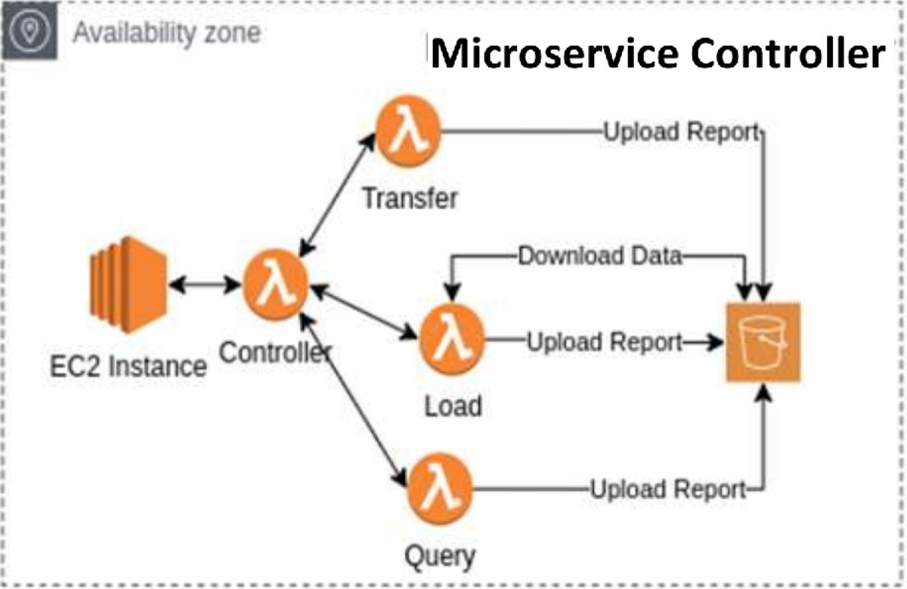
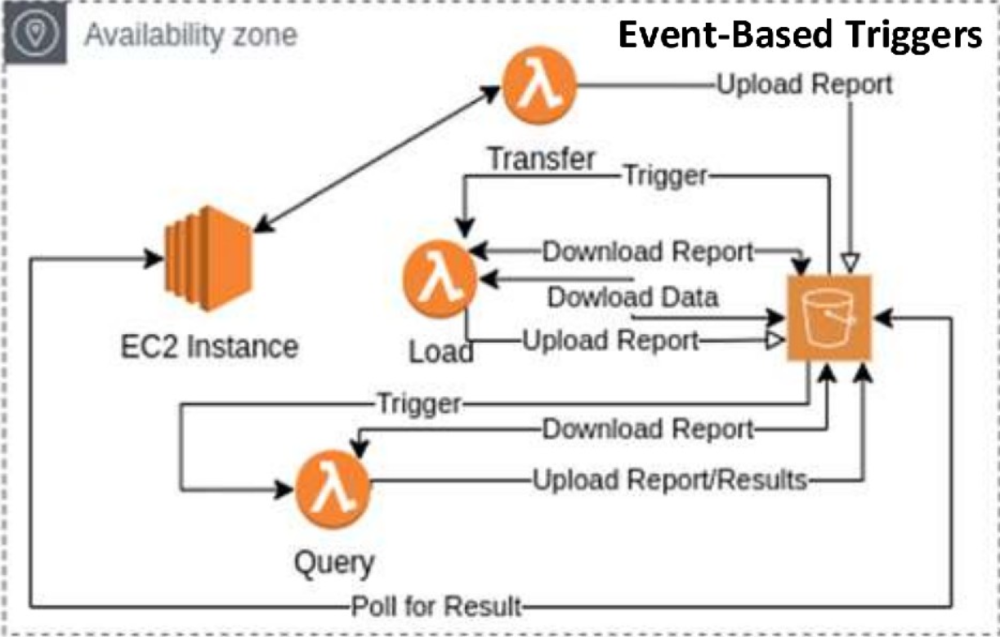

# FaaS (Function as a Service)


- runs on a BaaS (Backend as a Service).
- allows to have specific functions or methods run in most programming langauges on a cloud provider.
- code is uploaded to the cloud provider


- "Cloud functions" insipired by "functional programming" style
- stateless & short-lived
- high elastic scalability
- event driven
- single function[ality] microservices
- implied pricing model: true pay per use

## Advantages

- Almost no idle periods
- small implementations
- fast startup graceful shutdown

## FaaS units

A single function acts as a **processing unit**. The function can be **triggered** (HTML GET/POST, ...). The processing unit can be implemnented in any programming language, most often NodeJs or Python is used.


When having multiple of these functions are called a **App/Bundle**. The funtions in the bundle must be **uniquely identifiable by a name**.

**Input**

- Application specific: HTML, XML, JSON, ...
- Context parameters, direct protocol access (if supported)

**Output**

- Application specific: HTML, XML, JSON, ...
- state signaling, direct protocoll access (if supported)

**Model - Signature**
 
- Fixed ore registered name
- sync or async invocation
- parameters or via environment: event, context
- single return value

**Configuration**

- Runtime language & entry file
- Runtime parameters: memory, maximum duration, environment variables
- Packaging: artefacts, layers, libraries, isolation/containerisation, ...

## Encapsulation


### Function Execution

Runs on provider supplied infrastructure (BaaS)

- Hidden / Non deterministic specs
- Function lifecycle (pooling, recycling, provisioned concurrenct)

### Function encapsulation

Provider supplied container image

- language runtime
- basic dependency libraries & framework

### Function

Developer supplied code

- "app/bundle": Advanced libraries & frameworks
- injection if supported
- layers


## Examples

### AWS lambda

```python
import logging
import os
from http import HTTPStatus
import boto3

logger = logging.getLogger()
logger.setLevel(logging.INFO)

S3_BUCKET = os.environ['S3_BUCKET']


def lambda_handler(event, context):
    try:
        logger.info(f'Calling out to {S3_BUCKET} bucket to list objects')
        s3_client = boto3.client('s3')

        # Get all the objects from the bucket. Max 1000
        objects_in_bucket = s3_client.list_objects(Bucket=S3_BUCKET)

        logger.info('Found {} objects in the bucket. Printing a sample...'.format(len(objects_in_bucket['Contents'])))

        for key in objects_in_bucket['Contents'][:5]:
            logger.info('Found {} in bucket'.format(key['Key']))

    except Exception as e:  # Catch all for easier error tracing in logs
        logger.error(e, exc_info=True)
        raise Exception('Error occurred during execution')  # notify aws of failure

    return {
        "statusCode": HTTPStatus.OK.value
    }
```

### Azure 

```python
import azure.functions as func
import logging

app = func.FunctionApp(http_auth_level=func.AuthLevel.ANONYMOUS)

# A timer trigger function which repeats every 5 seconds and only accepts HTTP "GET" and "POST" requests.
@app.timer_trigger(schedule="5 * * * * *", arg_name="myTimer", methods=["GET", "POST"], run_on_startup=True,
              use_monitor=False) 
def TimerTrigger(myTimer: func.TimerRequest) -> None:
    
    if myTimer.past_due:
        logging.info('The timer is past due!')

    logging.info('Python timer trigger function executed.')
```

## Converting existing architecture (FaaSification)

Often, a conversion from a given architecture to a cloud architecture requires huge restructuring. This is because in traditional architecture, a monolitic architecture is required.


A existing design, where a centric server was used, is converted into a function based approach.


# Development

When developing, it is important to test the implementation. For that, there exist multiple tools like:

**Open source portable FaaS engines**

- OpenFaaS, Fission, Fn

**Runtimes of commercial FaaS offerings**

- Azure Function Core Tools
- AWS Greengrass

**Prototyping/mocking/emulation tools**

- Localstack
- GCloud Emulators

## Overlay approach

A strategy where the state of a function is separated from its compute environment. This means that the state is managed externally, usually in a different storage system, allowing the compute environment to be stateless. This approach is essential in serverless architectures, as it facilitates scalability and flexibility by decoupling the state from the execution environment​​.

# Workflows

Workflows allow to run multiple functions. The data can be directly passed or modified and be passed to the next function(s).


## Connection Patterns

Connection patterns describe, how the functions 

- Sequence / chain
- Parallelism
- Conditions
- Split + Join
- Compplex state macihines

## Control Flow Methods

### Client Orchestration

- Plain old code (e.g. Hyperflow)
- <span style="color:red">high cost</span>



### State Machine

- FaaS workflow engine offered as-a-service
-<span style="color:green">second-lowest latency</span>


### Microservice Controller

- Workflow defined inside function (Workflow Manager)
- <span style="color:red">high cost</span>
- <span style="color:green">lowest latency</span>



### Event-Based Triggers

- Asynchronous
- Event Driven Architecture (EDA)
- <span style="color:red">performance penalty</span>



## Optimisation

**Goals**

- Performance: Performance/cost ratio
- Reliability: checkpointing, fault tolerance, fault compensation
- Sustainability: "greenness", compliance / adaptivity


### Workflow Rewriting

Achieving **SP** (Series-Parallel) structure for polynomial execution time from general **DAGs** (directed acrylic graphs). This makes the execution:

- simple, layered (phased graphs)
- no intersection, -> easier re-use


### Function Resource Re-Use

In practice, all FaaS plattforms re-use resources

- per user binpacking
- functions are isolated
- function executions share resources


| FaaS | Keep-alive in practice |
|------|------------------------|
| AWS | 6 hours |
| Google | 6 Hours |
| Azure | 1-4 days |

### Function Runtime Pooling


### Function Prefetching


Fetch function sources proactively and place them near resources to reduce function transfer latency.

Software flow has a big impact on cold start durations
- Function sources (10s of MBs) have to be retrieved and transferred to the resources
Especially important for geo-distributed and edge use cases
- AWS Lambda@edge
- Cloudflare


### Function Prewarming

Anticipate function executions by deploying functions predictively.

Prewarming or predictive scheduling in other domains:

- CPU branch predictor
- proactive autoscalers
- predictive caches


**Common approaches**

- Runtime analysis
    - Rule-based
    - pattern recognition and machine learning
    - artificial intelligence
- exploit additional information of functions
    - dependency knowledge of functions
    - interval triggers

**Horizon-based prewarming**

