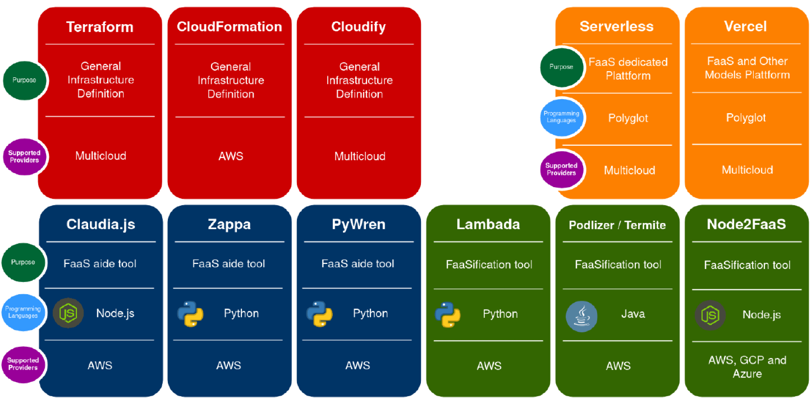
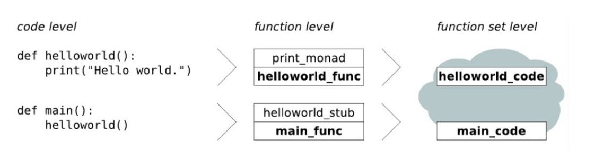

# Cloud Infrastructure

- A Function will not be executed in the same container all the time. Cloud providers have a max execution time, once that limit has been reached, the function is aborted.

## What we don't want to do

- Restart instances
- Infrastructure is upgraded automatically
- When new language runtimes is introduced, only little development is needed

## Issues
- Can properties be measured?
- Can properties be quantified?

# Local Infrastructure

- Many cloud providers provide functions for local execution
- Localstack can be used to *mock* the integration.

# FaaSification Overview

## Transformation

### Non Selective

The complete code is directly pushed into the cloud.

### Monad

In software, a “monad” is a design pattern or concept used to manage sequences of operations, particularly in functional programming. It helps handle side effects, such as input/output or state changes, in a controlled and predictable way.

Think of a monad as a wrapper around a value or a computation. It provides methods or functions to perform operations on that value while maintaining control over how those operations are executed. Monads ensure that operations are performed in a specific order or context, allowing for better error handling and resource management.

Common examples of monads include the Maybe monad for handling optional values, the List monad for working with collections, and the IO monad for managing input/output operations. Each of these monads defines its own rules for how operations can be combined and executed.

In essence, monads simplify complex sequencing of operations in a way that’s easy to reason about and control, making software more reliable and maintainable.

### Transformation Rules

- Entry Point
    - No transformation of main function
- functions definitions
    - adapt to FaaS conventions: parameters, return value
    - scan recursively for function calls
    - export as function unit including dependencies
- function calls
    - if internal, rewire
    - if input/output replace
    - otherwise, leave unchanged
- monads
    - functional programming with side effects (i.e. iput/output as side channel)