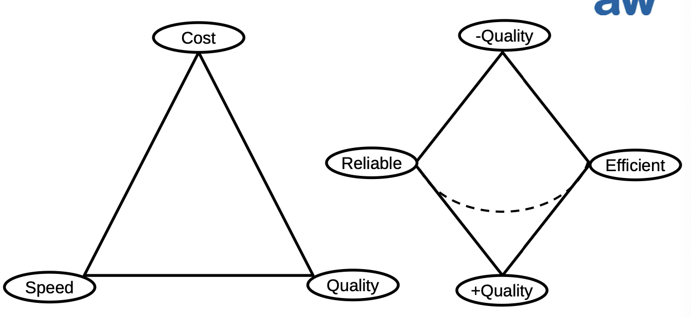
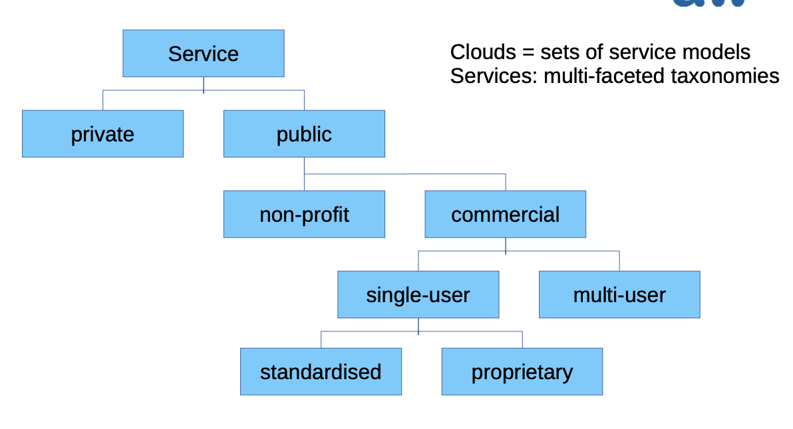

# SCAD - Serverless and Cloud computing

## Global Players (IaaS, CaaS, PaaS, FaaS)

- Amazon Web Services (AWS)
- Google Cloud (GCloud)
- IBM Cloud
- Microsoft Azure
- Alibaba Cloud

## Swiss Players (IaaS, Caas, PaaS)

- ZH: VSHN AG / APPUiO cloud
- ZH: Agiba AG / MySwissCloud
- BE: Puzzle ITC GmbH / APPUiO cloud
- BE: Swiwsscom / Application Dev Cloud
- GE: Appalia SA
- GE: Penta SA
- SZ: Ventus Cloud AG

## Computing Paradigm

### Functional Characteristics

- Performance
- Scalability
- Security
- Robustness

### Non-Functional Characteristics

- Cost
- Sustainability

## Applications (Services + Workflows)

### Definition of a (Cloud) Service

- Visibility: Well-defined and unified description
	- declarative
	- interactive (query)
- Interaction: well-defined and unified interface incl. protocol
	- message exchange pattern
	- layer
- effect: invocation semantics
	- idempotent (read-only w/o side effects)
	- reversible effect on service system
	- irreversible real-world effect
- encapsulation: encapsulates implementation (software, resources) for re-use
- interopability: loose coupling (late/dynamic binding)

## Serverless application

Serverless computing allows to run code without having a centreal server (P2P).

- Serverless architectures are application designs that ... remove much of the need for a traditional always-on server component.
- Serverless architectures may benefit from significantly reduced operational cost, complexity, and engineering lead time.
- Serverless architectures come at a cost of increased reliance on vendor dependencies and comparatively immature supporting services.

## Service types

- BaaS (Backend as a service)
- PaaS (Platform as a Service)
- FaaS (Function as a Service)
- CaaS (Container as a Service)
- XaaS (Everything as a Service)
