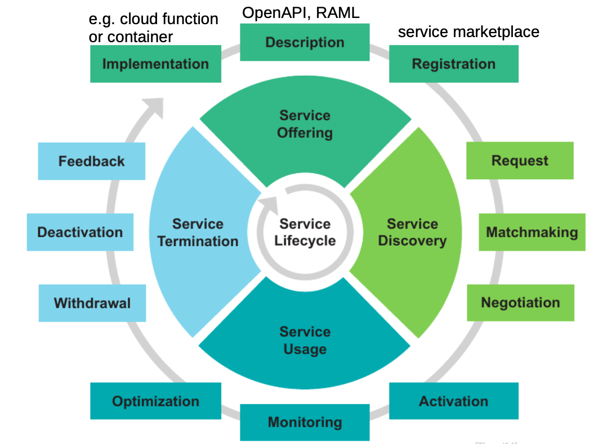

# Service lifecycle

# Quality dimensions and models

## Software Quality Models

SQuaRE: Software product Quality Requirements and Evaluation (ISO/IEC 25000)
- Functional suitability
- Performance efficiency
- Compatibility
- Usability
- Maintainability
- Reliability
- Security
- Portability

## Software Quality Metrics

degree to which software possesses a given attribute that affects its quality

metric := f(software data) → numerical value
