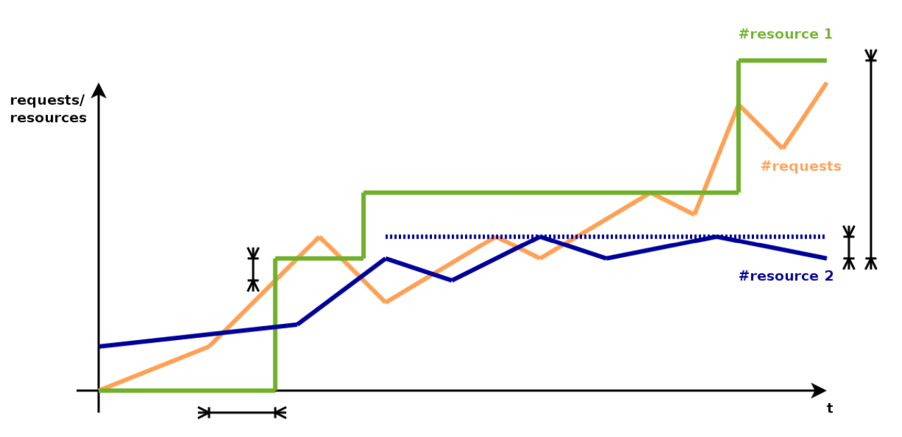

# Service Scalability

- Scalability: The ability to address arbitrary requests without violating Quality of Service requirements (e.g. maximum response time).

- Scaling: Essential but insufficient contributor to scalability. Complemented by:
	- performance tuning to reduce execution time
	- caching
	- granularity adjustments (microservices, request paths)
	- continuum topology, multi-cloud options
	- ....
	
| Fallacy | Effect |
|---------|--------|
| The network is reliable | App needs error handling / retyr |
| Latency is zero | App should minimize # of requests |
| Bandwith is infinite | app should send small payloads |
| The network is secure | App must secure its data/authenticate requests |
| Topology doesnt't change | changes affect latency, bandwith & endpoints |
| There is one administrator | changes affect ability to reach destination |
| Transport cost is zero | costs must be budgeted |
| The network is homgeneous | Affects reliability, latency & bandwidth |

## Properties

Elasticity (time)
- how elastic, which granularity?
- what is the degree of adaptation to varying demand?
- (= to which degree is potential used?)

Boundedness (space)
- how bounded?
- what are upper/lower limits?

Transformativity (space/behaviour)
- how transformative?
- is self-similarity of system guaranteed, or are there any bottlenecks?

### Missmatches

There exist two types of **overall missmatches** when scaling properties in the cloud

- Overprovisioning
	- high cost
	- low SLA penalty
- Underprovisioning
	- low cost
	- high SLA penalty

When talking FaaS only, there are the following additional missmatch types. In FaaS, these are called "good enough" at pay-per-use. yet not perfect. 

- billing cycle mismatch
- memory allocation missmatch
- dynamic profile missmatch

## Scaling Directions

We can scale 3 dimesions

- Vertical Scaling (upscaling): Increase system performance
- Horizontal scaling (outscaling): Add more systems
- Diagonal, combine vertical and horizontal scaling

### Vertical Scaling (upscaling)

Increase system performance

- Increase memory (setmem <xG> -- live)

#### Container

- Plain Docker (similar for Singularity, Rkt, ...)
	- static resource limits → passed through to CaaS (e.g. Kubernetes Resource Model) and eventually cloud services
	- e.g. via docker-compose (only works as stack)
- Docker resource limit updates (not on Windows)
	- resources: CPU periods/quotas, block IO, RAM, number of processes
	- initial grant: unlimited
	- ignored in docker-compose; adhered to in docker-swarm
	- -> docker update --memory ...
- OS-level primitives, but no adaptive scaling yet

- Various forecasting + adaptation approaches
	- HoloScale
	- VeMOC
	- ElasticDocker

### Horizontal scaling

Add more systems (e.g. parallel comput units)

- Parallel, on one system: multiple processes or threads
	- limited by # CPU cores
- Distributed, over the network: multiple instances or workers/slaves
	- limited by # nodes + interconnects

#### Containers

- Amdahl‘s law: decreasing effectiveness of scaling factor
- optimal scale detection: beforehand (prescaling) vs. later (costly)
- optimality: makespan (performance), cost, weighted utility → determine IG based on TG → determine sweetspots

### Diagonal Scaling

Connected issues in public clouds - mostly IaaS, but in part also up to FaaS: limited granularity x slow scaling speeds x flat pricing schemes

Common solution on provider side: diagonal scaling

#### SmartScale

savings of 25% in private clouds possible, but not supported in public clouds

## Granularity

# Autoscaling

- Realisation of “on-demand“ provisioning
	- more users / more activity → higher load
	- higher load → more application power → more resources

- Vertical Scaling
	- More resources on **one** node -> more threads or processes
- horizontal scaling
	- more physical nodes -> more instances (-> replication)

## Taxonomy

by:
- provider
	- within service
- application
	- within service
	- CPU load
	- memory utilisation - network traffic
on
- no. of requests
	- within provider across services
	- across providers

## Methods

### Reactive

- chaotic over-/ underprovisioning
- risk of SLA violation

### Proactive

- controlled overprovisioning
- SLAs maintained
- requires prediction or application insights

## Mathematical foundations

### Autoregression (AR)

$$
y_t = c + \epsilon_t + \sum_{i=1}^{p} a_i y_{(t-i)}
$$

where
- $a_i y_{(t-i)}$ is the rolling average

### Moving Average (MA)

$$
y_t = c + \epsilon_t + \sum_{i=1}^{p} b_i \epsilon_{(t-i)}
$$

where
- $b_i$ are the damping factors

### ARMA

- Combined AR/MA -> ARIMA
- integrated by using $t_t$ deltas

## Prediction

### Baseline Predictor

### Lagged Neighbour Predictor

### Nearest Neighbour Predictor

## Scale-to-zero with containers

- Zero interpretable as both horizontal & vertical scaling
- First supported for containers by early FaaS frameworks like OpenWhisk (container as executable unit)

## Challenges

# Scalable Application Design

## Multi tier design

Design Motivation and Characteristics
- popular for web applications and client-server architectures
- 3-tier: frontend, backend, database
- 4-tier: client/frontend, delivery (incl. cache), aggregation/logic, services (incl. data)

Advantages
- simple monolithic blocks
- established standards for protocols
- sufficient flexibility for complementary blocks

Disadvantages
- inequal loads and bottlenecks
- only applicable to isolated applications

## Service-oriented design

Design Motivation and Characteristics
- service orientation: uniform description + communication, encapsulation, re-use
- discovery
- flexible dynamic bindings

Advantages
- consequent evolution of complex software design
- viable basis for rapid prototyping of services

Disadvantages
- waning support for classical SOA technologies (WSDL, SOAP, UDDI etc.)
- no guidance for how to design, build, run services

## Cloud Native Application Design

Design Motivation and Characteristics
- main target properties: scalability (↑) & resilience (↑)
- refines service orientation with microservices
- exploits capabilities of cloud environments;
but also does autonomic self-management when needed (vs. immutable infrastructure)

Advantages
- closest to ideal scalability: elastic, hardly bounded, hardly transformative
- matched by contemporary technologies, e.g. containers, functions
- conversion of legacy applications possible

Disadvantages
- technological immaturity and volatility
- emerging tools and languages, incompatibilities, insufficiencies

### Databases & Messages

#### DBaaS (Database-as-a-service)

### Messaging in Clouds

Diverse types of messaging systems, often with overlap
- message queues
- message brokers
- stream processing/analytics systems publish/subscribe
- gateways, e.g. for protocol conversion service buses
- microservice meshes/proxies (as overlays)

Corresponding cloud offerings
- segmented by application requirements
- billing by # messages, payload size, management calls

# Distributed Applications

- Distinguish: coordination - cooperation - communication

## Coordination

### Coordination Majorities

### Paxos Consensus

### Swedish Leader Election

based on rounds - elimination of candidates
- each round: flip a coin
	- winners proceed into next round
	- if no winner, all play again
- last remaining candidate is leader
- good charactersistics
	- maximum number of consecutive null rounds

### Raft

- recent, modular algorithm
- uses log replication
- random timeout for followers → become candidates
- absolute majority of votes → leader
- heartbeats define election term

### Implementations

- Apache Zookeper (java, python, kazoo)
	- zab algorithn: zookeper atomic broadcast
	- similar to paxos, but with stricter ordering guarantees
- Etcd (go/rest, ptyhon interface), consul (GO/rest, java interface, elekt)
	- distributed service discovery and configuration
	- implement raft
- microsoft distributed mutex (c#)
	- sample code in cloud design patterns: leader election
	- custom algirhtm

- CAP theorem (consistency, availability, partitioning tolerance): focus on CA
- Microservices → BAC theorem (backup, availability, consistency)
