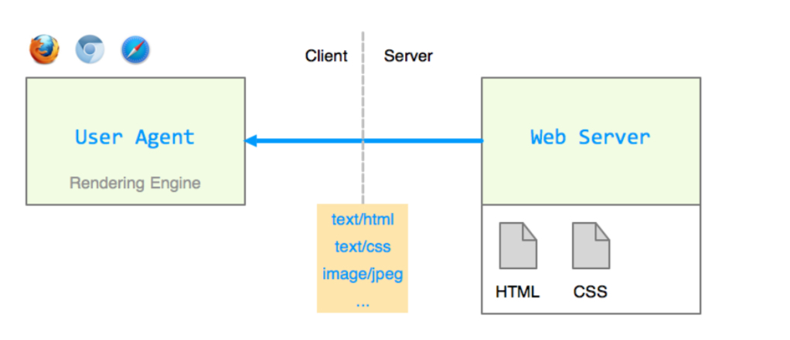
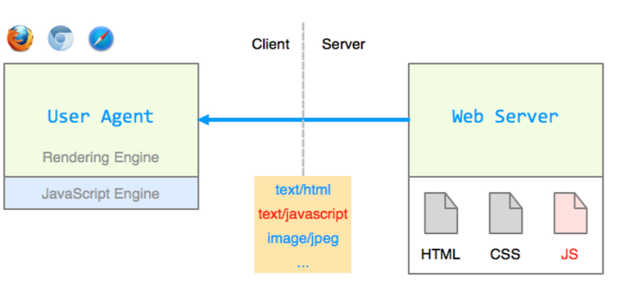
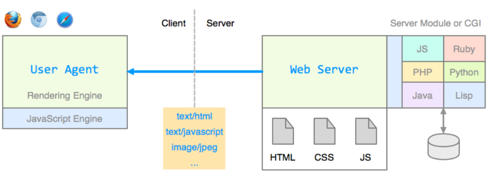

# Web Architektur

## Internet

- Weltweites Netzwerk, dass aus vielen Rechnernetzwerk besteht.
- Urprünglich: ARPANET (1969: vier Knoten)
- Als Internet ab 1987 bezeichnet (ca. 27'000 Knoten)

## Technologien

### Clientseitig (Frontend)

- Beschränkt auf das, was der Browser kann
- HTML, CSS, JavaScript, einige weitere Sachen

### Serverseitig (Backend)

- Praktisch unbeschränkt: Plattform, Programmiersprache, ...
- Erzeugt und gesendet wird das, was der Browser kann

### Statische Webseiten

### Clientseitige Programmlogik

### Serverseitige Programmlogik

