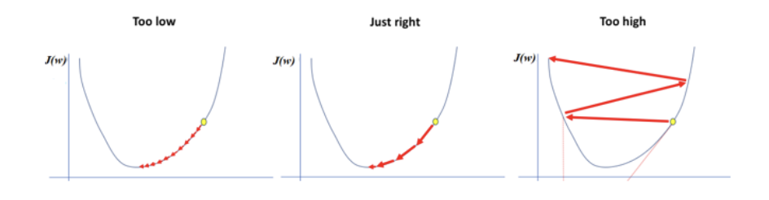

# Gradient Descent

## Generic Gradient Descent Algorithm

- Repeat until covergence

**Learning Rate / Schrittgrösse**: $\alpha$

$$
\theta_j =
\theta_j
- \alpha
\frac{\partial}
{\partial \theta_j} J(\theta)
$$

for every j=1..n

$$
\theta_j
=
\theta_j
-
\alpha
\frac{1}{M}
\sum\limits_{i=1}^{m}
(h_{\theta}(x^{(i)}) - y^{(i)})x_j^{(i)}
$$

## Learning Rate

Als Lernrate wird die Veränderung des Parameters von einem zum nächsten Versuch bezeichnet. Diese Lernrate wird, jeh näher der optimale Wert der Kuppel kommt, kleiner.
$$
\alpha
$$

- Zu Beginn grosse Lernrate, um möglichst schnell ans Minimum zu gelangen

### Regeln

- Learning Rate $\alpha$ too small -> slow convergence
- Learning Rate $\alpha$ too large -> might "jump too far", might not converge or even diverge

### Learning Rate Optimization / Decay

$$
\alpha
=
\frac{1}
{
1 + \text{decay rate}  * \text{epoch number}
}
\alpha_0
$$

### Momentum as Learning Rate Optimizer

**Idea**: add a fraction of previous update direction to the update: $\theta_j = \theta_j - \alpha \frac{\partial} {\partial \theta_j} J(\theta) - \gamma$

**Effect**: pushes the "jumps" of SGD in general direction towards the minimum

## Regularization

$$
\lambda
$$

- Ist $\lambda$ klein, kann $\theta$ gross, somit kann das Polygon möglichst genau den Werten enstsprechen.
- $\theta_0$ wird nicht beeinflusst.

**Hypothesis**: $\theta_0(x) = \theta^Tx = \sum\limits_{j=1}^{n} \theta_j x_j$

**Cost Function**: $J(\theta) = \frac{1}{2m} [ \sum\limits_{i=1}^{m}(y_m - \theta_0(x_m))^2 + \lambda \sum\limits_{j=1}^{n}\theta_j^2]$

## Grosses $\lambda$

- Es wäre eine Gerade
- Die Gerade wäre möglichst flach bei 0

## Hyperparameter Tuning

Hyperparameter sind Einstellungen oder Konfigurationen, die vor dem Training eines maschinellen Lernalgorithmus festgelegt werden müssen. Sie steuern Aspekte des Lernprozesses und beeinflussen, wie ein Modell trainiert wird. Im Gegensatz zu den Modellparametern, die während des Trainings aus den Daten gelernt werden, werden Hyperparameter manuell ausgewählt und können die Leistung und das Verhalten eines Modells erheblich beeinflussen. Beispiele für Hyperparameter sind Lernrate in neuronalen Netzen, Tiefe eines Entscheidungsbaums in Entscheidungsbäumen und die Anzahl der Cluster in k-means Clustering. Die Auswahl geeigneter Hyperparameter ist oft ein wichtiger Schritt beim Entwickeln von Machine-Learning-Modellen.

A hyperparameter in machine learning is a configuration setting that is external to the model and whose value cannot be learned from the data. Examples include learning rate, batch size, and the number of hidden layers in a neural network. Tuning hyperparameters is crucial for optimizing a model's performance.

