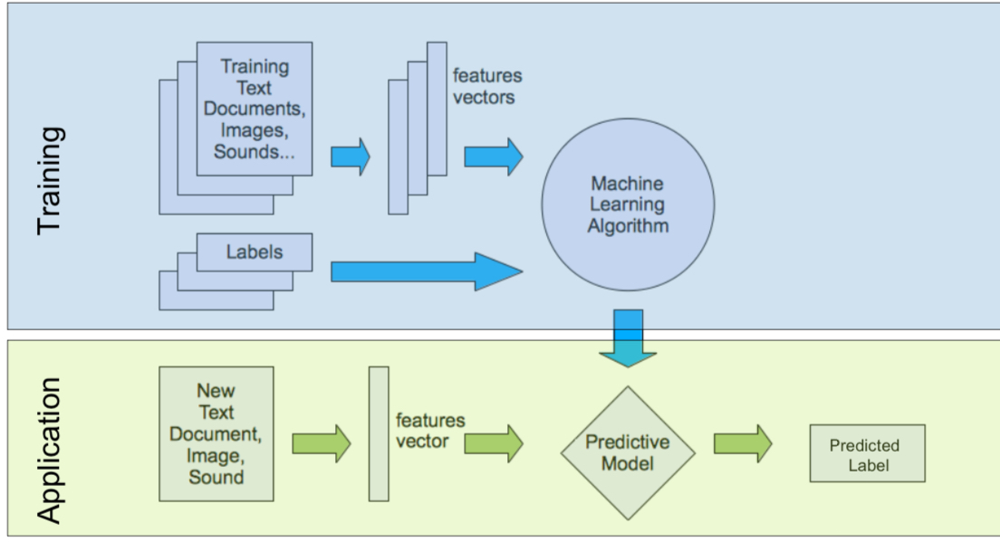

# Supervised Machine Learning

Labels werden Beispieldaten manuell hinzugefügt.

## Klassifizierung / Classification

Es wird etwas in eine Kategorie klassifiziert.

## Regression

Es wird ein Wert anhand vieler Werte errechnet.

