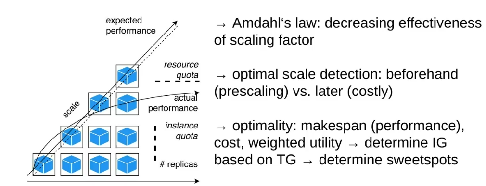
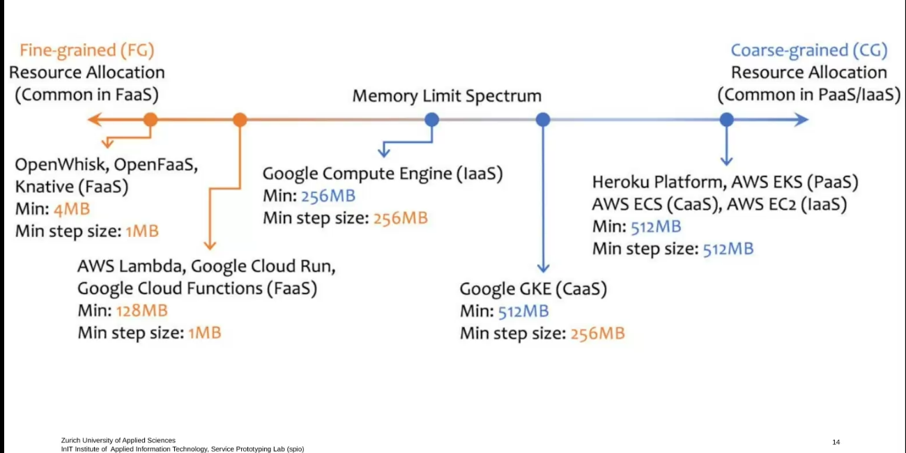
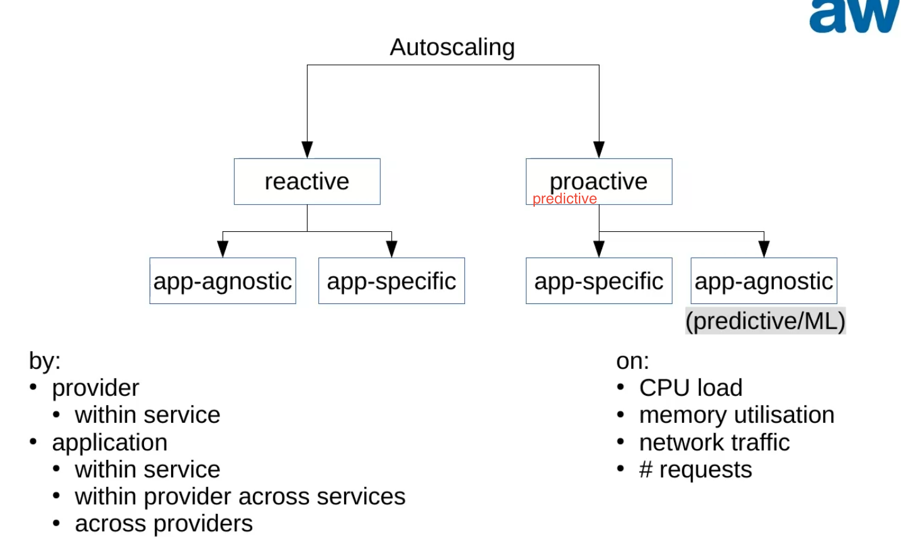

# Scaling

- On linux, the Hypervisor (KVM) is used

## Vertical Scaling

UP/DOWN-SCALING

Run more processes, on the **same** hardware

## Horizontal Scaling

IN/OUT - SCALING

Run on more hardware.

**Disadvantages**

- Much more overhead
- network communication between the processes.

## Diagonal Scaling

## Scaling Granularity

- Most systems are not comparable. Overall AWS has the most predictable runtime.

## Autoscaling

- On-Dmand provisioning

- More users / more activity -> higher load
- higher load -> more application power -> more resources

**Vertical scaling**

- more resources on one node -> more threads or processes

**horizontal scaling**

- more physical nodes -> more instances (-> replication)

